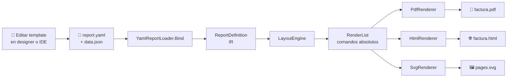
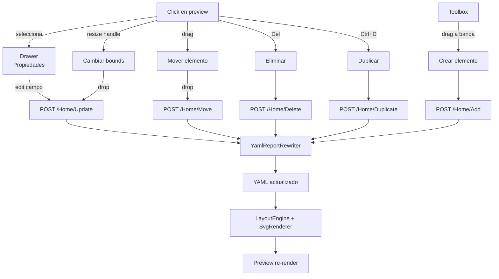

<div align="center">

[🇺🇸 English](README.md) · **🇪🇸 Español**

# 🧾 NetReporter

**Motor de reportes para .NET 10 con IR — un mismo template produce PDF, HTML y SVG.**

[](https://dotnet.microsoft.com/)
[](#-tests)
[](#-licencias)
[](#estado)

🎨 Designer visual · 📄 PDF · 🌐 HTML · 🖼️ SVG · 📦 Templates YAML

</div>

---

## 📚 Tabla de contenidos

1. [Filosofía y arquitectura](#-filosofía-y-arquitectura)
2. [Características](#-características)
3. [Pipeline visual](#-pipeline-visual)
4. [Stack tecnológico](#-stack-tecnológico)
5. [Estructura del repo](#-estructura-del-repo)
6. [Quick start](#-quick-start)
7. [Designer visual](#-designer-visual)
8. [Sintaxis del template YAML](#-sintaxis-del-template-yaml)
9. [Renderers disponibles](#-renderers-disponibles)
10. [Tamaños de papel](#-tamaños-de-papel)
11. [Tests](#-tests)
12. [Limitaciones conocidas](#-limitaciones-conocidas)
13. [Roadmap](#-roadmap)
14. [Licencias](#-licencias)

---

## 💡 Filosofía y arquitectura

NetReporter separa el reporte en cuatro capas con interfaces claras. **El template no sabe del formato de salida**: se describe una vez, se renderiza N veces.

```
┌────────────────────────────────────┐
│  📝 Template (YAML / API C#)       │  Definición declarativa
└────────────────────────────────────┘
                ▼
┌────────────────────────────────────┐
│  🧠 IR (ReportDefinition)          │  Modelo en memoria
└────────────────────────────────────┘
                ▼
┌────────────────────────────────────┐
│  📐 LayoutEngine                   │  Measure + arrange + paginación
└────────────────────────────────────┘
                ▼
┌────────────────────────────────────┐
│  📋 RenderList                     │  Comandos de dibujo absolutos
│  · DrawTextCommand                 │  (un solo IR para todos los outputs)
│  · DrawLineCommand                 │
│  · DrawRectangleCommand            │
└────────────────────────────────────┘
                ▼
   ┌───────────┬───────────┬──────────┐
   ▼           ▼           ▼           ▼
 ┌─────┐   ┌──────┐   ┌──────┐   ┌─────────┐
 │ 📄  │   │  🌐  │   │  🖼️  │   │  📊     │
 │ PDF │   │ HTML │   │ SVG  │   │ XLSX    │  ← futuro
 └─────┘   └──────┘   └──────┘   └─────────┘
```

**Principios no negociables:**

| Principio | Implementación |
|---|---|
| 🚫 **Sin reflection** en hot paths | Data binding con `Func<TRow,TValue>` tipados; expresiones con `Func<IEvaluationContext,T>` |
| 🎨 **Sin CSS / Tailwind para reportes** | Styling nativo con `StyleSheet` + `StyleRef` (struct zero-alloc) y herencia con `BasedOn` |
| 🧪 **QuestPDF solo como contenedor** | Todo el dibujo PDF pasa por SkiaSharp → SVG → `container.Svg(...)` |
| 🔄 **Mismo IR, múltiples outputs** | El `RenderList` se calcula una vez y N renderers lo consumen |
| 📦 **Templates editables sin recompilar** | YAML + JSON enlazados con JSON Path |

---

## ✨ Características

### Engine
- ⚡ **Pipeline IR** — un template, múltiples salidas
- 📐 **Layout engine** con paginación, repetición de headers de tabla, bandas (Report/Page Header/Footer + Detail)
- 🎨 **StyleSheet con herencia** — `BasedOn` chain con detección de ciclos y caché
- 🔢 **Cultura por reporte** — formato de números/fechas localizado (probado con `es-HN`)
- 📋 **Tablas tipadas** — `TableElement<TRow>` con columnas tipadas, alineación y formato por columna

### Templates YAML
- 📝 **Schema declarativo** — page, styles, bands, elements
- 🔗 **JSON Path bindings** — `$.cliente.nombre`, `$.lineas[*]`
- 🪝 **Template strings** — `{{ pageNumber }}`, `{{ totalPages }}`, `{{ $.titulo }}`
- 📁 **FileName con templates** — `fileName: "factura-{{ $.numero }}"` resuelto al exportar
- 🎯 **Multi-formato** — Letter, Legal, A3-A6, B4-B5, Tabloid, custom (paperoll 80mm/58mm)

### Designer visual web
- 🖱️ **Drag-and-drop** sobre el preview SVG (mover y crear elementos)
- 🎯 **Resize handles** (8 direcciones) con snap a 5pt con Shift
- ⌨️ **Keyboard nudge** — flechas mueven 1pt, Shift+flechas 10pt
- 📋 **CRUD completo** sobre elementos, bandas y columnas de tabla
- 💾 **Save/Load** templates a `~/.netreporter/templates/`
- 📦 **Samples builtin** + **importar archivo** desde disco
- ↶ **Undo/Redo** (50 niveles, Ctrl+Z / Ctrl+Shift+Z)
- 📥 **Export a PDF y HTML** con un click

### Renderers
- 📄 **PDF** vía QuestPDF + SkiaSharp (Letter, A4, Legal, custom)
- 🌐 **HTML** paginado con `@page` CSS — imprimible nativo
- 🖼️ **SVG** vectorial — uno por página

---

## 🔄 Pipeline visual

### Flujo de uso end-to-end



### Flujo de edición en el designer



---

## 🛠️ Stack tecnológico

| Capa | Tecnología | Notas |
|---|---|---|
| Runtime | **.NET 10** | `LangVersion: latest`, `Nullable: enable`, `TreatWarningsAsErrors: true` |
| Layout & IR | C# puro | Sin dependencias externas |
| YAML parser | **YamlDotNet** ≥ 17.0 | CamelCase naming, ignore unmatched, default values handling |
| PDF backend | **QuestPDF** ≥ 2026.2 | Solo como contenedor; el dibujo va por SkiaSharp |
| 2D drawing | **SkiaSharp** ≥ 3.119 | `SKSvgCanvas` para emitir SVG |
| Web UI | **ASP.NET Core MVC** (.NET 10) | Designer interactivo |
| Frontend interactivo | **Alpine.js** 3.14 (CDN) | State + reactivity sin build pipeline |
| Network reactividad | **HTMX** 2.0 (CDN) | Live preview con debounce |
| CSS | **Tailwind CSS** (CDN play) | Utility-first |
| Tests | **xUnit** 2.9 | 138 tests en 3 proyectos |
| JSON | `System.Text.Json` (BCL) | Sin Newtonsoft |

---

## 📁 Estructura del repo

```
NetReporter/
├── 📦 src/
│   ├── NetReporter.Core/        🧠 IR, Primitives, Styles, Layout, RenderList
│   ├── NetReporter.Templates/   📝 YAML loader/rewriter, JSON Path, template strings
│   ├── NetReporter.Pdf/         📄 PdfRenderer (delega a Svg)
│   ├── NetReporter.Svg/         🖼️ SvgRenderer (SkiaSharp.SKSvgCanvas)
│   └── NetReporter.Html/        🌐 HtmlRenderer (HTML/CSS paginado)
│
├── 🧪 tests/
│   ├── NetReporter.Core.Tests/        ColorTests, PageSetupTests, StyleSheetTests, BorderSetTests
│   ├── NetReporter.Templates.Tests/   JsonPathTests, TemplateStringTests, YamlReportRewriterTests, FileNameTests
│   └── NetReporter.Html.Tests/        HtmlRendererTests
│
├── 🛠️ tools/
│   └── NetReporter.Designer/    🎨 ASP.NET Core MVC + Alpine + HTMX + Tailwind
│
└── 🎯 samples/
    ├── InvoiceSample/           Factura con API C# (sin YAML)
    └── TemplateSample/          Demo con YAML
        ├── report.yaml          Reporte de clientes
        ├── invoice-laser.yaml   📄 Factura Letter (laser)
        ├── invoice-paperoll.yaml 🧾 Factura 80mm (POS térmico)
        └── invoice-data.json
```

---

## 🚀 Quick start

### Requisitos

- ✅ .NET 10 SDK (probado con `10.0.103`)
- ✅ macOS / Linux / Windows
- ⚠️ Licencia QuestPDF Community para uso personal/empresas <1M USD/año

### Setup

```bash
git clone <este-repo>
cd NetReporter
dotnet build
```

### Render desde código (API C#)

```csharp
using NetReporter.Core.Bands;
using NetReporter.Core.Definition;
using NetReporter.Core.Elements;
using NetReporter.Core.Expressions;
using NetReporter.Core.Layout;
using NetReporter.Core.Primitives;
using NetReporter.Core.Styles;
using NetReporter.Pdf;

QuestPDF.Settings.License = QuestPDF.Infrastructure.LicenseType.Community;

var styles = new StyleSheetBuilder()
    .Add("Default", s => s.FontFamily("Helvetica").FontSize(12))
    .Add("Title",   s => s.BasedOn("Default").FontSize(24).Bold())
    .Build();

var page = PageSetup.Letter.WithMargins(new Thickness(Units.Cm(2)));

var report = new ReportDefinition
{
    Name = "Hola",
    Page = page,
    Styles = styles,
    Bands = new Band[]
    {
        new ReportHeaderBand
        {
            Height = 60,
            Elements = new ReportElement[]
            {
                new TextElement
                {
                    Bounds = new Rect(0, 0, page.ContentWidth, 30),
                    Content = Expr.Str("Hola NetReporter"),
                    Style = new StyleRef("Title")
                }
            }
        }
    }
};

var pdf = new PdfRenderer().Render(new LayoutEngine().Layout(report));
File.WriteAllBytes("hola.pdf", pdf);
```

### Render desde template YAML

```csharp
using NetReporter.Core.Layout;
using NetReporter.Pdf;
using NetReporter.Templates;

QuestPDF.Settings.License = QuestPDF.Infrastructure.LicenseType.Community;

var template = YamlReportLoader.Load("invoice-laser.yaml");
var json = File.ReadAllText("invoice-data.json");
var report = template.Bind(json);

var layout = new LayoutEngine().Layout(report);
File.WriteAllBytes("factura.pdf", new PdfRenderer().Render(layout));
File.WriteAllText("factura.html", new NetReporter.Html.HtmlRenderer().Render(layout));
```

### Correr los samples

```bash
# Sample con C# imperative
dotnet run --project samples/InvoiceSample
# → samples/InvoiceSample/bin/Debug/net10.0/factura.pdf

# Sample con YAML — genera 3 PDFs (clientes, factura laser, factura paperoll)
dotnet run --project samples/TemplateSample
# → samples/TemplateSample/bin/Debug/net10.0/{clientes,invoice-laser,invoice-paperoll}.pdf
```

---

## 🎨 Designer visual

### Lanzar

```bash
dotnet run --project tools/NetReporter.Designer
```

Abre `http://localhost:5296`.

### Layout

```
┌───────────────────────────────────────────────────────────────────────────────┐
│ 🅽 Designer  [Template ▼ ●] [↥ Importar] [Save][Save as…][Delete]            │
│              [↶ Undo (n)] [↷ Redo]   [⭳ PDF] [⭳ HTML]                        │
├──────────────────────────┬──────────┬────────────────────────────────────────┤
│ report.yaml | data.json  │ Toolbox  │ Preview                                │
│                          │          │                                        │
│ name: ClientesReport     │ [T]      │  ┌──────────────────┐                  │
│ title: Reporte clientes  │ Text     │  │ Reporte clientes │  ┌─────────────┐ │
│ page:                    │          │  │                  │  │Propiedades  │ │
│   size: Letter           │ [━]      │  │ Código  Nombre   │  │bands.0.el.0 │ │
│   margins: { all: 2cm }  │ Line     │  │ ────────────     │  │TEXT         │ │
│ ...                      │          │  │ C001    ...      │  │X     Y      │ │
│ bands:                   │ [▭]      │  │ C002    ...      │  │ 50    20    │ │
│   - kind: ReportHeader   │ Rect     │  │ C003    ...      │  │             │ │
│     ...                  │          │  └──────────────────┘  │ Width Height│ │
│                          │ [⊞]      │                        │  120   14   │ │
│                          │ Table    │                        │             │ │
│                          │          │                        │ Style: Title│ │
│                          │ BANDAS   │                        │ Content: ...│ │
│                          │ R... ▲▼✕ │                        └─────────────┘ │
│                          │ D... ▲▼✕ │                                        │
│                          │ P... ▲▼✕ │                                        │
└──────────────────────────┴──────────┴────────────────────────────────────────┘
```

### Atajos de teclado

| Acción | Shortcut |
|---|---|
| Mover elemento | Click + drag |
| Mover con snap | Shift + drag |
| Redimensionar | Drag de handle (8 direcciones) |
| Nudge 1pt | `← ↑ → ↓` |
| Nudge 10pt | `Shift + ← ↑ → ↓` |
| Eliminar | `Del` o `Backspace` |
| Duplicar | `Ctrl+D` / `Cmd+D` |
| Undo | `Ctrl+Z` / `Cmd+Z` |
| Redo | `Ctrl+Shift+Z` / `Ctrl+Y` |

### Flujo típico

1. **Abrir un sample** → `📦 Samples / invoice-paperoll`.
2. **Editar** datos de prueba en el tab `data.json`.
3. **Drag** un texto, **resize** una tabla, **agregar columnas** desde el drawer.
4. **Save as…** con un nombre propio → se guarda en `~/.netreporter/templates/`.
5. **⭳ PDF** o **⭳ HTML** → descarga con el `fileName` del template (e.g. `factura-000-001.pdf`).

### Importar archivos del disco

`↥ Importar` abre file picker. Acepta `.yaml`, `.yml`, `.json`. Selección múltiple (yaml + json a la vez). Detecta automáticamente cuál es cuál por extensión.

---

## 📝 Sintaxis del template YAML

### Esqueleto mínimo

```yaml
name: MiReporte
title: "Reporte {{ $.titulo }}"
fileName: "reporte-{{ $.id }}"      # opcional, soporta template strings

page:
  size: Letter                       # Letter | Legal | A3-A6 | B4-B5 | Tabloid | custom
  orientation: Portrait              # Portrait | Landscape
  margins:
    horizontal: 1.5cm
    vertical: 1.8cm

culture: es-HN                       # cultura para formato de números/fechas

styles:
  Default:
    fontFamily: Helvetica
    fontSize: 10
    foreground: "#0F172A"
  Title:
    basedOn: Default
    fontSize: 18
    bold: true

bands:
  - kind: ReportHeader               # ReportHeader | PageHeader | Detail | PageFooter | ReportFooter
    height: 60
    elements:
      - type: text                   # text | line | rectangle | table
        bounds: { x: 0, y: 0, width: 500, height: 24 }
        content: "{{ $.titulo }}"
        style: Title
```

### Elementos disponibles

| Tipo | Campos clave |
|---|---|
| `text` | `content` (template), `style` |
| `line` | `orientation` (horizontal/vertical), `color`, `thickness` |
| `rectangle` | `fill`, `borderLine: { thickness, color }` |
| `table` | `rows` (JSON Path), `columns[]`, `headerStyle`, `rowStyle`, `alternateRowStyle`, `headerHeight`, `rowHeight`, `headerMode` |

### Tabla con columnas

```yaml
- type: table
  bounds: { x: 0, y: 0, width: 527, height: 0 }
  rows: "$.lineas"
  headerStyle: TableHeader
  rowStyle: TableRow
  alternateRowStyle: TableRowAlt
  headerMode: RepeatOnPageBreak       # PrintOnce | RepeatOnPageBreak
  headerHeight: 22
  rowHeight: 18
  columns:
    - { header: "Código",      binding: "$.codigo",      width: 70,  align: left }
    - { header: "Descripción", binding: "$.descripcion", width: 257, align: left }
    - { header: "Cant.",       binding: "$.cantidad",    width: 50,  align: right }
    - { header: "Precio",      binding: "$.precio",      width: 75,  format: "N2", align: right }
    - { header: "Total",       binding: "$.total",       width: 75,  format: "N2", align: right }
```

### Template strings

| Placeholder | Resuelve a |
|---|---|
| `{{ pageNumber }}` | Número de página actual |
| `{{ totalPages }}` | Total de páginas |
| `{{ rowIndex }}` | Índice de fila (en contexto de tabla) |
| `{{ $.path.to.field }}` | Valor del JSON Path |

### Unidades

`pt`, `mm`, `cm`, `in` — el parser las reconoce: `1.5cm`, `15mm`, `1in`, `42pt`.

---

## 🎨 Renderers disponibles

### 📄 PDF — `NetReporter.Pdf`

Genera PDF vectorial vía **QuestPDF** (contenedor) + **SkiaSharp** (dibujo). El texto es seleccionable, el archivo se imprime con calidad nativa.

```csharp
byte[] pdf = new PdfRenderer().Render(renderList);
```

### 🌐 HTML — `NetReporter.Html`

Emite HTML self-contained con CSS `@page` para print y CSS de pantalla con sombras y márgenes entre páginas.

```csharp
string html = new HtmlRenderer().Render(renderList, new HtmlRenderOptions
{
    Title = "Factura",
    ShowScreenChrome = true   // sombra/margin entre páginas en pantalla
});
```

- 📱 Imprimible nativamente con Ctrl+P respetando tamaño de página
- 🚀 Cero deps externas (solo `System.Net.WebUtility`)
- 🎨 Inline CSS, fácil de embeber en cualquier página

### 🖼️ SVG — `NetReporter.Svg`

Una cadena SVG por página, usado internamente por el PDF y por el live preview del Designer.

```csharp
IReadOnlyList<string> svgs = new SvgRenderer().Render(renderList);
```

---

## 📐 Tamaños de papel

### US / ANSI
`Letter` · `Legal` · `Tabloid` · `Executive` · `Statement`

### ISO A
`A3` · `A4` · `A5` · `A6`

### ISO B
`B4` · `B5`

### Custom (ej. paperoll POS)

```yaml
page:
  size: custom
  width: 226.77        # 80mm en puntos
  height: 600
```

### Transformaciones fluent (API C#)

```csharp
PageSetup.A4.Landscape().WithMargins(Units.Cm(1.5))
PageSetup.Custom(226.77, 600).WithMargins(8)
```

---

## 🧪 Tests

```bash
dotnet test
```

```
┌─────────────────────────────────────┬───────┐
│ Proyecto                            │ Tests │
├─────────────────────────────────────┼───────┤
│ NetReporter.Core.Tests              │   33  │
│ NetReporter.Templates.Tests         │   92  │
│ NetReporter.Html.Tests              │   13  │
├─────────────────────────────────────┼───────┤
│ Total                               │  138  │
└─────────────────────────────────────┴───────┘
```

**Cobertura por área:**

- 🧠 **Core**: Color hex parsing, PageSetup transformations, StyleSheet (herencia + ciclos + cache), BorderSet factories.
- 📝 **Templates**: JSON Path (Select/SelectMany/edge cases), TemplateString (placeholders + literals + escape), YamlReportRewriter (los 11 métodos × casos felices y errores).
- 🌐 **Html**: HTML válido, escape de chars especiales, fonts, alignments, líneas, rectangles, multi-page, print CSS.

---

## ⚠️ Limitaciones conocidas

### No implementado (Fase 3)

| Feature | Estado | Workaround actual |
|---|---|---|
| **Word wrap real** | ❌ | El texto se trunca con clipping al borde del bounds |
| **Auto-height** en bandas/text | ❌ | Bandas con altura fija |
| **KeepTogether** | ❌ | Posible page break en medio de un bloque |
| **Grupos con subtotales** | ❌ | Pre-calcular agregados fuera del reporte |
| **Imágenes / barcodes / QR** | ❌ | — |
| **Charts** | ❌ | — |
| **XLSX renderer** | ❌ | Pendiente (mismo IR sirve) |
| **Subreportes** | ❌ | — |

### Deuda técnica documentada

1. **Reflection en `LayoutEngine.RenderTableElement`** — workaround para invocar el método genérico `RenderTableElementGeneric<TRow>`. Una sola vez por tipo de tabla. Fix futuro: visitor pattern.
2. **`TextMeasurer` aproximado** — `chars * fontSize * 0.55`. La medición real la hace SkiaSharp al pintar. Para layout que dependa de medir texto real, reemplazar por SkiaSharp directo.
3. **Re-serialización YAML pierde comentarios** — el rewriter usa parse → modify POCO → re-serialize. Si vas a editar a mano YAML con comentarios, hazlo después de las acciones del Designer.

---

## 🛣️ Roadmap

### ✅ Completado

- [x] **Fase 1** — Pipeline IR → Layout → RenderList → PDF
- [x] **Fase 2.1** — Templates YAML + JSON binding
- [x] **Fase 2.2** — HTML renderer
- [x] **Fase 2.3** — Designer visual con drag-and-drop
- [x] **Fase 2.4** — Resize handles + snap + nudge + undo/redo
- [x] **Fase 2.5** — Toolbox para crear elementos
- [x] **Fase 2.6** — Save/Load templates a disco
- [x] **Fase 2.7** — Soporte completo de tablas en designer
- [x] **Fase 2.8** — Editor de columnas inline + resize redistributivo
- [x] **Fase 2.9** — Samples builtin + import file
- [x] **Fase 2.10** — `fileName` con template strings + sanitización
- [x] **Tests** — 138 tests verdes en 3 proyectos

### 🚧 En consideración

- [ ] Word wrap real con SkiaSharp metrics
- [ ] Auto-height en bandas y text elements
- [ ] Imágenes (data URI o binary embed)
- [ ] Barcode / QR code (zxing.net o nativo)
- [ ] Grupos con subtotales (`GroupHeaderBand`/`GroupFooterBand` + agregados)
- [ ] XLSX renderer (mismo IR)
- [ ] Multi-selección + copy/paste en Designer
- [ ] Charts simples (bar / line / pie)
- [ ] DSL parsed expressions (en lugar de closures C#)

---

## 📄 Licencias

| Componente | Licencia |
|---|---|
| **NetReporter** | TBD |
| **QuestPDF** | MIT para uso no comercial y empresas <1M USD/año revenue. Comercial: Professional ($699 one-time). [Pricing](https://www.questpdf.com/pricing.html) |
| **SkiaSharp** | MIT |
| **YamlDotNet** | MIT |
| **HTMX** | BSD-2-Clause |
| **Alpine.js** | MIT |
| **Tailwind CSS** | MIT |

---

## 📎 Referencias internas

- [`NetReporter-Prototype-Invoice.md`](NetReporter-Prototype-Invoice.md) — spec original del prototipo (≈2000 líneas en español).
- [`CLAUDE.md`](CLAUDE.md) — guía para asistentes Claude Code en este repo.
- [`PLAN.md`](PLAN.md) — plan paso a paso por si se retoma tras interrupción.

---

<div align="center">

**Hecho con .NET 10 · QuestPDF · SkiaSharp · YamlDotNet · HTMX · Alpine.js · Tailwind**

</div>
