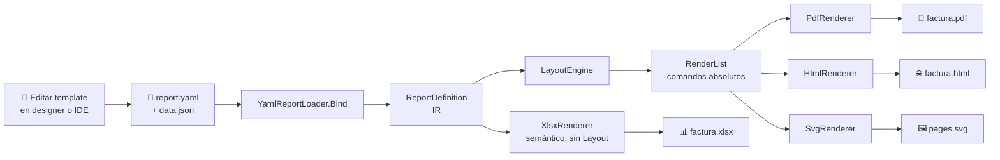

<div align="center">

[🇺🇸 English](README.md) · **🇪🇸 Español**

# 🧾 NetReporter

**Motor de reportes para .NET 10 con IR — un mismo template produce PDF, HTML, SVG y XLSX.**

[](https://dotnet.microsoft.com/)
[](https://www.nuget.org/packages/NetReporter)
[](#-tests)
[](#-licencias)
[](#estado)

🎨 Designer visual · 📄 PDF · 🌐 HTML · 🖼️ SVG · 📊 XLSX · 📦 Templates YAML · 📈 Gráficos · 🧮 Expresiones

</div>

---

## 🎬 NetReporter Designer


> El editor visual: paneles YAML/datos a la izquierda, un toolbox de elementos arrastrables y un preview SVG en vivo que refleja exactamente lo que producirán los renderers PDF/HTML/XLSX. Zoom de 25% a 400%, multi-selección, copiar/pegar, alinear, snap, nudge, undo/redo y export con un click — todo sin recompilar.

---

## 📚 Tabla de contenidos

1. [Novedades de la 1.1](#-novedades-de-la-11)
2. [Filosofía y arquitectura](#-filosofía-y-arquitectura)
3. [Características](#-características)
4. [Pipeline visual](#-pipeline-visual)
5. [Stack tecnológico](#-stack-tecnológico)
6. [Estructura del repo](#-estructura-del-repo)
7. [Quick start](#-quick-start)
8. [Designer visual](#-designer-visual)
9. [Sintaxis del template YAML](#-sintaxis-del-template-yaml)
10. [Expresiones (DSL)](#-expresiones-dsl)
11. [Gráficos](#-gráficos)
12. [Renderers disponibles](#-renderers-disponibles)
13. [Tamaños de papel](#-tamaños-de-papel)
14. [Tests](#-tests)
15. [Limitaciones conocidas](#-limitaciones-conocidas)
16. [Completado](#-completado)
17. [Roadmap](#-roadmap)
18. [Licencias](#-licencias)

---

## 🆕 Novedades de la 1.1

La versión **1.1.0** entrega todo el roadmap de la 1.0:

| Feature | Dónde |
|---|---|
| 🧮 **DSL de expresiones** — `{{ $.cantidad * $.precio : N2 }}`, `if()`, `sum($.lineas[*].total)`, ternarios, más de 40 funciones | [Expresiones](#-expresiones-dsl) |
| 🗂️ **Grupos multinivel** — `groups:` con encabezado/pie propio por nivel, fila `summary:` de total general, agregados `min`/`max` | [Tablas agrupadas](#tablas-agrupadas-multinivel) |
| 🔒 **KeepTogether en DetailBand** — un bloque de detalle pasa entero a la página siguiente en vez de partirse | [Propiedades de banda](#propiedades-de-banda) |
| 📈 **Gráficos** — `bar`, `horizontalBar`, `line`, `area`, `pie`, `donut`, totalmente vectoriales en PDF/SVG/HTML | [Gráficos](#-gráficos) |
| 🖱️ **Multi-selección + copiar/pegar en el Designer** — Shift+clic, selección por marco, Ctrl+A, mover/nudge en grupo, alinear, Ctrl+C/X/V/D | [Designer visual](#-designer-visual) |
| 🖼️ **Pickers del Designer** para imágenes (subir → embebida), barcodes y gráficos, más sugerencias de bindings desde `data.json` | [Designer visual](#-designer-visual) |
| 👁️ **Condiciones `visible:`** en elementos y bandas, **`style:` dinámico** por elemento | [Expresiones](#-expresiones-dsl) |

Cuatro plantillas nuevas muestran cada feature: `sales-dashboard`, `nested-groups`, `account-statement` y `contracts-keep-together`.


### ⚠️ Cambios de comportamiento en la 1.1

Los templates existentes siguen funcionando, pero algunas correcciones cambian la salida. Revísalas antes de actualizar un template en producción:

1. **Ahora se respetan `wordWrap:` / `autoHeight:` en elementos de texto.** La 1.0 los ignoraba en silencio en el YAML (el texto siempre hacía wrap y nunca crecía), así que un texto con `autoHeight: true` puede ocupar ahora más líneas.
2. **El `bounds.y` de una tabla es un desplazamiento** desde la posición actual del flujo (el tope de la banda o la tabla anterior). La 1.0 lo ignoraba — y arrastrar una tabla verticalmente en el Designer cambiaba el YAML sin mover el preview. Los templates con `y: 0` no cambian.
3. **Los page headers se arman después de paginar**, igual que los page footers: `{{ pageNumber }}` / `{{ totalPages }}` también se resuelven en el encabezado de página, y `{{ pageNumber }}` en el cuerpo da la página real (la 1.0 imprimía `0`).
4. **Las bandas Detail sin tablas nunca se parten**: si no caben, pasan a la página siguiente (la 1.0 las dibujaba encima del page footer).
5. **Un encabezado de grupo nunca queda huérfano** al pie de la página: se mueve junto con su primera fila.
6. **`{{ $.path:formato }}` usa la `culture:` del reporte** (la 1.0 usaba la cultura de la máquina).
7. **Los acentos de las mayúsculas (Á, Í, Ó, Ñ…) ya no se recortan** por el clip de texto del SVG/PDF — la 1.0 imprimía "MARÍA" como "MARIA".
8. **`title:` resuelve template strings** (`"Ventas {{ $.anio }}"`), igual que `fileName:`.
9. **Designer:** redimensionar un elemento o editar X/Y en el drawer de propiedades ahora escribe bounds relativos a la banda; la 1.0 escribía coordenadas de página y el elemento saltaba el ancho del margen.
10. Los errores de template strings lanzan `DslSyntaxException`, que deriva de `FormatException` (los `catch (FormatException)` existentes siguen funcionando) e indica la posición del error.

---

## 💡 Filosofía y arquitectura

NetReporter separa el reporte en cuatro capas con interfaces claras. **El template no sabe del formato de salida**: se describe una vez, se renderiza N veces.

```
┌────────────────────────────────────┐
│  📝 Template (YAML / API C#)       │  Definición declarativa
└────────────────────────────────────┘
                ▼
┌────────────────────────────────────┐
│  🧠 IR (ReportDefinition)          │  Modelo en memoria
└────────────────────────────────────┘
                ▼
┌────────────────────────────────────┐
│  📐 LayoutEngine                   │  Measure + arrange + paginación
└────────────────────────────────────┘
                ▼
┌────────────────────────────────────┐
│  📋 RenderList                     │  Comandos de dibujo absolutos
│  · DrawTextCommand                 │  (un solo IR para todos los outputs)
│  · DrawLineCommand                 │
│  · DrawRectangleCommand            │
│  · DrawImageCommand                │
│  · DrawPathCommand  (gráficos)     │
└────────────────────────────────────┘
                ▼
   ┌───────────┬───────────┬──────────┐
   ▼           ▼           ▼           ▼
 ┌─────┐   ┌──────┐   ┌──────┐   ┌─────────┐
 │ 📄  │   │  🌐  │   │  🖼️  │   │  📊     │
 │ PDF │   │ HTML │   │ SVG  │   │ XLSX *  │
 └─────┘   └──────┘   └──────┘   └─────────┘

 * XLSX es semántico: consume ReportDefinition directo (texto → celdas,
   tablas → rangos Excel reales con filtros/sort), saltándose el RenderList.
```

**Principios no negociables:**

| Principio | Implementación |
|---|---|
| 🚫 **Sin reflection** en hot paths | Data binding con `Func<TRow,TValue>` tipados; expresiones con `Func<IEvaluationContext,T>`; las tablas despachan su tipo de fila con un visitor (`ITableVisitor<T>`) |
| 🎨 **Sin CSS / Tailwind para reportes** | Styling nativo con `StyleSheet` + `StyleRef` (struct zero-alloc) y herencia con `BasedOn` |
| 🧪 **QuestPDF solo como contenedor** | Todo el dibujo PDF pasa por SkiaSharp → SVG → `container.Svg(...)` |
| 🔄 **Mismo IR, múltiples outputs** | El `RenderList` se calcula una vez y N renderers lo consumen |
| 📦 **Templates editables sin recompilar** | YAML + JSON enlazados con JSON Path — y, desde la 1.1, también la lógica (DSL de expresiones compilado una vez a delegates) |

---

## ✨ Características

### Engine
- ⚡ **Pipeline IR** — un template, múltiples salidas
- 📐 **Layout engine** con paginación, repetición de headers de tabla, bandas (Report/Page Header/Footer + Detail)
- 📝 **Word wrap real** + auto-height — el texto se rompe naturalmente, las bandas crecen para acomodar el contenido
- 🔒 **KeepTogether** — los bloques atómicos no se parten entre páginas, **incluidas las bandas Detail con tablas** (medidas con un layout en seco)
- 🗂️ **Tablas agrupadas multinivel** — `groups:` (región → categoría → …), encabezado/pie por nivel, total general `summary:`, `sum`/`count`/`avg`/`min`/`max`
- 📈 **Gráficos** — barras, barras horizontales, líneas, área, pastel y dona, dibujados como primitivas vectoriales
- 🧮 **DSL de expresiones** — aritmética, comparaciones, ternarios, `if()`, funciones de texto/números/fechas/agregados; se compila una vez y se evalúa como cadena de delegates
- 👁️ **Visibilidad condicional** (`visible:`) en elementos y bandas, **estilos dinámicos** (`style: "{{ … }}"`)
- 🖼️ **Imágenes embebidas** (PNG/JPEG/GIF/WebP) — source por path, data URI o template; una imagen faltante se omite en lugar de hacer fallar el reporte
- ▦ **Barcodes y QR vectoriales** — QR / Code 128 / Code 39 / EAN-13 (vía ZXing, opt-in)
- 🎨 **StyleSheet con herencia** — cadena `BasedOn` con detección de ciclos y caché, más temas con nombre que se pasan al enlazar
- 🔢 **Cultura por reporte** — formato de números/fechas localizado (probado con `es-HN`)
- 📋 **Tablas tipadas** — `TableElement<TRow>` con columnas tipadas, alineación, formato y estilo por columna, y columnas calculadas (`binding: "= $.cantidad * $.precio"`)
- 🗂️ **Estilos de tabla** — borde exterior con esquinas redondeadas ("tarjeta"), regla bajo el header, separadores de fila, estilos por tipo de fila (sección / subtotal / total), fondos de fila completa, tablas lado a lado
- ⬜ **Rectángulos redondeados** — `cornerRadius` con control por esquina (`top`, `bottom`, `topLeft`, …) para apilar bandas como una sola tarjeta

### Templates YAML
- 📝 **Schema declarativo** — page, styles, bands, elements
- 🔗 **JSON Path bindings** — `$.cliente.nombre`, `$.lineas[*]`, `$.lineas[*].total` (proyección), `$$.raiz` (la raíz del documento desde dentro de una tabla)
- 🪝 **Template strings** — `{{ pageNumber }}`, `{{ totalPages }}`, `{{ $.titulo }}`, `{{ $.total:N2 }}`, `{{ #group }}`, `{{ #count }}`, y cualquier expresión: `{{ $.total * 1.15 : N2 }}`
- 📁 **FileName y title con templates** — `fileName: "factura-{{ $.numero }}"` resuelto al exportar
- 🎯 **Multi-formato** — Letter, Legal, A3-A6, B4-B5, Tabloid, custom (paperoll 80mm/58mm)

### Designer visual web
- 🖱️ **Drag-and-drop** sobre el preview SVG (mover y crear elementos) — toolbox con Text, Line, Rect, Table, **Image, Barcode, Chart**
- 🧺 **Multi-selección** — Shift/Cmd+clic, selección por marco (rubber band), Ctrl+A; mover, nudge, alinear (izquierda/centro/derecha/arriba/medio/abajo), duplicar y borrar en grupo
- 📋 **Copiar / cortar / pegar** — Ctrl+C / X / V, también entre templates (el portapapeles persiste en `localStorage`)
- 🖼️ **Pickers** — subir una imagen (embebida como data URI), formato/valor/colores del barcode, tipo/filas/categoría/editor de series del gráfico, condición `visible:`
- 💡 **Sugerencias de bindings** — paths descubiertos en `data.json` (arrays para `rows`, campos de fila para columnas/categorías/series)
- 🎯 **Resize handles** (8 direcciones) con snap a 5pt con Shift
- ⌨️ **Keyboard nudge** — flechas mueven 1pt, Shift+flechas 10pt
- 🔍 **Zoom in/out** — 25%–400% por pasos, ajustar al ancho, persistido entre recargas
- 📋 **CRUD completo** sobre elementos, bandas y columnas de tabla
- 💾 **Save/Load** templates a `~/.netreporter/templates/`
- 📦 **14 samples builtin** + **importar archivo** desde disco
- ↶ **Undo/Redo** (50 niveles, Ctrl+Z / Ctrl+Shift+Z)
- 📥 **Export a PDF, HTML y XLSX** con un click

### Renderers
- 📄 **PDF** vía QuestPDF + SkiaSharp (Letter, A4, Legal, custom)
- 🌐 **HTML** paginado con `@page` CSS — imprimible nativo, gráficos como SVG inline, barra de zoom flotante opcional
- 🖼️ **SVG** vectorial — uno por página
- 📊 **XLSX** semántico vía ClosedXML — texto → celdas, tablas → Excel Tables nativas (filtros, sort, banded rows), tablas agrupadas → outline de Excel, gráficos → tablas de datos

---

## 🔄 Pipeline visual

### Flujo de uso end-to-end


```mermaid
flowchart LR
    A[📝 Editar template<br/>en designer o IDE] --> B[💾 report.yaml<br/>+ data.json]
    B --> C[YamlReportLoader.Bind]
    C --> D[ReportDefinition<br/>IR]
    D --> E[LayoutEngine]
    E --> F[RenderList<br/>comandos absolutos]
    F --> G1[PdfRenderer]
    F --> G2[HtmlRenderer]
    F --> G3[SvgRenderer]
    D --> G4[XlsxRenderer<br/>semántico, sin Layout]
    G1 --> H1[📄 factura.pdf]
    G2 --> H2[🌐 factura.html]
    G3 --> H3[🖼️ pages.svg]
    G4 --> H4[📊 factura.xlsx]
```

### Flujo de edición en el designer

```mermaid
flowchart TB
    A[Click en preview] -->|selecciona| B[Drawer<br/>Propiedades]
    A -->|Shift+clic / marco| S[Multi-selección]
    A -->|drag| C[Mover elemento(s)]
    A -->|resize handle| D[Cambiar bounds]
    A -->|Del| E[Eliminar]
    A -->|Ctrl+C / Ctrl+V| P[Copiar / Pegar]

    G[Toolbox] -->|drag a banda| H[Crear elemento]

    B -->|edit campo| I[POST /Home/Update]
    C -->|drop| J[POST /Home/MoveMany]
    S -->|alinear| J
    D -->|drop| I
    E --> K[POST /Home/DeleteMany]
    P --> L[POST /Home/Copy + /Home/Paste]
    H --> M[POST /Home/Add]

    I --> N[YamlReportRewriter]
    J --> N
    K --> N
    L --> N
    M --> N
    N --> O[YAML actualizado]
    O --> Q[LayoutEngine + SvgRenderer]
    Q --> R[Preview re-render]
```

---

## 🛠️ Stack tecnológico

| Capa | Tecnología | Notas |
|---|---|---|
| Runtime | **.NET 10** | `LangVersion: latest`, `Nullable: enable`, `TreatWarningsAsErrors: true` |
| Layout & IR | C# puro | Sin dependencias externas |
| Expresiones | C# puro | Lexer propio + parser de descenso recursivo → cadena de delegates (sin Roslyn, sin `eval`) |
| YAML parser | **YamlDotNet** 18.1 | CamelCase naming, ignore unmatched, default values handling |
| PDF backend | **QuestPDF** 2026.9 | Solo como contenedor; el dibujo va por SkiaSharp |
| 2D drawing | **SkiaSharp** 4.152 | `SKSvgCanvas` para emitir SVG; binarios nativos de Linux vía `SkiaSharp.NativeAssets.Linux` |
| Web UI | **ASP.NET Core MVC** (.NET 10) | Designer interactivo |
| Frontend interactivo | **Alpine.js** 3.14 (CDN) | State + reactivity sin build pipeline |
| Network reactividad | **HTMX** 2.0 (CDN) | Live preview con debounce |
| CSS | **Tailwind CSS** (CDN play) | Utility-first |
| Barcodes (opt-in) | **ZXing.Net** 0.16.11 | Apache 2.0 · QR / Code128 / Code39 / EAN-13 |
| XLSX backend | **ClosedXML** 0.105 | MIT · OpenXML, Excel Tables nativas |
| Tests | **xUnit** 2.9 | 365 tests en 6 proyectos |
| JSON | `System.Text.Json` (BCL) | Sin Newtonsoft |

---

## 📁 Estructura del repo

```
NetReporter/
├── 📦 src/
│   ├── NetReporter.Core/        🧠 IR, Primitives, Styles, Layout (+ ChartLayout), RenderList
│   ├── NetReporter.Templates/   📝 YAML loader/rewriter, JSON Path, template strings, DSL de expresiones
│   ├── NetReporter.Pdf/         📄 PdfRenderer (delega a Svg)
│   ├── NetReporter.Svg/         🖼️ SvgRenderer (SkiaSharp.SKSvgCanvas)
│   ├── NetReporter.Html/        🌐 HtmlRenderer (HTML/CSS paginado)
│   ├── NetReporter.Xlsx/        📊 XlsxRenderer semántico (ClosedXML, Excel Tables nativas)
│   ├── NetReporter.Barcodes/    ▦ Generador de barcode/QR vía ZXing (opt-in)
│   └── NetReporter/             📦 Meta-package que referencia todos los anteriores
│
├── 🧪 tests/
│   ├── NetReporter.Core.Tests/        Primitives, estilos, word wrap, auto-height, KeepTogether (report + detail), tablas agrupadas/anidadas/multipágina, estilos de tabla, gráficos, visibilidad
│   ├── NetReporter.Templates.Tests/   JSON Path, template strings, DSL de expresiones, loader YAML (schema 1.1), rewriter (simple + multi-elemento + clipboard), file names
│   ├── NetReporter.Html.Tests/        HtmlRendererTests
│   ├── NetReporter.Svg.Tests/         SvgRendererTests
│   ├── NetReporter.Xlsx.Tests/        XlsxRendererTests
│   └── NetReporter.Barcodes.Tests/    ZXingBarcodeGeneratorTests
│
├── 🛠️ tools/
│   └── NetReporter.Designer/    🎨 ASP.NET Core MVC + Alpine + HTMX + Tailwind
│
└── 🎯 samples/
    ├── InvoiceSample/           Factura con API C# (sin YAML)
    └── TemplateSample/          Demo con YAML (13 templates exportados por Program.cs)
        ├── report.yaml                   Reporte de clientes
        ├── invoice-laser.yaml            📄 Factura Letter (laser)
        ├── invoice-paperoll.yaml         🧾 Factura 80mm (POS térmico)
        ├── wrap-demo.yaml                Word-wrap + auto-height
        ├── grouped-invoice.yaml          groupBy + subtotales sum/count/avg
        ├── invoice-with-qr.yaml          Logo + QR del CAI
        ├── barcodes-demo.yaml            Los 4 formatos de barcode
        ├── keep-together-demo.yaml       Demo de KeepTogether con page-break
        ├── invoice-complete.yaml         🚀 Flagship — todas las features Fase 1-4
        ├── sales-dashboard.yaml          📈 1.1 — KPIs con expresiones + 5 tipos de gráfico
        ├── nested-groups.yaml            🗂️ 1.1 — grupos región → categoría + total general
        ├── account-statement.yaml        🧮 1.1 — expresiones, visible, estilos dinámicos
        ├── contracts-keep-together.yaml  🔒 1.1 — KeepTogether en bandas Detail
        ├── invoice-complete-pastel.yaml  Variante con paleta pastel del flagship (solo Designer)
        └── invoice-with-qr-embedded.yaml Copia de invoice-with-qr para el Designer (logo como data URI)
```

---

## 🚀 Quick start

### Requisitos

- ✅ .NET 10 SDK (probado con `10.0.103`)
- ✅ macOS / Linux / Windows
- 🐧 En Linux, SkiaSharp y QuestPDF necesitan `libfontconfig1` en el host (`apt-get install libfontconfig1`)
- ⚠️ Licencia QuestPDF Community para uso personal/empresas <1M USD/año

### Instalar desde NuGet

```bash
dotnet add package NetReporter   # meta-package: Core + Templates + todos los renderers + Barcodes
```

O referenciar solo las piezas que necesites:

| Paquete | Contenido |
|---|---|
| `NetReporter.Core` | IR, estilos, layout engine, gráficos, RenderList |
| `NetReporter.Templates` | Templates YAML, bindings JSON Path, template strings, DSL de expresiones |
| `NetReporter.Pdf` | Renderer PDF (host QuestPDF) |
| `NetReporter.Svg` | Renderer SVG (SkiaSharp) |
| `NetReporter.Html` | Renderer HTML/CSS paginado |
| `NetReporter.Xlsx` | Renderer XLSX semántico (ClosedXML) |
| `NetReporter.Barcodes` | QR / Code 128 / Code 39 / EAN-13 (ZXing.Net) |

Todos los paquetes comparten una misma versión. Cada push a `main` publica una nueva versión **patch** mediante
[`.github/workflows/publish.yml`](.github/workflows/publish.yml); incluye `[minor]` o `[major]` en el mensaje
del commit para subir esa parte en su lugar. Cada release queda etiquetado como `vX.Y.Z` en GitHub. (La release
1.1.0 = el primer push después de `v1.0.3` cuyo mensaje de commit contenga `[minor]`.)

### Compilar desde el código fuente

```bash
git clone https://github.com/mchinchilla/NetReporter.git
cd NetReporter
dotnet build
```

### Render desde código (API C#)

```csharp
using NetReporter.Core.Bands;
using NetReporter.Core.Definition;
using NetReporter.Core.Elements;
using NetReporter.Core.Expressions;
using NetReporter.Core.Layout;
using NetReporter.Core.Primitives;
using NetReporter.Core.Styles;
using NetReporter.Pdf;

QuestPDF.Settings.License = QuestPDF.Infrastructure.LicenseType.Community;

var styles = new StyleSheetBuilder()
    .Add("Default", s => s.FontFamily("Helvetica").FontSize(12))
    .Add("Title",   s => s.BasedOn("Default").FontSize(24).Bold())
    .Build();

var page = PageSetup.Letter.WithMargins(new Thickness(Units.Cm(2)));

var report = new ReportDefinition
{
    Name = "Hola",
    Page = page,
    Styles = styles,
    Bands = new Band[]
    {
        new ReportHeaderBand
        {
            Height = 60,
            Elements = new ReportElement[]
            {
                new TextElement
                {
                    Bounds = new Rect(0, 0, page.ContentWidth, 30),
                    Content = Expr.Str("Hola NetReporter"),
                    Style = new StyleRef("Title")
                }
            }
        }
    }
};

var pdf = new PdfRenderer().Render(new LayoutEngine().Layout(report));
File.WriteAllBytes("hola.pdf", pdf);
```

### Render desde template YAML

```csharp
using NetReporter.Core.Layout;
using NetReporter.Pdf;
using NetReporter.Templates;

QuestPDF.Settings.License = QuestPDF.Infrastructure.LicenseType.Community;

var template = YamlReportLoader.Load("invoice-laser.yaml");
var json = File.ReadAllText("invoice-data.json");
var report = template.Bind(json);

var layout = new LayoutEngine().Layout(report);
File.WriteAllBytes("factura.pdf", new PdfRenderer().Render(layout));
File.WriteAllText("factura.html", new NetReporter.Html.HtmlRenderer().Render(layout));

// XLSX es semántico: consume el ReportDefinition directo (no el layout)
File.WriteAllBytes("factura.xlsx", new NetReporter.Xlsx.XlsxRenderer().Render(report));
```

### Correr los samples

```bash
# Sample con C# imperativo
dotnet run --project samples/InvoiceSample
# → samples/InvoiceSample/bin/Debug/net10.0/factura.pdf

# Sample con YAML — emite PDF + XLSX por cada template (13 reportes × 2 outputs)
dotnet run --project samples/TemplateSample
# → samples/TemplateSample/bin/Debug/net10.0/*.pdf y *.xlsx

# Designer visual (navegador)
dotnet run --project tools/NetReporter.Designer
# → http://localhost:5296
```

---

## 🎨 Designer visual


### Lanzar

```bash
dotnet run --project tools/NetReporter.Designer
```

Abre `http://localhost:5296`.

### Layout

El designer es una app web de tres paneles (visible en la captura de arriba):

- **Izquierda** — editor con tabs para `report.yaml` y `data.json`. Las ediciones hacen debounce y re-renderizan el preview.
- **Centro** — el **Toolbox** (arrastra `Text` / `Line` / `Rect` / `Table` / `Image` / `Code` / `Chart` a una banda) y la lista de **Bandas** con controles para reordenar/eliminar.
- **Derecha** — **preview SVG** en vivo de la página renderizada, con controles de zoom (`−` / `+` / `1:1` / `↔`) y paginación. Click en cualquier elemento para seleccionarlo; un drawer de propiedades se desliza desde el borde derecho. Con varios elementos seleccionados, el drawer cambia a **selección múltiple** (lista, alinear, copiar, duplicar, borrar).

La barra superior expone las acciones globales: selector de template, **Importar**, **Save** / **Save as** / **Delete**, **Undo** / **Redo**, y export con un click a **PDF** / **HTML** / **XLSX**.

### Drawer de propiedades por elemento

| Elemento | Editable en el drawer |
|---|---|
| Todos | Bounds (pt relativos a la banda), **Visible si…** (expresión) |
| `text` | Estilo, contenido (template strings + expresiones) |
| `line` | Color, grosor |
| `rectangle` | Estilo, fill, radio de esquinas |
| `table` | Path de filas, alturas de header/fila, header mode, estilos de header/fila/alterna, editor de columnas inline (el binding acepta `= expr`) |
| `image` | **Elegir imagen…** (subir → data URI embebido, advierte arriba de 2 MB), source por path o template, ajuste |
| `barcode` | Formato (QR / Code 128 / Code 39 / EAN-13), valor (texto o template), colores de primer plano/fondo |
| `chart` | Estilo, tipo, leyenda, título, path de filas, categoría, valores/porcentaje/apilado, formato de valores, **editor de series** (nombre, color, binding del valor) |

Los campos de path sugieren bindings descubiertos en `data.json`: paths de arrays para `rows`, y los campos de la primera fila para columnas, categorías y series.

### Atajos de teclado

| Acción | Shortcut |
|---|---|
| Mover elemento | Click + drag |
| Mover con snap | Shift + drag |
| Redimensionar | Drag de handle (8 direcciones) |
| Agregar / quitar de la selección | `Shift` / `Cmd` / `Ctrl` + clic |
| Selección por marco | Arrastrar sobre un área vacía de la página (Shift suma a la selección) |
| Seleccionar todo | `Ctrl+A` / `Cmd+A` |
| Limpiar selección | `Esc` |
| Nudge 1pt | `← ↑ → ↓` (mueve toda la selección) |
| Nudge 10pt | `Shift + ← ↑ → ↓` |
| Eliminar | `Del` o `Backspace` |
| Duplicar | `Ctrl+D` / `Cmd+D` |
| Copiar / Cortar / Pegar | `Ctrl+C` / `Ctrl+X` / `Ctrl+V` (pega en la banda del elemento seleccionado, o vuelve a las bandas originales) |
| Undo | `Ctrl+Z` / `Cmd+Z` |
| Redo | `Ctrl+Shift+Z` / `Ctrl+Y` |
| Zoom in | `Ctrl/Cmd + +` (o `=`) |
| Zoom out | `Ctrl/Cmd + -` |
| Zoom 100% | `Ctrl/Cmd + 0` |

### Samples builtin (dropdown 📦 Samples)

| Sample | Demuestra |
|---|---|
| `clientes` | Reporte tabular básico con header, tabla, page footer |
| `invoice-laser` | Factura completa Letter con bloque de totales |
| `invoice-paperoll` | Recibo continuo 80mm (impresora térmica POS) |
| `wrap-demo` | Word wrap real + auto-height de bandas |
| `grouped-invoice` | `groupBy` con headers por grupo y subtotales `Sum`/`Count`/`Avg` |
| `invoice-with-qr` | Logo PNG embebido + QR vectorial del CAI |
| `barcodes-demo` | Los 4 formatos de barcode soportados (QR / Code128 / Code39 / EAN-13) en una sola página |
| `keep-together` | `keepTogether` forzando page break limpio en un bloque "Términos & firmas" |
| `invoice-complete` | 🚀 **Flagship** — todas las features Fase 1-4 combinadas: logo, word-wrap, autoHeight, tabla agrupada, QR, barcode, KeepTogether, cultura es-HN, fileName con template (el de la captura de arriba) |
| `invoice-complete-pastel` | La misma factura flagship con una paleta pastel clara (header de tabla claro, filas de grupo y cajas con tinte) |
| `sales-dashboard` | 📈 Tarjetas KPI calculadas con expresiones (verde/rojo con estilo dinámico), gráficos de barras agrupadas, líneas, dona, pastel y barras horizontales, tabla mensual con columnas calculadas y resumen |
| `nested-groups` | 🗂️ Grupos de dos niveles (región → categoría) con `group(0)`, pies con `min`/`max`/`avg` y un total general `summary` que abarca dos páginas |
| `account-statement` | 🧮 Expresiones por todas partes: `upper`, `padLeft`, formatos de fecha, ternarios, columnas `= expr`, bloques de aviso/promoción con `visible:`, color de saldo dinámico |
| `contracts-keep-together` | 🔒 Una banda Detail por cliente (tarjeta + tabla) con `keepTogether: true`: los bloques pasan enteros a la página siguiente |

### Flujo típico

1. **Abrir un sample** → `📦 Samples / invoice-with-qr`.
2. **Editar** datos de prueba en el tab `data.json`.
3. **Drag** un texto, **resize** una tabla, **agregar columnas** desde el drawer, **soltar un gráfico** desde el toolbox y elegir sus filas/series.
4. **Save as…** con un nombre propio → se guarda en `~/.netreporter/templates/`.
5. **⭳ PDF**, **⭳ HTML** o **⭳ XLSX** → descarga con el `fileName` del template (e.g. `factura-000-001.pdf`).

### Importar archivos del disco

`↥ Importar` abre un file picker que acepta `.yaml`, `.yml`, `.json`. Selección múltiple (yaml + json a la vez). Detecta automáticamente cuál es cuál por extensión.

### Controles de zoom

La barra del preview tiene botones `−` / `+` / `1:1` / `↔`. Los pasos son `25 · 50 · 75 · 100 · 125 · 150 · 200 · 300 · 400 %`. El botón `↔` ajusta el ancho de página al área disponible del preview. El nivel elegido se persiste en `localStorage`, así que recargar el designer lo mantiene. Las coordenadas de drag/resize se compensan por el zoom actual — mover un elemento al 200% sigue moviéndolo pt-a-pt en el YAML.

> Nota de implementación: el preview se escala con `transform: scale(var(--zoom))`, no con la propiedad CSS `zoom`. `zoom` mete el contenido escalado en el cálculo de layout de flexbox, haciendo que el panel del preview invada el editor YAML / toolbox. Los flex items del chain del preview llevan `min-w-0` para que el `overflow-auto` del contenedor sí recorte el contenido escalado en vez de dejarlo crecer al panel.

---

## 📝 Sintaxis del template YAML

### Esqueleto mínimo

```yaml
name: MiReporte
title: "Reporte {{ $.titulo }}"
fileName: "reporte-{{ $.id }}"      # opcional, soporta template strings

page:
  size: Letter                       # Letter | Legal | A3-A6 | B4-B5 | Tabloid | custom
  orientation: Portrait              # Portrait | Landscape
  margins:                           # all | horizontal + vertical | left/top/right/bottom
    horizontal: 1.5cm
    vertical: 1.8cm

culture: es-HN                       # cultura para formato de números/fechas

styles:                              # o `theme: <nombre>` — ver "Estilos y temas" abajo
  Default:
    fontFamily: Helvetica
    fontSize: 10
    foreground: "#0F172A"
  Title:
    basedOn: Default
    fontSize: 18
    bold: true

bands:
  - kind: ReportHeader               # ReportHeader | PageHeader | Detail | PageFooter | ReportFooter
    height: 60
    elements:
      - type: text                   # text | line | rectangle | table | image | barcode | chart
        bounds: { x: 0, y: 0, width: 500, height: 24 }
        content: "{{ $.titulo }}"
        style: Title
```

### Elementos disponibles

| Tipo | Campos clave |
|---|---|
| `text` | `content` (template), `style`, `wordWrap`, `autoHeight` |
| `line` | `orientation` (horizontal/vertical), `color`, `thickness` |
| `rectangle` | `fill`, `borderLine: { thickness, color }`, `cornerRadius`, `roundedCorners` |
| `table` | `rows` (JSON Path), `columns[]`, `headerStyle`, `rowStyle`, `alternateRowStyle`, `headerHeight`, `rowHeight`, `headerMode`, `groupBy`, `groupHeader`, `groupFooter`, `groups`, `summary`, `headerRule`, `rowSeparator`, `rowStyleBinding`, `rowStyleMap`, `fullRowBackground`, `outerBorder`, `cornerRadius`, `suppressAdvance` |
| `image` | `source` (path local, `data:image/png;base64,...` o template como `{{ $.logo }}`), `fit` (contain/fill) |
| `barcode` | `value` (template), `format` (qr/code128/code39/ean13), `barcodeForeground`, `barcodeBackground` |
| `chart` | `chartType`, `rows`, `category`, `series[]`, `title`, `legend`, `showValues`, `showPercent`, `stacked`, `valueFormat`, `axisMin`/`axisMax`, `palette`, `innerRadius`, `lineWidth`, `showGrid`, `showMarkers`, `fill`, `borderLine` — ver [Gráficos](#-gráficos) |

Todos los elementos aceptan además `bounds: { x, y, width, height }`, un `style` opcional (un nombre, o un template que devuelve un nombre — ver [estilos dinámicos](#estilos-dinamicos)) y una condición `visible:` opcional.

### Estilos y temas

| Propiedad de estilo | Valores |
|---|---|
| `basedOn` | Nombre del estilo padre (cadena de herencia, máx. 16 niveles, ciclos rechazados) |
| `fontFamily`, `fontSize` | Nombre de fuente, tamaño en pt |
| `bold`, `italic` | `true` / `false` |
| `foreground`, `background` | Color hex (`"#0F172A"`) |
| `align` / `vAlign` | `left` · `center` · `right` · `justify` / `top` · `center` · `bottom` |
| `padding` | Misma forma que los márgenes de página (`all`, `horizontal`/`vertical`, o por lado) |
| `border` | `all`, `horizontalEdges`, o `top`/`bottom`/`left`/`right`, cada uno `{ thickness, color }` |
| `format` | Format string de .NET aplicado a los valores (`N2`, `C`, `yyyy-MM-dd`, …) |

En lugar de `styles` inline, un template puede referenciar un tema compartido con `theme: Corporativo`. Los temas son `StyleSheet`s que se pasan al enlazar — un nombre de tema desconocido lanza excepción:

```csharp
var report = template.Bind(json, new Dictionary<string, StyleSheet> { ["Corporativo"] = estilosCorporativos });
```

Si un template no tiene ni `styles` ni `theme`, se usa `StyleSheet.Minimal`.

### Propiedades de banda

| Propiedad | Efecto |
|---|---|
| `height` | Altura mínima reservada (pt) |
| `autoHeight: true` | La banda crece para acomodar su contenido (max con `height`) |
| `keepTogether: true` | Si la banda no cabe en la página actual, page break antes de emitirla. La altura se **mide con un layout en seco** (texto con auto-height y tablas incluidos), así que también funciona en **bandas Detail con tablas**. Una banda más alta que una página completa se emite normal (sin página vacía). |
| `visible` | Condición (expresión); si es falsa la banda se omite. Las condiciones de page header/footer pueden usar `pageNumber` / `totalPages`. |
| `printOnFirstPage` / `printOnLastPage` | Page header/footer: en `false` se omite en la primera / última página |

Las bandas Detail **sin** tablas nunca se parten: sus elementos se posicionan relativos al tope de la banda, así que una banda que no cabe pasa entera a la página siguiente, con o sin `keepTogether`.

```yaml
- kind: Detail
  height: 0
  autoHeight: true
  keepTogether: true              # toda la tarjeta (encabezado + tabla + total) se mueve como un bloque
  elements:
    - { type: rectangle, bounds: { x: 0, y: 0, width: 527, height: 30 }, fill: "#4338CA", cornerRadius: 8, roundedCorners: top }
    - { type: text, bounds: { x: 10, y: 9, width: 360, height: 14 }, content: "{{ $.clientes[0].nombre }}" }
    - type: table
      bounds: { x: 0, y: 30, width: 527, height: 0 }   # y = desplazamiento bajo el encabezado de la tarjeta
      rows: "$.clientes[0].servicios"
      columns: [...]
```

### Tabla con columnas

```yaml
- type: table
  bounds: { x: 0, y: 0, width: 527, height: 0 }
  rows: "$.lineas"
  headerStyle: TableHeader
  rowStyle: TableRow
  alternateRowStyle: TableRowAlt
  headerMode: RepeatOnPageBreak       # PrintOnce | RepeatOnPageBreak
  headerHeight: 22
  rowHeight: 18
  columns:
    - { header: "Código",      binding: "$.codigo",                  width: 70,  align: left }
    - { header: "Descripción", binding: "$.descripcion",             width: 197, align: left }
    - { header: "Cant.",       binding: "$.cantidad",                width: 50,  align: right }
    - { header: "Precio",      binding: "$.precio",                  width: 75,  format: "N2", align: right }
    - { header: "Total",       binding: "= $.cantidad * $.precio",   width: 75,  format: "N2", align: right, style: Mono }
    - { header: "ISV",         binding: "= $.cantidad * $.precio * $$.tasaIsv", width: 60, format: "N2", align: right }
```

El `style` opcional de una columna se combina sobre el estilo de fila (p. ej. una fuente monoespaciada para códigos o montos). Un `binding` que empieza con `=` es una [expresión](#-expresiones-dsl) evaluada por fila: `$` es la fila, `$$` es la raíz de los datos.

La tabla empieza en la posición actual del flujo más `bounds.y` — úsalo para dejar espacio a un título arriba de la tabla dentro de la misma banda.

### Estilos de tabla

```yaml
- type: table
  rows: "$.cuentas"
  headerRule:   { thickness: 1,    color: "#0F172A" }   # una sola regla de ancho completo bajo el header, sin cajas por celda
  rowSeparator: { thickness: 0.25, color: "#CBD5E1" }   # línea fina bajo cada fila de datos ("libro rayado")
  outerBorder:  { thickness: 0.5,  color: "#94A3B8" }   # borde alrededor de toda la tabla (por segmento de página)
  cornerRadius: 6                                       # redondea el borde exterior como "tarjeta"

  rowStyleBinding: "$.tipo"                             # filas tipadas: elige un estilo por fila… (también "= expr")
  rowStyleMap:                                          # …de este mapa (claves desconocidas usan rowStyle)
    seccion:  SectionRow
    subtotal: SubtotalRow
    total:    TotalRow
  fullRowBackground: true                               # pinta el fondo de filas con estilo de borde a borde (sin costuras)

  suppressAdvance: true                                 # no mueve el cursor de la banda: la siguiente tabla empieza en la misma Y
  columns: [...]
```

`suppressAdvance` permite tablas lado a lado (p. ej. un balance en forma de T): da a cada tabla su propio `bounds.x`/`width`. El auto-height de la banda sigue creciendo para contenerla, pero una tabla con `suppressAdvance` debe caber en una página — no maneja la paginación.

### Rectángulos redondeados

```yaml
- type: rectangle
  bounds: { x: 0, y: 0, width: 527, height: 40 }
  fill: "#F1F5F9"
  borderLine: { thickness: 0.5, color: "#CBD5E1" }
  cornerRadius: 8
  roundedCorners: top            # all (default) | none | top | bottom | left | right
                                 # o una lista por comas: topLeft, topRight, bottomRight, bottomLeft
```

Redondear solo las esquinas `top` de una banda y las `bottom` de la siguiente hace que las bandas apiladas se lean como una sola tarjeta. Las esquinas redondeadas se dibujan en PDF, SVG y HTML.

### Imágenes y barcodes

```yaml
# Imagen embebida — path local o data URI inline
- type: image
  bounds: { x: 0, y: 0, width: 120, height: 60 }
  source: "logo.png"                            # o: data:image/png;base64,...
  fit: contain                                  # contain | fill

# QR vectorial (también: code128, code39, ean13)
- type: barcode
  bounds: { x: 0, y: 0, width: 90, height: 90 }
  value: "{{ $.cai }}"                          # template string evaluado
  format: qr
  barcodeForeground: "#0F172A"
  barcodeBackground: "#FFFFFF"
```

El `source` de una imagen también puede ser un template string (`"{{ $.logo }}"`). Si resuelve a vacío, a un archivo inexistente o a un data URI malformado, el elemento se omite en lugar de hacer fallar el reporte — útil para logos white-label opcionales.

Los barcodes se emiten como N `DrawRectangleCommand`s (uno por módulo oscuro) — totalmente **vectoriales**, escalan perfecto en PDF/SVG/HTML a cualquier zoom. Requiere referencia a `NetReporter.Barcodes` y pasar `ZXingBarcodeGenerator.Instance` al constructor del `LayoutEngine`:

```csharp
var layout = new LayoutEngine(SkiaTextMeasurer.Instance, ZXingBarcodeGenerator.Instance)
                 .Layout(report);
```

El Designer ya lo cablea — los barcodes funcionan out-of-the-box en preview/export.

### Tablas agrupadas (multinivel)

`groups:` agrupa filas consecutivas nivel por nivel (índice 0 = el más externo). Cada nivel tiene su propio encabezado y pie; `summary:` agrega una fila de total general después de todos los grupos:

```yaml
- type: table
  rows: "$.ventas"                                   # las filas deben venir ordenadas por región y luego categoría
  columns:
    - { header: "Producto", binding: "$.producto",              width: 207 }
    - { header: "Unidades", binding: "$.unidades",              width: 70, format: "N0", align: right }
    - { header: "Precio",   binding: "$.precio",                width: 80, format: "N2", align: right }
    - { header: "Total",    binding: "= $.unidades * $.precio", width: 95, format: "N2", align: right }
    - { header: "Margen",   binding: "$.margen",                width: 75, format: "N1", align: right }

  groups:
    - by: "$.region"                                 # JSON Path o "= expr"
      header: { height: 20, style: RegionHeader, content: "Región {{ #group }} · {{ #count }} productos" }
      footer:
        height: 18
        style: RegionFooter
        cells:                                       # paralelas a las columnas por índice
          - { content: "Total {{ #group }}" }
          - { aggregate: sum, format: "N0", align: right }
          - null                                     # vacía
          - { aggregate: sum, format: "N2", align: right }
          - { aggregate: avg, format: "N1", align: right }
    - by: "$.categoria"
      header: { height: 17, style: CategoryHeader, content: "{{ group(0) }} › {{ #group }} ({{ #count }})" }
      footer:
        height: 16
        cells: [ { content: "Subtotal {{ #group }}" }, { aggregate: sum }, { aggregate: min, format: "N2" }, { aggregate: sum, format: "N2" }, { aggregate: max } ]

  summary:                                           # total general sobre TODAS las filas (estilo por defecto: TableSummary)
    height: 22
    cells: [ { content: "TOTAL GENERAL · {{ #count }} líneas" }, { aggregate: sum, format: "N0" }, null, { aggregate: sum, format: "N2" } ]
```

- Agregadores: `sum` · `count` · `avg` · `min` · `max`. Cada celda del pie agrega el **binding de la columna en su mismo índice** (incluidas las columnas calculadas `= expr`) sobre las filas de su propio grupo. Conversión numérica segura desde `int`/`long`/`decimal`/`double`/`float`/strings parseables.
- En encabezados y pies: `{{ #group }}` = clave del nivel actual, `{{ #count }}` = filas del grupo, `{{ group(0) }}` = clave del nivel externo (`group(1)`, … para los más profundos). En `summary`, `#count` es el total de filas.
- El encabezado de grupo se mantiene con su primera fila (nunca queda huérfano al pie de la página); el header de la tabla se repite en cada página.
- En XLSX, las filas de detalle de cada grupo se agrupan en el **outline** de Excel (colapsables).
- El atajo de un nivel de la 1.0 sigue funcionando: `groupBy` + `groupHeader` + `groupFooter`.

> **Limitación:** las filas deben venir pre-ordenadas por las claves de grupo — los grupos son tramos consecutivos, no hay sort interno.

### Template strings

| Placeholder | Resuelve a |
|---|---|
| `{{ pageNumber }}` | Número de página actual |
| `{{ totalPages }}` | Total de páginas |
| `{{ rowIndex }}` | Índice de fila (en contexto de tabla) |
| `{{ $.path.to.field }}` | Valor del JSON Path |
| `{{ $.path.to.field:N2 }}` | Valor del JSON Path con un format string de .NET (números y fechas) |
| `{{ #group }}` | Clave del grupo actual (en contexto de group header/footer) |
| `{{ #count }}` | Cantidad de filas en el grupo actual |
| `{{ cualquier expresión : formato }}` | Resultado de una [expresión](#-expresiones-dsl), con formato opcional |

### Unidades

`pt`, `mm`, `cm`, `in` — el parser las reconoce: `1.5cm`, `15mm`, `1in`, `42pt`.

---

## 🧮 Expresiones (DSL)

Desde la 1.1 los templates pueden llevar lógica, no solo datos. Una expresión se parsea **una vez** al cargar el template (texto → árbol sintáctico → cadena de delegates) y luego se evalúa por página/fila sin volver a tocar el texto — sin reflection, sin Roslyn, sin código arbitrario: es un lenguaje cerrado. Los errores de sintaxis fallan al cargar, con la posición exacta (`DslSyntaxException`).

### Dónde se permiten expresiones

| Lugar | Ejemplo |
|---|---|
| Cualquier template string | `content: "Total: {{ sum($.lineas[*].total) * 1.15 : N2 }}"` |
| Binding de columna / grupo / categoría / serie (prefijo `=`) | `binding: "= $.cantidad * $.precio"` |
| `rowStyleBinding` | `rowStyleBinding: "= $.saldo < 0 ? 'negativo' : 'ok'"` |
| `visible:` en elementos y bandas (desnuda o en `{{ }}`) | `visible: "$.descuento > 0"` |
| `style:` dinámico (devuelve un nombre de estilo) | `style: "{{ $.saldo > 0 ? 'Deuda' : 'AlDia' }}"` |

### Sintaxis

| Tipo | Sintaxis |
|---|---|
| Literales | `12`, `3.5`, `'texto'` o `"texto"`, `true`, `false`, `null` |
| Paths | `$.cliente.nombre`, `$.lineas[0].total`, `$.lineas[-1].total` (el último), `$.lineas[*].total` (lista), `$$.empresa` (siempre la raíz de datos — útil dentro de tablas) |
| Contexto | `pageNumber`, `totalPages`, `rowIndex`, `rowNumber` (base 1), `#group`, `#count`, `#level` |
| Aritmética | `+ - * / %` (aritmética decimal; `+` concatena si un lado es texto; división entre cero → `null`) |
| Comparación | `== != < <= > >=` (números, fechas y texto; comparar con `null` da falso) |
| Lógica | `&&` / `and`, `\|\|` / `or`, `!` / `not`, `??` (coalescencia de null), `cond ? a : b` |
| Sufijo de formato | `{{ expr : N2 }}` — el último `:` de nivel superior (que no sea de un ternario) inicia un format string de .NET |

### Funciones

| Grupo | Funciones |
|---|---|
| Lógica | `if(cond, a, b)` (perezosa — solo evalúa la rama elegida), `iif`, `coalesce(a, b, …)`, `isNull(x)`, `isEmpty(x)` |
| Texto | `upper`, `lower`, `trim`, `len`, `substr(s, inicio[, largo])`, `left(s, n)`, `right(s, n)`, `replace(s, a, b)`, `contains(s, x)`, `startsWith`, `endsWith`, `concat(…)`, `padLeft(s, n[, c])`, `padRight`, `join(lista[, sep])` |
| Números | `round(x[, decimales])`, `floor`, `ceil`, `abs`, `min(…)`, `max(…)`, `number(x)` |
| Agregados | `sum(lista)`, `avg(lista)`, `count(lista)`, `min(lista)`, `max(lista)` — las listas vienen de paths con `[*]` |
| Fechas | `date(x[, formato])`, `now()`, `today()`, `year(d)`, `month(d)`, `day(d)`, `addDays(d, n)`, `addMonths(d, n)` |
| Formato | `format(x, 'N2')`, `text(x)` |
| Grupos | `group(n)` — clave del nivel de grupo *n* (0 = el más externo) |

```yaml
content: "{{ upper($.cliente.nombre) }} · cuenta {{ padLeft($.cliente.numero, 10, '0') }}"
content: "{{ $.saldo > 0 ? 'Pago mínimo L ' + format(max($.saldo * 0.05, 250), 'N2') : 'Sin saldo pendiente' }}"
content: "Fecha límite: {{ format(addDays($.corte, 20), 'dd/MM/yyyy') }}"
content: "{{ count($.clientes[*].servicios[*]) }} servicios"       # los wildcards anidados se aplanan
```

Los valores se tipan como `decimal` (números), `string`, `bool`, `DateTime`, listas o `null`; los strings que parecen números o fechas ISO se convierten al comparar o formatear, así que `format($.fecha, 'dd/MM')` funciona con fechas JSON. El formato usa la `culture:` del reporte.

<a id="estilos-dinamicos"></a>**Estilos dinámicos:** un `style:` que contiene `{{ }}` se evalúa al renderizar y debe devolver un nombre de estilo. Si el resultado está vacío o el estilo no existe, el elemento cae a `Default`.

**Visibilidad condicional:** `visible:` en un elemento o banda lo oculta cuando la expresión es falsa (`null`, `false`, `0`, `""`, lista vacía). Los elementos ocultos no ocupan espacio en bandas con auto-height.

Desde C# el mismo motor está disponible directo:

```csharp
var expr = DslExpression.Parse("$.cantidad * $.precio * (1 - $$.descuento / 100)");
object? valor = expr.Evaluate(context, fila, raiz);                       // decimal
var binding = BindingFactory.Create("= $.cantidad * $.precio", raiz);     // IDataBinding<JsonElement, object?>
```

---

## 📈 Gráficos


Un elemento `chart` lee sus filas con un JSON Path, toma una categoría por fila y un valor por serie:

```yaml
- type: chart
  chartType: bar                  # bar | horizontalBar | line | area | pie | donut
  bounds: { x: 0, y: 0, width: 527, height: 176 }
  style: ChartText                # fuente de etiquetas, ejes y leyenda
  rows: "$.meses"
  category: "$.mes"               # path o "= expr"
  title: "Ventas mensuales {{ $.anio }}"
  legend: top                     # none | top | bottom | right (omitido = automático)
  valueFormat: "N0"
  showValues: false               # etiquetas de valor en barras / puntos / porciones
  stacked: false                  # bar, horizontalBar, area
  fill: "#FFFFFF"                 # fondo del gráfico (opcional)
  borderLine: { thickness: 0.5, color: "#E2E8F0" }
  series:
    - { name: "{{ $.anio }}",     value: "= $.ventas / 1000",   color: "#2563EB" }
    - { name: "{{ $.anio - 1 }}", value: "= $.anterior / 1000", color: "#CBD5E1" }
```

| Tipo | Notas |
|---|---|
| `bar` | Barras verticales; varias series se agrupan lado a lado, o se apilan con `stacked: true` |
| `horizontalBar` | Categorías en el eje Y — ideal para etiquetas largas (regiones, productos) |
| `line` | Una polilínea por serie con marcadores (`showMarkers`, `lineWidth`); un valor `null` corta la línea |
| `area` | Área rellena bajo cada línea (semitransparente), apilable |
| `pie` / `donut` | Usa la primera serie; una porción por categoría; `showPercent: true` rotula las porciones con porcentajes; `innerRadius` (0–0.9) define el hueco de la dona, que muestra el total con `showValues` |

Otras opciones: `axisMin` / `axisMax` (por defecto el eje siempre incluye el cero y usa ticks "redondos"), `palette: ["#…", …]` (colores por serie — o por categoría en pie/donut), `showGrid`. Las etiquetas de categoría que no caben se espacian automáticamente para no encimarse, y las etiquetas de valor se mantienen dentro de la caja del gráfico.

El motor convierte los gráficos en primitivas vectoriales (`DrawRectangleCommand`, `DrawLineCommand`, `DrawTextCommand` y el nuevo `DrawPathCommand`), así que se ven idénticos en PDF, SVG y HTML. El renderer XLSX, al ser semántico, exporta cada gráfico como su **tabla de datos** (categoría + una columna por serie, como Excel Table nativa) para que puedas graficarla en Excel.

Desde C#:

```csharp
var (categorias, series) = ChartElement.From(ventas, v => v.Mes,
    ("2025", v => (double?)v.Total), ("Meta", v => (double?)v.Meta));

var chart = new ChartElement
{
    Bounds = new Rect(0, 0, 500, 200),
    Kind = ChartKind.Line,
    Categories = categorias,
    Series = series,
    Title = "Ventas vs meta"
};
```

---

## 🎨 Renderers disponibles

### 📄 PDF — `NetReporter.Pdf`

Genera PDF vectorial vía **QuestPDF** (contenedor) + **SkiaSharp** (dibujo). El texto es seleccionable y el archivo se imprime con calidad nativa.

```csharp
byte[] pdf = new PdfRenderer().Render(renderList);
```

### 🌐 HTML — `NetReporter.Html`

Emite HTML self-contained con CSS `@page` para impresión y CSS de pantalla con sombras y márgenes entre páginas. Los paths de los gráficos se escriben como elementos `<svg>` inline.

```csharp
string html = new HtmlRenderer().Render(renderList, new HtmlRenderOptions
{
    Title = "Factura",
    ShowScreenChrome = true,  // sombra/margen entre páginas en pantalla
    FullDocument = true,      // false → solo el markup de las páginas (fragmento para embeber)
    ShowZoomControls = false, // barra de zoom flotante (abajo a la derecha), nivel persistido en localStorage
    InitialZoom = 1.0         // zoom de la primera carga cuando ShowZoomControls = true
});
```

- 📱 Imprimible nativamente con Ctrl+P respetando el tamaño de página (la barra de zoom se oculta al imprimir)
- 🚀 Cero dependencias externas (solo `System.Net.WebUtility`)
- 🎨 CSS inline, fácil de embeber en cualquier página

### 🖼️ SVG — `NetReporter.Svg`

Una cadena SVG por página. Lo usan internamente el renderer PDF y el live preview del Designer.

```csharp
IReadOnlyList<string> svgs = new SvgRenderer().Render(renderList);
```

### 📊 XLSX — `NetReporter.Xlsx`

Renderer **semántico**: consume el `ReportDefinition` directo (sin `LayoutEngine`, sin `RenderList`). Los `TextElement`s se vuelven celdas, los `TableElement<TRow>` se vuelven rangos Excel reales (filtrables, ordenables, banded). Los elementos decorativos (Line / Rectangle / Barcode) se omiten intencionalmente — no tienen equivalente en una hoja de cálculo.

```csharp
byte[] xlsx = new XlsxRenderer().Render(report, new XlsxRenderOptions
{
    WorksheetName = "Factura",     // default: ReportDefinition.Name (truncado a 31 chars)
    EmitNativeTables = true,       // tablas → Excel Tables (filtros + sort + banded rows)
    FreezeTableHeaders = false     // freeze pane debajo del header de cada tabla
});
```

- 📊 Tablas emitidas como **Excel Tables nativas** con filtros, sort y banded rows
- 🗂️ Tablas agrupadas: encabezados/pies de grupo como filas, filas de detalle en el **outline** de Excel (colapsables), fila `summary` al final
- 📈 Gráficos exportados como su tabla de datos (categoría + columnas por serie)
- 🎨 Estilos por celda (font, color, alineación) preservados desde el `StyleSheet`, incluidos los estilos dinámicos y las condiciones `visible:`
- 📐 Page setup (tamaño de papel, orientación, márgenes) mapeado al page setup de Excel
- 🖼️ Imágenes embebidas preservadas (tamaño en puntos → pixels @ 96dpi)
- 🌍 Cultura por reporte respetada para formato de números/fechas

---

## 📐 Tamaños de papel

### US / ANSI
`Letter` · `Legal` · `Tabloid` · `Executive` · `Statement`

### ISO A
`A3` · `A4` · `A5` · `A6`

### ISO B
`B4` · `B5`

### Custom (ej. paperoll POS)

```yaml
page:
  size: custom
  width: 226.77        # 80mm en puntos
  height: 600
```

### Transformaciones fluent (API C#)

```csharp
PageSetup.A4.Landscape().WithMargins(Units.Cm(1.5))
PageSetup.Custom(226.77, 600).WithMargins(8)
```

---

## 🧪 Tests

```bash
dotnet test
```

```
┌─────────────────────────────────────┬───────┐
│ Proyecto                            │ Tests │
├─────────────────────────────────────┼───────┤
│ NetReporter.Core.Tests              │  114  │
│ NetReporter.Templates.Tests         │  204  │
│ NetReporter.Html.Tests              │   20  │
│ NetReporter.Svg.Tests               │    5  │
│ NetReporter.Xlsx.Tests              │   15  │
│ NetReporter.Barcodes.Tests          │    7  │
├─────────────────────────────────────┼───────┤
│ Total                               │  365  │
└─────────────────────────────────────┴───────┘
```

**Cobertura por área:**

- 🧠 **Core**: parsing de colores hex, transformaciones de PageSetup, StyleSheet (herencia + ciclos + caché), factories de BorderSet, **algoritmo de word-wrap**, **auto-height de bandas**, **KeepTogether en bandas report y detail (medición en seco)**, **grupos anidados + summary + min/max**, **keep-with-next del encabezado de grupo**, **tablas multipágina con PageHeader repetido**, **borde exterior / regla de header / separadores / estilos por tipo de fila**, **offset `bounds.y` de tablas**, **rectángulos redondeados**, **gráficos (bar/line/area/pie/donut/horizontal, leyenda, etiquetas dentro de la caja)**, **visible / estilo dinámico**, **page chrome con `totalPages`**.
- 📝 **Templates**: JSON Path, TemplateString (placeholders + literales + escape + `:format`), **DSL de expresiones (operadores, funciones, errores con posición, separación del formato)**, **schema YAML 1.1 (gráficos, grupos, visible, estilo dinámico, flags de texto, flags de banda)**, YamlReportRewriter (cada método de mutación, **movimientos/borrados multi-elemento, clipboard copiar/pegar, patches de imagen/barcode/gráfico, editor de series**), resolución de FileName, parsing de `cornerRadius` / `roundedCorners`.
- 🌐 **Html**: HTML válido, escape de caracteres especiales, fuentes, alineaciones, líneas, rectángulos (incl. esquinas redondeadas), **paths como SVG inline**, multipágina, CSS de impresión, modo fragmento, barra de zoom opt-in.
- 🖼️ **Svg**: rectángulos redondeados y cuadrados, **paths rellenos y con trazo**.
- 📊 **Xlsx**: texto → celdas, tablas → rangos, Excel Tables nativas, **grupos anidados con outline + summary**, **gráficos como tablas de datos**, **estilos dinámicos**, mapeo de page setup, sanitización del nombre de hoja, embedding de imágenes, formato por cultura.
- ▦ **Barcodes**: finder patterns de QR, densidad de barras Code 128, validación estricta EAN-13, edge cases (empty/null/throwing fallback).

El Designer (UI) no tiene tests automatizados; sus features de la 1.1 se verificaron manualmente en Chrome (creación desde el toolbox, pickers, multi-selección, marco, arrastre en grupo, alinear, copiar/pegar, resize, exports).

---

## ⚠️ Limitaciones conocidas

| Feature | Estado | Workaround actual |
|---|---|---|
| **Subreportes** | ❌ | Usa varias bandas Detail / tablas sobre distintos paths del JSON |
| **Bandas Detail iteradas por datos** | ❌ | Una banda Detail es un bloque estático; para repetir datos usa tablas (y grupos) en lugar de repetir bandas |
| **Agrupar sin ordenar** | ⚠️ | Los grupos son tramos consecutivos: ordena las filas por las claves de grupo antes de enlazar |
| **Tipos de gráfico** | ⚠️ | bar / horizontalBar / line / area / pie / donut. Sin scatter, combinados ni doble eje; sin títulos de ejes (usa un elemento de texto) |
| **DSL de expresiones** | ⚠️ | Conjunto cerrado de funciones — sin funciones definidas por el usuario, sin filtrado (`where`) dentro de listas |
| **Elementos ocultos en el Designer** | ⚠️ | Un elemento cuyo `visible:` es falso no se dibuja, así que no se puede clickear: edita su YAML (o quita la condición) para recuperarlo |
| **Tablas lado a lado entre páginas** | ⚠️ | Una tabla con `suppressAdvance` no maneja la paginación — mantenla en una página |
| **XLSX: líneas / rectángulos / barcodes** | ⚠️ | Elementos decorativos omitidos a propósito — XLSX es semántico, no pixel-perfect |
| **XLSX: gráficos** | ⚠️ | Se exportan como tablas de datos (ClosedXML no tiene API de gráficos); inserta un gráfico de Excel sobre la tabla si lo necesitas |

### Deuda técnica documentada

1. **`EstimateTextMeasurer` aproximado** — `chars * fontSize * 0.55`. La medición real la hace SkiaSharp al pintar. Para layout que dependa de medir texto real, pasa `SkiaTextMeasurer.Instance` al `LayoutEngine` (el Designer y los samples lo hacen).
2. **Re-serialización YAML pierde comentarios** — el rewriter usa parse → modify POCO → re-serialize. Si vas a editar a mano YAML con comentarios, hazlo después de usar el Designer.

(El ítem de deuda de la 1.0 "reflection en `LayoutEngine.RenderTableElement`" desapareció: las tablas ahora despachan su tipo de fila con `ITableVisitor<T>`, tanto en el layout engine como en el renderer XLSX.)

---

## ✅ Completado

- [x] **Fase 1** — Pipeline IR → Layout → RenderList → PDF
- [x] **Fase 2.1** — Templates YAML + JSON binding
- [x] **Fase 2.2** — HTML renderer
- [x] **Fase 2.3** — Designer visual con drag-and-drop
- [x] **Fase 2.4** — Resize handles + snap + nudge + undo/redo
- [x] **Fase 2.5** — Toolbox para crear elementos
- [x] **Fase 2.6** — Save/Load templates a disco
- [x] **Fase 2.7** — Soporte completo de tablas en designer
- [x] **Fase 2.8** — Editor de columnas inline + resize redistributivo
- [x] **Fase 2.9** — Samples builtin + import file
- [x] **Fase 2.10** — `fileName` con template strings + sanitización
- [x] **Fase 3.1** — Word wrap real (`ITextMeasurer` + `SkiaTextMeasurer`)
- [x] **Fase 3.2** — Auto-height en bandas y text elements
- [x] **Fase 3.3** — `KeepTogether` para bloques atómicos
- [x] **Fase 3.4** — Tablas agrupadas con subtotales (`groupBy` + headers/footers + sum/count/avg)
- [x] **Fase 4.1** — Imágenes embebidas (PNG/JPEG/GIF/WebP, path local o data URI)
- [x] **Fase 4.2** — Barcodes y QR vectoriales (ZXing.Net opt-in)
- [x] **Fase 4.3** — Designer integra 9 samples builtin (clientes, invoice-laser/paperoll, wrap-demo, grouped-invoice, invoice-with-qr, barcodes-demo, keep-together, **invoice-complete** flagship)
- [x] **Fase 4.4** — XLSX renderer semántico (ClosedXML, Excel Tables nativas) + export ⭳ XLSX en el Designer
- [x] **Fase 4.5** — Zoom en el preview del Designer (25%–400%, ajustar al ancho, atajos, persistido)
- [x] **Fase 4.6** — Barra de zoom flotante opcional en el renderer HTML
- [x] **Fase 4.7** — `source` de imagen con template strings; imágenes faltantes se omiten en lugar de hacer fallar el reporte
- [x] **Fase 4.8** — Estilos de tabla: borde exterior + corner radius, regla de header, separadores de fila, estilos por tipo de fila, fondos de fila completa, estilos por columna, tablas lado a lado
- [x] **Fase 4.9** — Rectángulos redondeados con control por esquina (`cornerRadius` + `roundedCorners`)
- [x] **Fase 4.10** — Paquetes NuGet + workflow de publicación en GitHub Actions (versionado por tags)
- [x] **Fase 5.1 (v1.1)** — DSL de expresiones: parser + delegates compilados, más de 40 funciones, bindings `= expr`, `visible:`, `style:` dinámico
- [x] **Fase 5.2 (v1.1)** — Grupos multinivel (`groups:`), fila `summary:`, agregados `min`/`max`, `group(n)`, outline de Excel
- [x] **Fase 5.3 (v1.1)** — KeepTogether en DetailBand: refactor del layout engine (`LayoutRun`), medición de bandas en seco, visitor de tablas en lugar de reflection
- [x] **Fase 5.4 (v1.1)** — Gráficos (bar / horizontalBar / line / area / pie / donut) + `DrawPathCommand` en SVG/PDF/HTML + tablas de datos en XLSX
- [x] **Fase 5.5 (v1.1)** — Multi-selección en el Designer (Shift+clic, marco, Ctrl+A), mover/nudge/alinear en grupo, copiar/cortar/pegar/duplicar
- [x] **Fase 5.6 (v1.1)** — Toolbox + pickers del Designer para imagen (subir), barcode y gráfico (editor de series), campo `visible:`, sugerencias de bindings desde `data.json`
- [x] **Samples (v1.1)** — `sales-dashboard`, `nested-groups`, `account-statement`, `contracts-keep-together`
- [x] **Tests** — 365 tests verdes en 6 proyectos

---

## 🛣️ Roadmap

Todos los ítems del roadmap de la 1.0 se entregaron en la **1.1.0**. Candidatos para la próxima iteración:

- [ ] Subreportes (un reporte embebido en una banda, enlazado a un sub-path del JSON)
- [ ] Bandas Detail iteradas por datos (repetir una banda libre por cada fila del JSON)
- [ ] Más tipos de gráfico: scatter, combinado (barras + líneas), eje secundario, títulos de ejes
- [ ] DSL: filtrado y proyección de listas (`where`, `select`), funciones registradas por el usuario desde C#
- [ ] Designer: mostrar los elementos ocultos (`visible: false`) como "fantasmas" para que sigan siendo seleccionables

---

## 📄 Licencias

| Componente | Licencia |
|---|---|
| **NetReporter** | MIT |
| **QuestPDF** | MIT para uso no comercial y empresas <1M USD/año revenue. Comercial: Professional ($699 one-time). [Pricing](https://www.questpdf.com/pricing.html) |
| **SkiaSharp** | MIT |
| **YamlDotNet** | MIT |
| **ZXing.Net** | Apache 2.0 (solo si se referencia `NetReporter.Barcodes`) |
| **ClosedXML** | MIT (solo si se referencia `NetReporter.Xlsx`) |
| **HTMX** | BSD-2-Clause |
| **Alpine.js** | MIT |
| **Tailwind CSS** | MIT |

---

## 📎 Referencias internas

- [`NetReporter-Prototype-Invoice.md`](NetReporter-Prototype-Invoice.md) — spec original del prototipo (≈2000 líneas en español). Solo histórico; el engine actual ya lo superó con creces.
- [`CLAUDE.md`](CLAUDE.md) — guía para asistentes Claude Code en este repo.
- [`PLAN.md`](PLAN.md) — plan paso a paso por si se retoma tras interrupción.

---

<div align="center">

**Hecho con .NET 10 · QuestPDF · SkiaSharp · YamlDotNet · ZXing.Net · ClosedXML · HTMX · Alpine.js · Tailwind**

</div>
