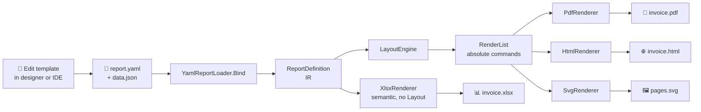
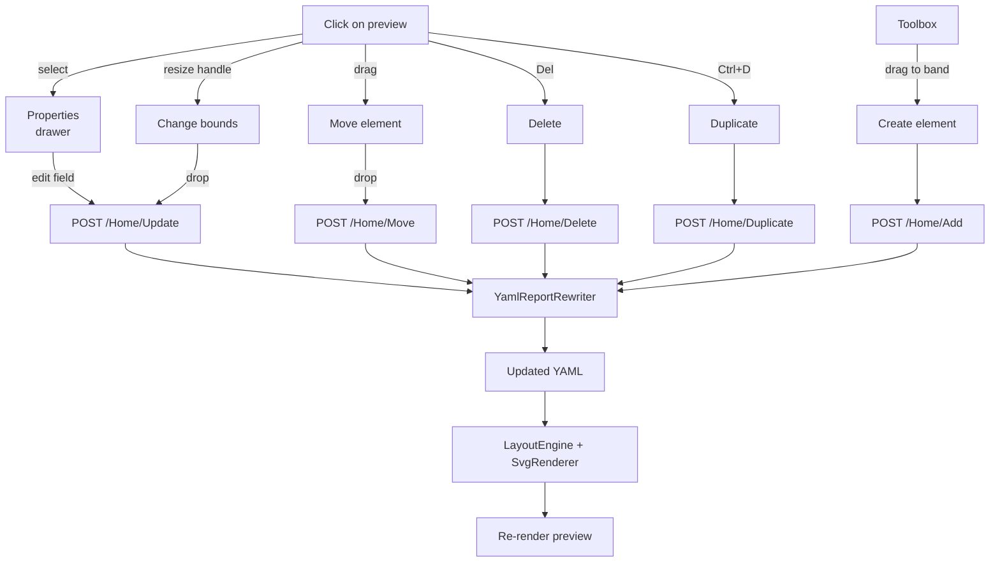

<div align="center">

**🇺🇸 English** · [🇪🇸 Español](README.es.md)

# 🧾 NetReporter

**Reporting engine for .NET 10 with an IR — one template produces PDF, HTML, SVG and XLSX.**

[](https://dotnet.microsoft.com/)
[](#-tests)
[](#-licenses)
[](#status)

🎨 Visual designer · 📄 PDF · 🌐 HTML · 🖼️ SVG · 📊 XLSX · 📦 YAML templates

</div>

---

## 📚 Table of contents

1. [Philosophy and architecture](#-philosophy-and-architecture)
2. [Features](#-features)
3. [Visual pipeline](#-visual-pipeline)
4. [Tech stack](#-tech-stack)
5. [Repository layout](#-repository-layout)
6. [Quick start](#-quick-start)
7. [Visual designer](#-visual-designer)
8. [YAML template syntax](#-yaml-template-syntax)
9. [Available renderers](#-available-renderers)
10. [Page sizes](#-page-sizes)
11. [Tests](#-tests)
12. [Known limitations](#-known-limitations)
13. [Roadmap](#-roadmap)
14. [Licenses](#-licenses)

---

## 💡 Philosophy and architecture

NetReporter splits the report into four layers with clear interfaces. **The template is unaware of the output format**: it is described once and rendered N times.

```
┌────────────────────────────────────┐
│  📝 Template (YAML / C# API)       │  Declarative definition
└────────────────────────────────────┘
                ▼
┌────────────────────────────────────┐
│  🧠 IR (ReportDefinition)          │  In-memory model
└────────────────────────────────────┘
                ▼
┌────────────────────────────────────┐
│  📐 LayoutEngine                   │  Measure + arrange + pagination
└────────────────────────────────────┘
                ▼
┌────────────────────────────────────┐
│  📋 RenderList                     │  Absolute drawing commands
│  · DrawTextCommand                 │  (single IR for all outputs)
│  · DrawLineCommand                 │
│  · DrawRectangleCommand            │
└────────────────────────────────────┘
                ▼
   ┌───────────┬───────────┬──────────┐
   ▼           ▼           ▼           ▼
 ┌─────┐   ┌──────┐   ┌──────┐   ┌─────────┐
 │ 📄  │   │  🌐  │   │  🖼️  │   │  📊     │
 │ PDF │   │ HTML │   │ SVG  │   │ XLSX *  │
 └─────┘   └──────┘   └──────┘   └─────────┘

 * XLSX is semantic: it consumes ReportDefinition directly (text → cells,
   tables → real Excel ranges with filters/sort), bypassing the RenderList.
```

**Non-negotiable principles:**

| Principle | Implementation |
|---|---|
| 🚫 **No reflection** in hot paths | Data binding with typed `Func<TRow,TValue>`; expressions with `Func<IEvaluationContext,T>` |
| 🎨 **No CSS / Tailwind for reports** | Native styling via `StyleSheet` + `StyleRef` (zero-alloc struct) and inheritance through `BasedOn` |
| 🧪 **QuestPDF only as a host** | All PDF drawing flows through SkiaSharp → SVG → `container.Svg(...)` |
| 🔄 **Single IR, multiple outputs** | The `RenderList` is computed once; N renderers consume it |
| 📦 **Editable templates without recompiling** | YAML + JSON wired with JSON Path |

---

## ✨ Features

### Engine
- ⚡ **IR pipeline** — one template, multiple outputs
- 📐 **Layout engine** with pagination, table-header repetition, bands (Report/Page Header/Footer + Detail)
- 📝 **Real word wrap** + auto-height — text breaks naturally, bands grow to fit content
- 🔒 **KeepTogether** — atomic blocks don't split across pages
- 📊 **Grouped tables with subtotals** — `groupBy` + group headers/footers with `Sum`/`Count`/`Avg`
- 🖼️ **Embedded images** (PNG/JPEG/GIF/WebP) — file path or data URI source
- ▦ **Vector barcodes & QR codes** — QR / Code 128 / Code 39 / EAN-13 (via ZXing, opt-in)
- 🎨 **Inheritable StyleSheet** — `BasedOn` chain with cycle detection and caching
- 🔢 **Per-report culture** — localized number/date formatting (verified with `es-HN`)
- 📋 **Typed tables** — `TableElement<TRow>` with typed columns, alignment and per-column format

### YAML templates
- 📝 **Declarative schema** — page, styles, bands, elements
- 🔗 **JSON Path bindings** — `$.client.name`, `$.lines[*]`
- 🪝 **Template strings** — `{{ pageNumber }}`, `{{ totalPages }}`, `{{ $.title }}`, `{{ #group }}`, `{{ #count }}`
- 📁 **Templated FileName** — `fileName: "invoice-{{ $.number }}"` resolved at export time
- 🎯 **Multi-format** — Letter, Legal, A3-A6, B4-B5, Tabloid, custom (80mm/58mm receipt)

### Visual web designer
- 🖱️ **Drag-and-drop** on the SVG preview (move and create elements)
- 🎯 **Resize handles** (8 directions) with 5pt snap when holding Shift
- ⌨️ **Keyboard nudge** — arrows move 1pt, Shift+arrows move 10pt
- 🔍 **Zoom in/out** — 25%–400% with steps, fit-to-width, persisted across reloads
- 📋 **Full CRUD** on elements, bands and table columns
- 💾 **Save/Load** templates to `~/.netreporter/templates/`
- 📦 **Built-in samples** + **import file** from disk
- ↶ **Undo/Redo** (50 levels, Ctrl+Z / Ctrl+Shift+Z)
- 📥 **One-click export** to PDF, HTML and XLSX

### Renderers
- 📄 **PDF** via QuestPDF + SkiaSharp (Letter, A4, Legal, custom)
- 🌐 **HTML** paginated with CSS `@page` — natively printable
- 🖼️ **SVG** vector — one per page
- 📊 **XLSX** semantic via ClosedXML — text → cells, tables → native Excel tables (filters, sort, banded rows)

---

## 🔄 Visual pipeline

### End-to-end usage flow



### Editing flow inside the designer



---

## 🛠️ Tech stack

| Layer | Technology | Notes |
|---|---|---|
| Runtime | **.NET 10** | `LangVersion: latest`, `Nullable: enable`, `TreatWarningsAsErrors: true` |
| Layout & IR | Pure C# | No external dependencies |
| YAML parser | **YamlDotNet** ≥ 17.0 | CamelCase naming, ignore unmatched, default values handling |
| PDF backend | **QuestPDF** ≥ 2026.2 | Used only as a container; drawing goes through SkiaSharp |
| 2D drawing | **SkiaSharp** ≥ 3.119 | `SKSvgCanvas` to emit SVG |
| Web UI | **ASP.NET Core MVC** (.NET 10) | Interactive designer |
| Frontend reactivity | **Alpine.js** 3.14 (CDN) | State + reactivity, no build pipeline |
| Network reactivity | **HTMX** 2.0 (CDN) | Live preview with debounce |
| CSS | **Tailwind CSS** (CDN play) | Utility-first |
| Barcodes (opt-in) | **ZXing.Net** 0.16 | Apache 2.0 · QR / Code128 / Code39 / EAN-13 |
| XLSX backend | **ClosedXML** 0.105 | MIT · OpenXML, native Excel tables |
| Tests | **xUnit** 2.9 | 184 tests across 5 projects |
| JSON | `System.Text.Json` (BCL) | No Newtonsoft |

---

## 📁 Repository layout

```
NetReporter/
├── 📦 src/
│   ├── NetReporter.Core/        🧠 IR, Primitives, Styles, Layout, RenderList
│   ├── NetReporter.Templates/   📝 YAML loader/rewriter, JSON Path, template strings
│   ├── NetReporter.Pdf/         📄 PdfRenderer (delegates to Svg)
│   ├── NetReporter.Svg/         🖼️ SvgRenderer (SkiaSharp.SKSvgCanvas)
│   ├── NetReporter.Html/        🌐 HtmlRenderer (paginated HTML/CSS)
│   ├── NetReporter.Xlsx/        📊 XlsxRenderer semantic (ClosedXML, native tables)
│   └── NetReporter.Barcodes/    ▦ ZXing-based barcode/QR generator (opt-in)
│
├── 🧪 tests/
│   ├── NetReporter.Core.Tests/        ColorTests, PageSetupTests, StyleSheetTests, BorderSetTests, EstimateTextMeasurer, AutoHeight, KeepTogether, GroupedTable
│   ├── NetReporter.Templates.Tests/   JsonPathTests, TemplateStringTests, YamlReportRewriterTests, FileNameTests
│   ├── NetReporter.Html.Tests/        HtmlRendererTests
│   ├── NetReporter.Xlsx.Tests/        XlsxRendererTests
│   └── NetReporter.Barcodes.Tests/    ZXingBarcodeGeneratorTests
│
├── 🛠️ tools/
│   └── NetReporter.Designer/    🎨 ASP.NET Core MVC + Alpine + HTMX + Tailwind
│
└── 🎯 samples/
    ├── InvoiceSample/           Invoice using the C# API (no YAML)
    └── TemplateSample/          YAML demo (9 templates)
        ├── report.yaml              Customer report
        ├── invoice-laser.yaml       📄 Letter invoice (laser)
        ├── invoice-paperoll.yaml    🧾 80mm invoice (thermal POS)
        ├── wrap-demo.yaml           Word-wrap + auto-height
        ├── grouped-invoice.yaml     groupBy + sum/count/avg subtotals
        ├── invoice-with-qr.yaml     Logo + QR of CAI
        ├── barcodes-demo.yaml       All 4 barcode formats
        ├── keep-together-demo.yaml  KeepTogether page-break demo
        └── invoice-complete.yaml    🚀 Flagship — every Phase 1-4 feature
```

---

## 🚀 Quick start

### Requirements

- ✅ .NET 10 SDK (tested with `10.0.103`)
- ✅ macOS / Linux / Windows
- ⚠️ QuestPDF Community license for personal use / companies <1M USD/year

### Setup

```bash
git clone <this-repo>
cd NetReporter
dotnet build
```

### Render from code (C# API)

```csharp
using NetReporter.Core.Bands;
using NetReporter.Core.Definition;
using NetReporter.Core.Elements;
using NetReporter.Core.Expressions;
using NetReporter.Core.Layout;
using NetReporter.Core.Primitives;
using NetReporter.Core.Styles;
using NetReporter.Pdf;

QuestPDF.Settings.License = QuestPDF.Infrastructure.LicenseType.Community;

var styles = new StyleSheetBuilder()
    .Add("Default", s => s.FontFamily("Helvetica").FontSize(12))
    .Add("Title",   s => s.BasedOn("Default").FontSize(24).Bold())
    .Build();

var page = PageSetup.Letter.WithMargins(new Thickness(Units.Cm(2)));

var report = new ReportDefinition
{
    Name = "Hello",
    Page = page,
    Styles = styles,
    Bands = new Band[]
    {
        new ReportHeaderBand
        {
            Height = 60,
            Elements = new ReportElement[]
            {
                new TextElement
                {
                    Bounds = new Rect(0, 0, page.ContentWidth, 30),
                    Content = Expr.Str("Hello NetReporter"),
                    Style = new StyleRef("Title")
                }
            }
        }
    }
};

var pdf = new PdfRenderer().Render(new LayoutEngine().Layout(report));
File.WriteAllBytes("hello.pdf", pdf);
```

### Render from YAML template

```csharp
using NetReporter.Core.Layout;
using NetReporter.Pdf;
using NetReporter.Templates;

QuestPDF.Settings.License = QuestPDF.Infrastructure.LicenseType.Community;

var template = YamlReportLoader.Load("invoice-laser.yaml");
var json = File.ReadAllText("invoice-data.json");
var report = template.Bind(json);

var layout = new LayoutEngine().Layout(report);
File.WriteAllBytes("invoice.pdf", new PdfRenderer().Render(layout));
File.WriteAllText("invoice.html", new NetReporter.Html.HtmlRenderer().Render(layout));

// XLSX is semantic: it consumes the ReportDefinition directly (not the layout)
File.WriteAllBytes("invoice.xlsx", new NetReporter.Xlsx.XlsxRenderer().Render(report));
```

### Run the samples

```bash
# Imperative C# sample
dotnet run --project samples/InvoiceSample
# → samples/InvoiceSample/bin/Debug/net10.0/factura.pdf

# YAML sample — emits PDF + XLSX for every template (9 reports × 2 outputs)
dotnet run --project samples/TemplateSample
# → samples/TemplateSample/bin/Debug/net10.0/*.pdf and *.xlsx
```

---

## 🎨 Visual designer

### Launch

```bash
dotnet run --project tools/NetReporter.Designer
```

Open `http://localhost:5296`.

### Layout

```
┌───────────────────────────────────────────────────────────────────────────────┐
│ 🅽 Designer  [Template ▼ ●] [↥ Import] [Save][Save as…][Delete]              │
│              [↶ Undo (n)] [↷ Redo]   [⭳ PDF] [⭳ HTML] [⭳ XLSX]               │
├──────────────────────────┬──────────┬────────────────────────────────────────┤
│ report.yaml | data.json  │ Toolbox  │ Preview                                │
│                          │          │                                        │
│ name: ClientsReport      │ [T]      │  ┌──────────────────┐                  │
│ title: Customer report   │ Text     │  │ Customer report  │  ┌─────────────┐ │
│ page:                    │          │  │                  │  │Properties   │ │
│   size: Letter           │ [━]      │  │ Code   Name      │  │bands.0.el.0 │ │
│   margins: { all: 2cm }  │ Line     │  │ ────────────     │  │TEXT         │ │
│ ...                      │          │  │ C001   ...       │  │X     Y      │ │
│ bands:                   │ [▭]      │  │ C002   ...       │  │ 50    20    │ │
│   - kind: ReportHeader   │ Rect     │  │ C003   ...       │  │             │ │
│     ...                  │          │  └──────────────────┘  │ Width Height│ │
│                          │ [⊞]      │                        │  120   14   │ │
│                          │ Table    │                        │             │ │
│                          │          │                        │ Style: Title│ │
│                          │ BANDS    │                        │ Content: ...│ │
│                          │ R... ▲▼✕ │                        └─────────────┘ │
│                          │ D... ▲▼✕ │                                        │
│                          │ P... ▲▼✕ │                                        │
└──────────────────────────┴──────────┴────────────────────────────────────────┘
```

### Keyboard shortcuts

| Action | Shortcut |
|---|---|
| Move element | Click + drag |
| Move with snap | Shift + drag |
| Resize | Drag a handle (8 directions) |
| Nudge 1pt | `← ↑ → ↓` |
| Nudge 10pt | `Shift + ← ↑ → ↓` |
| Delete | `Del` or `Backspace` |
| Duplicate | `Ctrl+D` / `Cmd+D` |
| Undo | `Ctrl+Z` / `Cmd+Z` |
| Redo | `Ctrl+Shift+Z` / `Ctrl+Y` |
| Zoom in | `Ctrl/Cmd + +` (or `=`) |
| Zoom out | `Ctrl/Cmd + -` |
| Reset zoom (100%) | `Ctrl/Cmd + 0` |

### Built-in samples (📦 Samples dropdown)

| Sample | Demonstrates |
|---|---|
| `clientes` | Basic tabular report with header, table, page footer |
| `invoice-laser` | Full Letter invoice with totals block |
| `invoice-paperoll` | 80mm continuous receipt (POS thermal printer) |
| `wrap-demo` | Real word wrap + band auto-height |
| `grouped-invoice` | `groupBy` with per-group headers and `Sum`/`Count`/`Avg` subtotals |
| `invoice-with-qr` | Embedded PNG logo + vector QR code of the CAI |
| `barcodes-demo` | All 4 supported barcode formats (QR / Code128 / Code39 / EAN-13) on a single page |
| `keep-together` | `keepTogether` forcing a clean page break on a "Terms & signatures" block |
| `invoice-complete` | 🚀 **Flagship** — all Phase 1-4 features combined: logo, word-wrap, autoHeight, grouped table, QR, barcode, KeepTogether, culture es-HN, templated fileName |

### Typical flow

1. **Open a sample** → `📦 Samples / invoice-with-qr`.
2. **Edit** sample data on the `data.json` tab.
3. **Drag** a text, **resize** a table, **add columns** from the drawer.
4. **Save as…** with your own name → stored in `~/.netreporter/templates/`.
5. **⭳ PDF**, **⭳ HTML** or **⭳ XLSX** → downloads with the template's `fileName` (e.g. `invoice-000-001.pdf`).

### Import files from disk

`↥ Import` opens a file picker accepting `.yaml`, `.yml`, `.json`. Multi-select (yaml + json at once). Auto-detects which is which by extension.

### Zoom controls

The preview header has `−` / `+` / `1:1` / `↔` buttons. Steps are `25 · 50 · 75 · 100 · 125 · 150 · 200 · 300 · 400 %`. The `↔` button fits the page width to the available preview area. The chosen level persists in `localStorage` so reloading the designer keeps it. Drag and resize coordinates are compensated for the current zoom — moving an element at 200% still moves it pt-by-pt in the YAML.

---

## 📝 YAML template syntax

### Minimal skeleton

```yaml
name: MyReport
title: "Report {{ $.title }}"
fileName: "report-{{ $.id }}"      # optional, supports template strings

page:
  size: Letter                       # Letter | Legal | A3-A6 | B4-B5 | Tabloid | custom
  orientation: Portrait              # Portrait | Landscape
  margins:
    horizontal: 1.5cm
    vertical: 1.8cm

culture: en-US                       # culture for number/date formatting

styles:
  Default:
    fontFamily: Helvetica
    fontSize: 10
    foreground: "#0F172A"
  Title:
    basedOn: Default
    fontSize: 18
    bold: true

bands:
  - kind: ReportHeader               # ReportHeader | PageHeader | Detail | PageFooter | ReportFooter
    height: 60
    elements:
      - type: text                   # text | line | rectangle | table
        bounds: { x: 0, y: 0, width: 500, height: 24 }
        content: "{{ $.title }}"
        style: Title
```

### Available elements

| Type | Key fields |
|---|---|
| `text` | `content` (template), `style`, `wordWrap`, `autoHeight` |
| `line` | `orientation` (horizontal/vertical), `color`, `thickness` |
| `rectangle` | `fill`, `borderLine: { thickness, color }` |
| `table` | `rows` (JSON Path), `columns[]`, `headerStyle`, `rowStyle`, `alternateRowStyle`, `headerHeight`, `rowHeight`, `headerMode`, `groupBy`, `groupHeader`, `groupFooter` |
| `image` | `source` (file path or `data:image/png;base64,...`), `fit` (contain/fill) |
| `barcode` | `value` (template), `format` (qr/code128/code39/ean13), `barcodeForeground`, `barcodeBackground` |

### Band properties

| Property | Effect |
|---|---|
| `height` | Reserved minimum height (pt) |
| `autoHeight: true` | Band grows to fit its content (max with `height`) |
| `keepTogether: true` | If band doesn't fit on current page, page break before emitting |

### Table with columns

```yaml
- type: table
  bounds: { x: 0, y: 0, width: 527, height: 0 }
  rows: "$.lines"
  headerStyle: TableHeader
  rowStyle: TableRow
  alternateRowStyle: TableRowAlt
  headerMode: RepeatOnPageBreak       # PrintOnce | RepeatOnPageBreak
  headerHeight: 22
  rowHeight: 18
  columns:
    - { header: "Code",        binding: "$.code",        width: 70,  align: left }
    - { header: "Description", binding: "$.description", width: 257, align: left }
    - { header: "Qty",         binding: "$.quantity",    width: 50,  align: right }
    - { header: "Price",       binding: "$.price",       width: 75,  format: "N2", align: right }
    - { header: "Total",       binding: "$.total",       width: 75,  format: "N2", align: right }
```

### Images and barcodes

```yaml
# Embedded image — local path or inline data URI
- type: image
  bounds: { x: 0, y: 0, width: 120, height: 60 }
  source: "logo.png"                            # or: data:image/png;base64,...
  fit: contain                                  # contain | fill

# Vector QR code (also: code128, code39, ean13)
- type: barcode
  bounds: { x: 0, y: 0, width: 90, height: 90 }
  value: "{{ $.cai }}"                          # template string evaluated
  format: qr
  barcodeForeground: "#0F172A"
  barcodeBackground: "#FFFFFF"
```

Barcodes are emitted as N `DrawRectangleCommand`s (one per dark module) — fully **vector**, scaling perfectly in PDF/SVG/HTML at any zoom. Requires `NetReporter.Barcodes` reference and passing `ZXingBarcodeGenerator.Instance` to the `LayoutEngine` ctor:

```csharp
var layout = new LayoutEngine(SkiaTextMeasurer.Instance, ZXingBarcodeGenerator.Instance)
                 .Layout(report);
```

The Designer already wires this up — barcodes work out-of-the-box in preview/export.

### Grouped tables (subtotals)

Group consecutive rows with the same key, emit a header per group and a footer with aggregates:

```yaml
- type: table
  rows: "$.lines"
  groupBy: "$.category"            # group consecutive rows by this expression

  groupHeader:
    height: 20
    style: GroupHeader
    content: "▸ {{ #group }} ({{ #count }} items)"

  groupFooter:
    height: 18
    style: GroupFooter
    cells:                         # cells parallel to columns by index
      - { content: "Subtotal {{ #group }}:" }
      - null                       # blank
      - { aggregate: count, format: "N0", align: right }
      - { content: "Avg:", align: right }
      - { aggregate: sum, format: "N2", align: right }

  columns: [...]
```

Aggregates available: `sum` · `count` · `avg`. Each footer cell aggregates the **same column's binding** at its index. Numeric conversion is safe across `int`/`long`/`decimal`/`double`/`float`/parseable strings.

> **Limitation:** rows must come pre-sorted by group key — there's no internal sort. Only one nesting level (no nested groups).

### Template strings

| Placeholder | Resolves to |
|---|---|
| `{{ pageNumber }}` | Current page number |
| `{{ totalPages }}` | Total pages |
| `{{ rowIndex }}` | Row index (in table context) |
| `{{ $.path.to.field }}` | JSON Path value |
| `{{ #group }}` | Current group key (in group header/footer context) |
| `{{ #count }}` | Number of rows in current group |

### Units

`pt`, `mm`, `cm`, `in` — the parser recognises them: `1.5cm`, `15mm`, `1in`, `42pt`.

---

## 🎨 Available renderers

### 📄 PDF — `NetReporter.Pdf`

Generates vector PDF via **QuestPDF** (host) + **SkiaSharp** (drawing). Selectable text, native print quality.

```csharp
byte[] pdf = new PdfRenderer().Render(renderList);
```

### 🌐 HTML — `NetReporter.Html`

Emits self-contained HTML with CSS `@page` for print and screen styling with shadows and gaps between pages.

```csharp
string html = new HtmlRenderer().Render(renderList, new HtmlRenderOptions
{
    Title = "Invoice",
    ShowScreenChrome = true   // shadow/margin between pages on screen
});
```

- 📱 Natively printable with Ctrl+P respecting page size
- 🚀 Zero external dependencies (only `System.Net.WebUtility`)
- 🎨 Inline CSS, easy to embed in any page

### 🖼️ SVG — `NetReporter.Svg`

One SVG string per page. Used internally by the PDF renderer and the designer's live preview.

```csharp
IReadOnlyList<string> svgs = new SvgRenderer().Render(renderList);
```

### 📊 XLSX — `NetReporter.Xlsx`

**Semantic** renderer: it consumes the `ReportDefinition` directly (no `LayoutEngine`, no `RenderList`). `TextElement`s become cells, `TableElement<TRow>`s become real Excel ranges (filterable, sortable, banded). Decorative elements (Line / Rectangle / Barcode) are intentionally skipped — they have no equivalent in a spreadsheet.

```csharp
byte[] xlsx = new XlsxRenderer().Render(report, new XlsxRenderOptions
{
    WorksheetName = "Invoice",     // default: ReportDefinition.Name (truncated to 31 chars)
    EmitNativeTables = true,       // tables → Excel Tables (filters + sort + banded rows)
    FreezeTableHeaders = false     // freeze pane below each table header
});
```

- 📊 Tables emitted as **native Excel Tables** with filters, sort and banded rows
- 🎨 Per-cell styles (font, color, alignment) preserved from the `StyleSheet`
- 📐 Page setup (paper size, orientation, margins) mapped to Excel page setup
- 🖼️ Embedded images preserved (sized in points → pixels @ 96dpi)
- 🌍 Per-report culture honored for number/date formatting

---

## 📐 Page sizes

### US / ANSI
`Letter` · `Legal` · `Tabloid` · `Executive` · `Statement`

### ISO A
`A3` · `A4` · `A5` · `A6`

### ISO B
`B4` · `B5`

### Custom (e.g. POS receipt)

```yaml
page:
  size: custom
  width: 226.77        # 80mm in points
  height: 600
```

### Fluent transformations (C# API)

```csharp
PageSetup.A4.Landscape().WithMargins(Units.Cm(1.5))
PageSetup.Custom(226.77, 600).WithMargins(8)
```

---

## 🧪 Tests

```bash
dotnet test
```

```
┌─────────────────────────────────────┬───────┐
│ Project                             │ Tests │
├─────────────────────────────────────┼───────┤
│ NetReporter.Core.Tests              │   60  │
│ NetReporter.Templates.Tests         │   92  │
│ NetReporter.Html.Tests              │   13  │
│ NetReporter.Xlsx.Tests              │   12  │
│ NetReporter.Barcodes.Tests          │    7  │
├─────────────────────────────────────┼───────┤
│ Total                               │  184  │
└─────────────────────────────────────┴───────┘
```

**Coverage by area:**

- 🧠 **Core**: hex color parsing, PageSetup transformations, StyleSheet (inheritance + cycles + cache), BorderSet factories, **word-wrap algorithm**, **band auto-height**, **KeepTogether page-break**, **grouped tables with sum/count/avg**.
- 📝 **Templates**: JSON Path (Select/SelectMany/edge cases), TemplateString (placeholders + literals + escape), YamlReportRewriter (all 11 methods × happy paths and error cases), FileName resolution.
- 🌐 **Html**: valid HTML, special-char escaping, fonts, alignments, lines, rectangles, multi-page, print CSS.
- 📊 **Xlsx**: text → cells, tables → ranges, native Excel Tables, page setup mapping, sheet-name sanitation, image embedding, per-culture formatting.
- ▦ **Barcodes**: QR finder patterns, Code 128 bar density, EAN-13 strict validation, edge cases (empty/null/throwing fallback).

---

## ⚠️ Known limitations

### Not implemented (Phase 5+)

| Feature | Status | Current workaround |
|---|---|---|
| **Charts** | ❌ | — |
| **Subreports** | ❌ | — |
| **Multi-level grouping** | ❌ | Only one nesting level supported |
| **KeepTogether on DetailBand** | ⚠️ | Use ReportHeader/Footer instead (engine ref-locals limitation) |
| **XLSX: lines / rectangles / barcodes** | ⚠️ | Decorative elements skipped on purpose — XLSX is semantic, not pixel-perfect |

### Documented technical debt

1. **Reflection in `LayoutEngine.RenderTableElement`** — workaround to invoke the generic `RenderTableElementGeneric<TRow>` method. One-shot per table type. Future fix: visitor pattern.
2. **Approximate `TextMeasurer`** — `chars * fontSize * 0.55`. The real measurement happens in SkiaSharp at paint time. For layout that depends on real text metrics, replace with a SkiaSharp call.
3. **YAML re-serialization drops comments** — the rewriter does parse → modify POCO → re-serialize. If you plan to hand-edit YAML with comments, do so after using the designer.

---

## 🛣️ Roadmap

### ✅ Completed

- [x] **Phase 1** — IR → Layout → RenderList → PDF pipeline
- [x] **Phase 2.1** — YAML templates + JSON binding
- [x] **Phase 2.2** — HTML renderer
- [x] **Phase 2.3** — Visual designer with drag-and-drop
- [x] **Phase 2.4** — Resize handles + snap + nudge + undo/redo
- [x] **Phase 2.5** — Toolbox to create elements
- [x] **Phase 2.6** — Save/Load templates to disk
- [x] **Phase 2.7** — Full table support in the designer
- [x] **Phase 2.8** — Inline column editor + redistributive resize
- [x] **Phase 2.9** — Built-in samples + import file
- [x] **Phase 2.10** — `fileName` with template strings + sanitization
- [x] **Phase 3.1** — Real word wrap (`ITextMeasurer` + `SkiaTextMeasurer`)
- [x] **Phase 3.2** — Auto-height on bands and text elements
- [x] **Phase 3.3** — `KeepTogether` for atomic blocks
- [x] **Phase 3.4** — Grouped tables with subtotals (`groupBy` + headers/footers + sum/count/avg)
- [x] **Phase 4.1** — Embedded images (PNG/JPEG/GIF/WebP, file path or data URI)
- [x] **Phase 4.2** — Vector barcodes & QR codes (ZXing.Net opt-in)
- [x] **Phase 4.3** — Designer integrates 9 built-in samples (clientes, invoice-laser/paperoll, wrap-demo, grouped-invoice, invoice-with-qr, barcodes-demo, keep-together, **invoice-complete** flagship)
- [x] **Phase 4.4** — Semantic XLSX renderer (ClosedXML, native Excel Tables) + Designer ⭳ XLSX export
- [x] **Phase 4.5** — Designer preview zoom (25%–400%, fit-to-width, keyboard shortcuts, persisted)
- [x] **Tests** — 184 passing tests across 5 projects

### 🚧 Under consideration

- [ ] Multi-level grouping (nested groups)
- [ ] Multi-selection + copy/paste in the designer
- [ ] Simple charts (bar / line / pie)
- [ ] DSL parsed expressions (instead of C# closures)
- [ ] KeepTogether on DetailBand (requires engine refactor)
- [ ] Designer UI for image/barcode picker (currently only via YAML or Save-as a sample)

---

## 📄 Licenses

| Component | License |
|---|---|
| **NetReporter** | TBD |
| **QuestPDF** | MIT for non-commercial use and companies under 1M USD/year revenue. Commercial: Professional ($699 one-time). [Pricing](https://www.questpdf.com/pricing.html) |
| **SkiaSharp** | MIT |
| **YamlDotNet** | MIT |
| **ZXing.Net** | Apache 2.0 (only if `NetReporter.Barcodes` is referenced) |
| **ClosedXML** | MIT (only if `NetReporter.Xlsx` is referenced) |
| **HTMX** | BSD-2-Clause |
| **Alpine.js** | MIT |
| **Tailwind CSS** | MIT |

---

## 📎 Internal references

- [`NetReporter-Prototype-Invoice.md`](NetReporter-Prototype-Invoice.md) — original prototype spec (~2000 lines, in Spanish).
- [`CLAUDE.md`](CLAUDE.md) — guide for Claude Code assistants in this repo.
- [`PLAN.md`](PLAN.md) — step-by-step plan in case work is resumed after interruption.

---

<div align="center">

**Built with .NET 10 · QuestPDF · SkiaSharp · YamlDotNet · ZXing.Net · ClosedXML · HTMX · Alpine.js · Tailwind**

</div>
