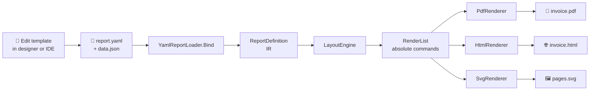
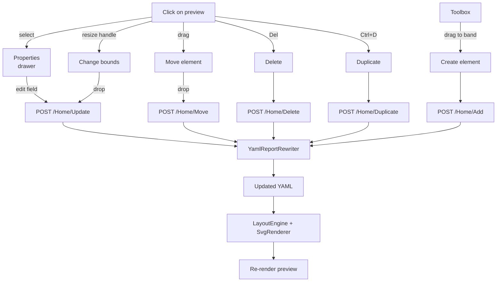

<div align="center">

**🇺🇸 English** · [🇪🇸 Español](README.es.md)

# 🧾 NetReporter

**Reporting engine for .NET 10 with an IR — one template produces PDF, HTML and SVG.**

[](https://dotnet.microsoft.com/)
[](#-tests)
[](#-licenses)
[](#status)

🎨 Visual designer · 📄 PDF · 🌐 HTML · 🖼️ SVG · 📦 YAML templates

</div>

---

## 📚 Table of contents

1. [Philosophy and architecture](#-philosophy-and-architecture)
2. [Features](#-features)
3. [Visual pipeline](#-visual-pipeline)
4. [Tech stack](#-tech-stack)
5. [Repository layout](#-repository-layout)
6. [Quick start](#-quick-start)
7. [Visual designer](#-visual-designer)
8. [YAML template syntax](#-yaml-template-syntax)
9. [Available renderers](#-available-renderers)
10. [Page sizes](#-page-sizes)
11. [Tests](#-tests)
12. [Known limitations](#-known-limitations)
13. [Roadmap](#-roadmap)
14. [Licenses](#-licenses)

---

## 💡 Philosophy and architecture

NetReporter splits the report into four layers with clear interfaces. **The template is unaware of the output format**: it is described once and rendered N times.

```
┌────────────────────────────────────┐
│  📝 Template (YAML / C# API)       │  Declarative definition
└────────────────────────────────────┘
                ▼
┌────────────────────────────────────┐
│  🧠 IR (ReportDefinition)          │  In-memory model
└────────────────────────────────────┘
                ▼
┌────────────────────────────────────┐
│  📐 LayoutEngine                   │  Measure + arrange + pagination
└────────────────────────────────────┘
                ▼
┌────────────────────────────────────┐
│  📋 RenderList                     │  Absolute drawing commands
│  · DrawTextCommand                 │  (single IR for all outputs)
│  · DrawLineCommand                 │
│  · DrawRectangleCommand            │
└────────────────────────────────────┘
                ▼
   ┌───────────┬───────────┬──────────┐
   ▼           ▼           ▼           ▼
 ┌─────┐   ┌──────┐   ┌──────┐   ┌─────────┐
 │ 📄  │   │  🌐  │   │  🖼️  │   │  📊     │
 │ PDF │   │ HTML │   │ SVG  │   │ XLSX    │  ← future
 └─────┘   └──────┘   └──────┘   └─────────┘
```

**Non-negotiable principles:**

| Principle | Implementation |
|---|---|
| 🚫 **No reflection** in hot paths | Data binding with typed `Func<TRow,TValue>`; expressions with `Func<IEvaluationContext,T>` |
| 🎨 **No CSS / Tailwind for reports** | Native styling via `StyleSheet` + `StyleRef` (zero-alloc struct) and inheritance through `BasedOn` |
| 🧪 **QuestPDF only as a host** | All PDF drawing flows through SkiaSharp → SVG → `container.Svg(...)` |
| 🔄 **Single IR, multiple outputs** | The `RenderList` is computed once; N renderers consume it |
| 📦 **Editable templates without recompiling** | YAML + JSON wired with JSON Path |

---

## ✨ Features

### Engine
- ⚡ **IR pipeline** — one template, multiple outputs
- 📐 **Layout engine** with pagination, table-header repetition, bands (Report/Page Header/Footer + Detail)
- 🎨 **Inheritable StyleSheet** — `BasedOn` chain with cycle detection and caching
- 🔢 **Per-report culture** — localized number/date formatting (verified with `es-HN`)
- 📋 **Typed tables** — `TableElement<TRow>` with typed columns, alignment and per-column format

### YAML templates
- 📝 **Declarative schema** — page, styles, bands, elements
- 🔗 **JSON Path bindings** — `$.client.name`, `$.lines[*]`
- 🪝 **Template strings** — `{{ pageNumber }}`, `{{ totalPages }}`, `{{ $.title }}`
- 📁 **Templated FileName** — `fileName: "invoice-{{ $.number }}"` resolved at export time
- 🎯 **Multi-format** — Letter, Legal, A3-A6, B4-B5, Tabloid, custom (80mm/58mm receipt)

### Visual web designer
- 🖱️ **Drag-and-drop** on the SVG preview (move and create elements)
- 🎯 **Resize handles** (8 directions) with 5pt snap when holding Shift
- ⌨️ **Keyboard nudge** — arrows move 1pt, Shift+arrows move 10pt
- 📋 **Full CRUD** on elements, bands and table columns
- 💾 **Save/Load** templates to `~/.netreporter/templates/`
- 📦 **Built-in samples** + **import file** from disk
- ↶ **Undo/Redo** (50 levels, Ctrl+Z / Ctrl+Shift+Z)
- 📥 **One-click export** to PDF and HTML

### Renderers
- 📄 **PDF** via QuestPDF + SkiaSharp (Letter, A4, Legal, custom)
- 🌐 **HTML** paginated with CSS `@page` — natively printable
- 🖼️ **SVG** vector — one per page

---

## 🔄 Visual pipeline

### End-to-end usage flow



### Editing flow inside the designer



---

## 🛠️ Tech stack

| Layer | Technology | Notes |
|---|---|---|
| Runtime | **.NET 10** | `LangVersion: latest`, `Nullable: enable`, `TreatWarningsAsErrors: true` |
| Layout & IR | Pure C# | No external dependencies |
| YAML parser | **YamlDotNet** ≥ 17.0 | CamelCase naming, ignore unmatched, default values handling |
| PDF backend | **QuestPDF** ≥ 2026.2 | Used only as a container; drawing goes through SkiaSharp |
| 2D drawing | **SkiaSharp** ≥ 3.119 | `SKSvgCanvas` to emit SVG |
| Web UI | **ASP.NET Core MVC** (.NET 10) | Interactive designer |
| Frontend reactivity | **Alpine.js** 3.14 (CDN) | State + reactivity, no build pipeline |
| Network reactivity | **HTMX** 2.0 (CDN) | Live preview with debounce |
| CSS | **Tailwind CSS** (CDN play) | Utility-first |
| Tests | **xUnit** 2.9 | 138 tests across 3 projects |
| JSON | `System.Text.Json` (BCL) | No Newtonsoft |

---

## 📁 Repository layout

```
NetReporter/
├── 📦 src/
│   ├── NetReporter.Core/        🧠 IR, Primitives, Styles, Layout, RenderList
│   ├── NetReporter.Templates/   📝 YAML loader/rewriter, JSON Path, template strings
│   ├── NetReporter.Pdf/         📄 PdfRenderer (delegates to Svg)
│   ├── NetReporter.Svg/         🖼️ SvgRenderer (SkiaSharp.SKSvgCanvas)
│   └── NetReporter.Html/        🌐 HtmlRenderer (paginated HTML/CSS)
│
├── 🧪 tests/
│   ├── NetReporter.Core.Tests/        ColorTests, PageSetupTests, StyleSheetTests, BorderSetTests
│   ├── NetReporter.Templates.Tests/   JsonPathTests, TemplateStringTests, YamlReportRewriterTests, FileNameTests
│   └── NetReporter.Html.Tests/        HtmlRendererTests
│
├── 🛠️ tools/
│   └── NetReporter.Designer/    🎨 ASP.NET Core MVC + Alpine + HTMX + Tailwind
│
└── 🎯 samples/
    ├── InvoiceSample/           Invoice using the C# API (no YAML)
    └── TemplateSample/          YAML demo
        ├── report.yaml          Customer report
        ├── invoice-laser.yaml   📄 Letter invoice (laser)
        ├── invoice-paperoll.yaml 🧾 80mm invoice (thermal POS)
        └── invoice-data.json
```

---

## 🚀 Quick start

### Requirements

- ✅ .NET 10 SDK (tested with `10.0.103`)
- ✅ macOS / Linux / Windows
- ⚠️ QuestPDF Community license for personal use / companies <1M USD/year

### Setup

```bash
git clone <this-repo>
cd NetReporter
dotnet build
```

### Render from code (C# API)

```csharp
using NetReporter.Core.Bands;
using NetReporter.Core.Definition;
using NetReporter.Core.Elements;
using NetReporter.Core.Expressions;
using NetReporter.Core.Layout;
using NetReporter.Core.Primitives;
using NetReporter.Core.Styles;
using NetReporter.Pdf;

QuestPDF.Settings.License = QuestPDF.Infrastructure.LicenseType.Community;

var styles = new StyleSheetBuilder()
    .Add("Default", s => s.FontFamily("Helvetica").FontSize(12))
    .Add("Title",   s => s.BasedOn("Default").FontSize(24).Bold())
    .Build();

var page = PageSetup.Letter.WithMargins(new Thickness(Units.Cm(2)));

var report = new ReportDefinition
{
    Name = "Hello",
    Page = page,
    Styles = styles,
    Bands = new Band[]
    {
        new ReportHeaderBand
        {
            Height = 60,
            Elements = new ReportElement[]
            {
                new TextElement
                {
                    Bounds = new Rect(0, 0, page.ContentWidth, 30),
                    Content = Expr.Str("Hello NetReporter"),
                    Style = new StyleRef("Title")
                }
            }
        }
    }
};

var pdf = new PdfRenderer().Render(new LayoutEngine().Layout(report));
File.WriteAllBytes("hello.pdf", pdf);
```

### Render from YAML template

```csharp
using NetReporter.Core.Layout;
using NetReporter.Pdf;
using NetReporter.Templates;

QuestPDF.Settings.License = QuestPDF.Infrastructure.LicenseType.Community;

var template = YamlReportLoader.Load("invoice-laser.yaml");
var json = File.ReadAllText("invoice-data.json");
var report = template.Bind(json);

var layout = new LayoutEngine().Layout(report);
File.WriteAllBytes("invoice.pdf", new PdfRenderer().Render(layout));
File.WriteAllText("invoice.html", new NetReporter.Html.HtmlRenderer().Render(layout));
```

### Run the samples

```bash
# Imperative C# sample
dotnet run --project samples/InvoiceSample
# → samples/InvoiceSample/bin/Debug/net10.0/factura.pdf

# YAML sample — emits 3 PDFs (clientes, invoice-laser, invoice-paperoll)
dotnet run --project samples/TemplateSample
# → samples/TemplateSample/bin/Debug/net10.0/{clientes,invoice-laser,invoice-paperoll}.pdf
```

---

## 🎨 Visual designer

### Launch

```bash
dotnet run --project tools/NetReporter.Designer
```

Open `http://localhost:5296`.

### Layout

```
┌───────────────────────────────────────────────────────────────────────────────┐
│ 🅽 Designer  [Template ▼ ●] [↥ Import] [Save][Save as…][Delete]              │
│              [↶ Undo (n)] [↷ Redo]   [⭳ PDF] [⭳ HTML]                        │
├──────────────────────────┬──────────┬────────────────────────────────────────┤
│ report.yaml | data.json  │ Toolbox  │ Preview                                │
│                          │          │                                        │
│ name: ClientsReport      │ [T]      │  ┌──────────────────┐                  │
│ title: Customer report   │ Text     │  │ Customer report  │  ┌─────────────┐ │
│ page:                    │          │  │                  │  │Properties   │ │
│   size: Letter           │ [━]      │  │ Code   Name      │  │bands.0.el.0 │ │
│   margins: { all: 2cm }  │ Line     │  │ ────────────     │  │TEXT         │ │
│ ...                      │          │  │ C001   ...       │  │X     Y      │ │
│ bands:                   │ [▭]      │  │ C002   ...       │  │ 50    20    │ │
│   - kind: ReportHeader   │ Rect     │  │ C003   ...       │  │             │ │
│     ...                  │          │  └──────────────────┘  │ Width Height│ │
│                          │ [⊞]      │                        │  120   14   │ │
│                          │ Table    │                        │             │ │
│                          │          │                        │ Style: Title│ │
│                          │ BANDS    │                        │ Content: ...│ │
│                          │ R... ▲▼✕ │                        └─────────────┘ │
│                          │ D... ▲▼✕ │                                        │
│                          │ P... ▲▼✕ │                                        │
└──────────────────────────┴──────────┴────────────────────────────────────────┘
```

### Keyboard shortcuts

| Action | Shortcut |
|---|---|
| Move element | Click + drag |
| Move with snap | Shift + drag |
| Resize | Drag a handle (8 directions) |
| Nudge 1pt | `← ↑ → ↓` |
| Nudge 10pt | `Shift + ← ↑ → ↓` |
| Delete | `Del` or `Backspace` |
| Duplicate | `Ctrl+D` / `Cmd+D` |
| Undo | `Ctrl+Z` / `Cmd+Z` |
| Redo | `Ctrl+Shift+Z` / `Ctrl+Y` |

### Typical flow

1. **Open a sample** → `📦 Samples / invoice-paperoll`.
2. **Edit** sample data on the `data.json` tab.
3. **Drag** a text, **resize** a table, **add columns** from the drawer.
4. **Save as…** with your own name → stored in `~/.netreporter/templates/`.
5. **⭳ PDF** or **⭳ HTML** → downloads with the template's `fileName` (e.g. `invoice-000-001.pdf`).

### Import files from disk

`↥ Import` opens a file picker accepting `.yaml`, `.yml`, `.json`. Multi-select (yaml + json at once). Auto-detects which is which by extension.

---

## 📝 YAML template syntax

### Minimal skeleton

```yaml
name: MyReport
title: "Report {{ $.title }}"
fileName: "report-{{ $.id }}"      # optional, supports template strings

page:
  size: Letter                       # Letter | Legal | A3-A6 | B4-B5 | Tabloid | custom
  orientation: Portrait              # Portrait | Landscape
  margins:
    horizontal: 1.5cm
    vertical: 1.8cm

culture: en-US                       # culture for number/date formatting

styles:
  Default:
    fontFamily: Helvetica
    fontSize: 10
    foreground: "#0F172A"
  Title:
    basedOn: Default
    fontSize: 18
    bold: true

bands:
  - kind: ReportHeader               # ReportHeader | PageHeader | Detail | PageFooter | ReportFooter
    height: 60
    elements:
      - type: text                   # text | line | rectangle | table
        bounds: { x: 0, y: 0, width: 500, height: 24 }
        content: "{{ $.title }}"
        style: Title
```

### Available elements

| Type | Key fields |
|---|---|
| `text` | `content` (template), `style` |
| `line` | `orientation` (horizontal/vertical), `color`, `thickness` |
| `rectangle` | `fill`, `borderLine: { thickness, color }` |
| `table` | `rows` (JSON Path), `columns[]`, `headerStyle`, `rowStyle`, `alternateRowStyle`, `headerHeight`, `rowHeight`, `headerMode` |

### Table with columns

```yaml
- type: table
  bounds: { x: 0, y: 0, width: 527, height: 0 }
  rows: "$.lines"
  headerStyle: TableHeader
  rowStyle: TableRow
  alternateRowStyle: TableRowAlt
  headerMode: RepeatOnPageBreak       # PrintOnce | RepeatOnPageBreak
  headerHeight: 22
  rowHeight: 18
  columns:
    - { header: "Code",        binding: "$.code",        width: 70,  align: left }
    - { header: "Description", binding: "$.description", width: 257, align: left }
    - { header: "Qty",         binding: "$.quantity",    width: 50,  align: right }
    - { header: "Price",       binding: "$.price",       width: 75,  format: "N2", align: right }
    - { header: "Total",       binding: "$.total",       width: 75,  format: "N2", align: right }
```

### Template strings

| Placeholder | Resolves to |
|---|---|
| `{{ pageNumber }}` | Current page number |
| `{{ totalPages }}` | Total pages |
| `{{ rowIndex }}` | Row index (in table context) |
| `{{ $.path.to.field }}` | JSON Path value |

### Units

`pt`, `mm`, `cm`, `in` — the parser recognises them: `1.5cm`, `15mm`, `1in`, `42pt`.

---

## 🎨 Available renderers

### 📄 PDF — `NetReporter.Pdf`

Generates vector PDF via **QuestPDF** (host) + **SkiaSharp** (drawing). Selectable text, native print quality.

```csharp
byte[] pdf = new PdfRenderer().Render(renderList);
```

### 🌐 HTML — `NetReporter.Html`

Emits self-contained HTML with CSS `@page` for print and screen styling with shadows and gaps between pages.

```csharp
string html = new HtmlRenderer().Render(renderList, new HtmlRenderOptions
{
    Title = "Invoice",
    ShowScreenChrome = true   // shadow/margin between pages on screen
});
```

- 📱 Natively printable with Ctrl+P respecting page size
- 🚀 Zero external dependencies (only `System.Net.WebUtility`)
- 🎨 Inline CSS, easy to embed in any page

### 🖼️ SVG — `NetReporter.Svg`

One SVG string per page. Used internally by the PDF renderer and the designer's live preview.

```csharp
IReadOnlyList<string> svgs = new SvgRenderer().Render(renderList);
```

---

## 📐 Page sizes

### US / ANSI
`Letter` · `Legal` · `Tabloid` · `Executive` · `Statement`

### ISO A
`A3` · `A4` · `A5` · `A6`

### ISO B
`B4` · `B5`

### Custom (e.g. POS receipt)

```yaml
page:
  size: custom
  width: 226.77        # 80mm in points
  height: 600
```

### Fluent transformations (C# API)

```csharp
PageSetup.A4.Landscape().WithMargins(Units.Cm(1.5))
PageSetup.Custom(226.77, 600).WithMargins(8)
```

---

## 🧪 Tests

```bash
dotnet test
```

```
┌─────────────────────────────────────┬───────┐
│ Project                             │ Tests │
├─────────────────────────────────────┼───────┤
│ NetReporter.Core.Tests              │   33  │
│ NetReporter.Templates.Tests         │   92  │
│ NetReporter.Html.Tests              │   13  │
├─────────────────────────────────────┼───────┤
│ Total                               │  138  │
└─────────────────────────────────────┴───────┘
```

**Coverage by area:**

- 🧠 **Core**: hex color parsing, PageSetup transformations, StyleSheet (inheritance + cycles + cache), BorderSet factories.
- 📝 **Templates**: JSON Path (Select/SelectMany/edge cases), TemplateString (placeholders + literals + escape), YamlReportRewriter (all 11 methods × happy paths and error cases).
- 🌐 **Html**: valid HTML, special-char escaping, fonts, alignments, lines, rectangles, multi-page, print CSS.

---

## ⚠️ Known limitations

### Not implemented (Phase 3)

| Feature | Status | Current workaround |
|---|---|---|
| **Real word wrap** | ❌ | Text is clipped at the bounds edge |
| **Auto-height** in bands/text | ❌ | Bands have a fixed height |
| **KeepTogether** | ❌ | A block can break across pages |
| **Groups with subtotals** | ❌ | Pre-compute aggregates outside the report |
| **Images / barcodes / QR** | ❌ | — |
| **Charts** | ❌ | — |
| **XLSX renderer** | ❌ | Pending (the same IR will work) |
| **Subreports** | ❌ | — |

### Documented technical debt

1. **Reflection in `LayoutEngine.RenderTableElement`** — workaround to invoke the generic `RenderTableElementGeneric<TRow>` method. One-shot per table type. Future fix: visitor pattern.
2. **Approximate `TextMeasurer`** — `chars * fontSize * 0.55`. The real measurement happens in SkiaSharp at paint time. For layout that depends on real text metrics, replace with a SkiaSharp call.
3. **YAML re-serialization drops comments** — the rewriter does parse → modify POCO → re-serialize. If you plan to hand-edit YAML with comments, do so after using the designer.

---

## 🛣️ Roadmap

### ✅ Completed

- [x] **Phase 1** — IR → Layout → RenderList → PDF pipeline
- [x] **Phase 2.1** — YAML templates + JSON binding
- [x] **Phase 2.2** — HTML renderer
- [x] **Phase 2.3** — Visual designer with drag-and-drop
- [x] **Phase 2.4** — Resize handles + snap + nudge + undo/redo
- [x] **Phase 2.5** — Toolbox to create elements
- [x] **Phase 2.6** — Save/Load templates to disk
- [x] **Phase 2.7** — Full table support in the designer
- [x] **Phase 2.8** — Inline column editor + redistributive resize
- [x] **Phase 2.9** — Built-in samples + import file
- [x] **Phase 2.10** — `fileName` with template strings + sanitization
- [x] **Tests** — 138 passing tests across 3 projects

### 🚧 Under consideration

- [ ] Real word wrap with SkiaSharp metrics
- [ ] Auto-height in bands and text elements
- [ ] Images (data URI or binary embed)
- [ ] Barcode / QR (zxing.net or native)
- [ ] Groups with subtotals (`GroupHeaderBand`/`GroupFooterBand` + aggregates)
- [ ] XLSX renderer (same IR)
- [ ] Multi-selection + copy/paste in the designer
- [ ] Simple charts (bar / line / pie)
- [ ] DSL parsed expressions (instead of C# closures)

---

## 📄 Licenses

| Component | License |
|---|---|
| **NetReporter** | TBD |
| **QuestPDF** | MIT for non-commercial use and companies under 1M USD/year revenue. Commercial: Professional ($699 one-time). [Pricing](https://www.questpdf.com/pricing.html) |
| **SkiaSharp** | MIT |
| **YamlDotNet** | MIT |
| **HTMX** | BSD-2-Clause |
| **Alpine.js** | MIT |
| **Tailwind CSS** | MIT |

---

## 📎 Internal references

- [`NetReporter-Prototype-Invoice.md`](NetReporter-Prototype-Invoice.md) — original prototype spec (~2000 lines, in Spanish).
- [`CLAUDE.md`](CLAUDE.md) — guide for Claude Code assistants in this repo.
- [`PLAN.md`](PLAN.md) — step-by-step plan in case work is resumed after interruption.

---

<div align="center">

**Built with .NET 10 · QuestPDF · SkiaSharp · YamlDotNet · HTMX · Alpine.js · Tailwind**

</div>
