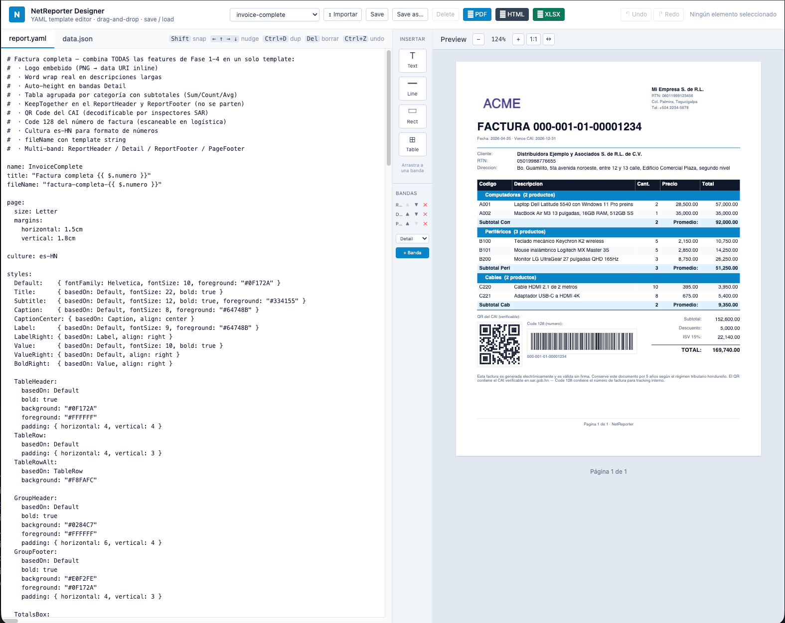
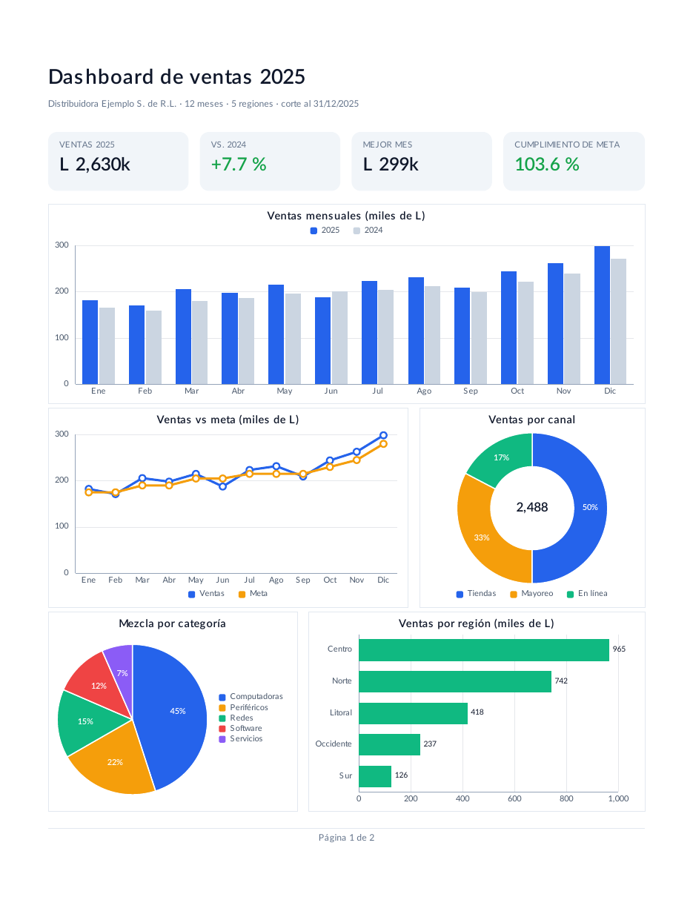
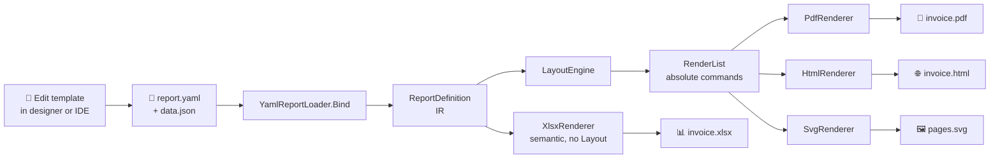

<div align="center">

**🇺🇸 English** · [🇪🇸 Español](README.es.md)

# 🧾 NetReporter

**Reporting engine for .NET 10 with an IR — one template produces PDF, HTML, SVG and XLSX.**

[](https://dotnet.microsoft.com/)
[](https://www.nuget.org/packages/NetReporter)
[](#-tests)
[](#-licenses)
[](#status)

🎨 Visual designer · 📄 PDF · 🌐 HTML · 🖼️ SVG · 📊 XLSX · 📦 YAML templates · 📈 Charts · 🧮 Expressions

</div>

---

## 🎬 NetReporter Designer



> The visual editor: split YAML/data panes on the left, a draggable element toolbox, and a live SVG preview that mirrors what the PDF/HTML/XLSX renderers will produce. Zoom from 25% to 400%, multi-selection, copy/paste, alignment, snap, nudge, undo/redo, and one-click export — all without rebuilding.

---

## 📚 Table of contents

1. [What's new in 1.1](#-whats-new-in-11)
2. [Philosophy and architecture](#-philosophy-and-architecture)
3. [Features](#-features)
4. [Visual pipeline](#-visual-pipeline)
5. [Tech stack](#-tech-stack)
6. [Repository layout](#-repository-layout)
7. [Quick start](#-quick-start)
8. [Visual designer](#-visual-designer)
9. [YAML template syntax](#-yaml-template-syntax)
10. [Expressions (DSL)](#-expressions-dsl)
11. [Charts](#-charts)
12. [Available renderers](#-available-renderers)
13. [Page sizes](#-page-sizes)
14. [Tests](#-tests)
15. [Known limitations](#-known-limitations)
16. [Completed](#-completed)
17. [Roadmap](#-roadmap)
18. [Licenses](#-licenses)

---

## 🆕 What's new in 1.1

Version **1.1.0** ships the whole 1.0 roadmap:

| Feature | Where |
|---|---|
| 🧮 **Expression DSL** — `{{ $.qty * $.price : N2 }}`, `if()`, `sum($.lines[*].total)`, ternaries, 40+ functions | [Expressions](#-expressions-dsl) |
| 🗂️ **Multi-level grouping** — `groups:` with its own header/footer per level, `summary:` grand-total row, `min`/`max` aggregates | [Grouped tables](#grouped-tables-multi-level) |
| 🔒 **KeepTogether on DetailBand** — a detail block moves whole to the next page instead of splitting | [Band properties](#band-properties) |
| 📈 **Charts** — `bar`, `horizontalBar`, `line`, `area`, `pie`, `donut`, fully vector in PDF/SVG/HTML | [Charts](#-charts) |
| 🖱️ **Designer multi-selection + copy/paste** — Shift+click, marquee, Ctrl+A, group drag/nudge, align, Ctrl+C/X/V/D | [Visual designer](#-visual-designer) |
| 🖼️ **Designer pickers** for images (upload → embedded), barcodes and charts, plus binding suggestions from `data.json` | [Visual designer](#-visual-designer) |
| 👁️ **`visible:` conditions** on elements and bands, **dynamic `style:`** per element | [Expressions](#-expressions-dsl) |

Four new sample templates show each feature: `sales-dashboard`, `nested-groups`, `account-statement` and `contracts-keep-together`.



### ⚠️ Behavior changes in 1.1

Existing templates keep working, but a few fixes change output. Review these before upgrading a production template:

1. **Text `wordWrap:` / `autoHeight:` on elements are now honored.** 1.0 silently ignored them in YAML (text always wrapped and never grew), so a text element with `autoHeight: true` may now take more lines.
2. **A table's `bounds.y` is an offset** from the current flow position (the band top, or the previous table). 1.0 ignored it — and dragging a table vertically in the Designer changed the YAML without moving the preview. Templates with `y: 0` are unaffected.
3. **Page headers are laid out after pagination**, like page footers, so `{{ pageNumber }}` / `{{ totalPages }}` resolve in page headers too; `{{ pageNumber }}` in the body now reports the real page (1.0 printed `0`).
4. **Detail bands without tables never split**: if they don't fit, they move to the next page (1.0 drew them over the page footer).
5. **Group headers are never orphaned** at the bottom of a page: a header moves together with its first row.
6. **`{{ $.path:format }}` uses the report `culture:`** (1.0 used the machine's culture).
7. **Accents on capital letters (Á, Í, Ó, Ñ…) are no longer clipped** by the SVG/PDF text clip — 1.0 printed "MARÍA" as "MARIA".
8. **`title:` resolves template strings** (`"Sales {{ $.year }}"`), like `fileName:`.
9. **Designer:** resizing an element or editing X/Y in the properties drawer now writes band-relative bounds; 1.0 wrote page coordinates, so the element jumped by the page margin.
10. Template-string errors throw `DslSyntaxException`, which derives from `FormatException` (existing `catch (FormatException)` blocks keep working) and reports the error position.

---

## 💡 Philosophy and architecture

NetReporter splits the report into four layers with clear interfaces. **The template is unaware of the output format**: it is described once and rendered N times.

```
┌────────────────────────────────────┐
│  📝 Template (YAML / C# API)       │  Declarative definition
└────────────────────────────────────┘
                ▼
┌────────────────────────────────────┐
│  🧠 IR (ReportDefinition)          │  In-memory model
└────────────────────────────────────┘
                ▼
┌────────────────────────────────────┐
│  📐 LayoutEngine                   │  Measure + arrange + pagination
└────────────────────────────────────┘
                ▼
┌────────────────────────────────────┐
│  📋 RenderList                     │  Absolute drawing commands
│  · DrawTextCommand                 │  (single IR for all outputs)
│  · DrawLineCommand                 │
│  · DrawRectangleCommand            │
│  · DrawImageCommand                │
│  · DrawPathCommand  (charts)       │
└────────────────────────────────────┘
                ▼
   ┌───────────┬───────────┬──────────┐
   ▼           ▼           ▼           ▼
 ┌─────┐   ┌──────┐   ┌──────┐   ┌─────────┐
 │ 📄  │   │  🌐  │   │  🖼️  │   │  📊     │
 │ PDF │   │ HTML │   │ SVG  │   │ XLSX *  │
 └─────┘   └──────┘   └──────┘   └─────────┘

 * XLSX is semantic: it consumes ReportDefinition directly (text → cells,
   tables → real Excel ranges with filters/sort), bypassing the RenderList.
```

**Non-negotiable principles:**

| Principle | Implementation |
|---|---|
| 🚫 **No reflection** in hot paths | Data binding with typed `Func<TRow,TValue>`; expressions with `Func<IEvaluationContext,T>`; tables dispatch their row type through a visitor (`ITableVisitor<T>`) |
| 🎨 **No CSS / Tailwind for reports** | Native styling via `StyleSheet` + `StyleRef` (zero-alloc struct) and inheritance through `BasedOn` |
| 🧪 **QuestPDF only as a host** | All PDF drawing flows through SkiaSharp → SVG → `container.Svg(...)` |
| 🔄 **Single IR, multiple outputs** | The `RenderList` is computed once; N renderers consume it |
| 📦 **Editable templates without recompiling** | YAML + JSON wired with JSON Path — and, since 1.1, logic too (expression DSL compiled once to delegates) |

---

## ✨ Features

### Engine
- ⚡ **IR pipeline** — one template, multiple outputs
- 📐 **Layout engine** with pagination, table-header repetition, bands (Report/Page Header/Footer + Detail)
- 📝 **Real word wrap** + auto-height — text breaks naturally, bands grow to fit content
- 🔒 **KeepTogether** — atomic blocks don't split across pages, **including Detail bands with tables** (measured with a dry-run layout)
- 🗂️ **Grouped tables, multi-level** — `groups:` (region → category → …), header/footer per level, `summary:` grand total, `sum`/`count`/`avg`/`min`/`max`
- 📈 **Charts** — bar, horizontal bar, line, area, pie and donut, drawn as vector primitives
- 🧮 **Expression DSL** — arithmetic, comparisons, ternaries, `if()`, text/number/date/aggregate functions; compiled once, evaluated as delegate chains
- 👁️ **Conditional visibility** (`visible:`) on elements and bands, **dynamic styles** (`style: "{{ … }}"`)
- 🖼️ **Embedded images** (PNG/JPEG/GIF/WebP) — file path, data URI or templated source; a missing image is skipped instead of failing the report
- ▦ **Vector barcodes & QR codes** — QR / Code 128 / Code 39 / EAN-13 (via ZXing, opt-in)
- 🎨 **Inheritable StyleSheet** — `BasedOn` chain with cycle detection and caching, plus named themes supplied at bind time
- 🔢 **Per-report culture** — localized number/date formatting (verified with `es-HN`)
- 📋 **Typed tables** — `TableElement<TRow>` with typed columns, alignment, per-column format and style, and computed columns (`binding: "= $.qty * $.price"`)
- 🗂️ **Table styling** — outer border with rounded corners ("card"), header rule, row separators, typed row styles (section / subtotal / total), full-row backgrounds, side-by-side tables
- ⬜ **Rounded rectangles** — `cornerRadius` with per-corner control (`top`, `bottom`, `topLeft`, …) to stack bands into a single card

### YAML templates
- 📝 **Declarative schema** — page, styles, bands, elements
- 🔗 **JSON Path bindings** — `$.client.name`, `$.lines[*]`, `$.lines[*].total` (projection), `$$.root` (document root from inside a table)
- 🪝 **Template strings** — `{{ pageNumber }}`, `{{ totalPages }}`, `{{ $.title }}`, `{{ $.total:N2 }}`, `{{ #group }}`, `{{ #count }}`, and any expression: `{{ $.total * 1.15 : N2 }}`
- 📁 **Templated FileName and title** — `fileName: "invoice-{{ $.number }}"` resolved at export time
- 🎯 **Multi-format** — Letter, Legal, A3-A6, B4-B5, Tabloid, custom (80mm/58mm receipt)

### Visual web designer
- 🖱️ **Drag-and-drop** on the SVG preview (move and create elements) — toolbox with Text, Line, Rect, Table, **Image, Barcode, Chart**
- 🧺 **Multi-selection** — Shift/Cmd+click, marquee (rubber band), Ctrl+A; move, nudge, align (left/center/right/top/middle/bottom), duplicate and delete as a group
- 📋 **Copy / cut / paste** — Ctrl+C / X / V, also between templates (clipboard persisted in `localStorage`)
- 🖼️ **Pickers** — upload an image (embedded as data URI), barcode format/value/colors, chart type/rows/category/series editor, `visible:` condition
- 💡 **Binding suggestions** — paths discovered in `data.json` (arrays for `rows`, row fields for columns/categories/series)
- 🎯 **Resize handles** (8 directions) with 5pt snap when holding Shift
- ⌨️ **Keyboard nudge** — arrows move 1pt, Shift+arrows move 10pt
- 🔍 **Zoom in/out** — 25%–400% with steps, fit-to-width, persisted across reloads
- 📋 **Full CRUD** on elements, bands and table columns
- 💾 **Save/Load** templates to `~/.netreporter/templates/`
- 📦 **14 built-in samples** + **import file** from disk
- ↶ **Undo/Redo** (50 levels, Ctrl+Z / Ctrl+Shift+Z)
- 📥 **One-click export** to PDF, HTML and XLSX

### Renderers
- 📄 **PDF** via QuestPDF + SkiaSharp (Letter, A4, Legal, custom)
- 🌐 **HTML** paginated with CSS `@page` — natively printable, charts as inline SVG, optional floating zoom bar
- 🖼️ **SVG** vector — one per page
- 📊 **XLSX** semantic via ClosedXML — text → cells, tables → native Excel tables (filters, sort, banded rows), grouped tables → Excel outline, charts → data tables

---

## 🔄 Visual pipeline

### End-to-end usage flow


```mermaid
flowchart LR
    A[📝 Edit template<br/>in designer or IDE] --> B[💾 report.yaml<br/>+ data.json]
    B --> C[YamlReportLoader.Bind]
    C --> D[ReportDefinition<br/>IR]
    D --> E[LayoutEngine]
    E --> F[RenderList<br/>absolute commands]
    F --> G1[PdfRenderer]
    F --> G2[HtmlRenderer]
    F --> G3[SvgRenderer]
    D --> G4[XlsxRenderer<br/>semantic, no Layout]
    G1 --> H1[📄 invoice.pdf]
    G2 --> H2[🌐 invoice.html]
    G3 --> H3[🖼️ pages.svg]
    G4 --> H4[📊 invoice.xlsx]
```

### Editing flow inside the designer

```mermaid
flowchart TB
    A[Click on preview] -->|select| B[Properties<br/>drawer]
    A -->|Shift+click / marquee| S[Multi-selection]
    A -->|drag| C[Move element(s)]
    A -->|resize handle| D[Change bounds]
    A -->|Del| E[Delete]
    A -->|Ctrl+C / Ctrl+V| P[Copy / Paste]

    G[Toolbox] -->|drag to band| H[Create element]

    B -->|edit field| I[POST /Home/Update]
    C -->|drop| J[POST /Home/MoveMany]
    S -->|align| J
    D -->|drop| I
    E --> K[POST /Home/DeleteMany]
    P --> L[POST /Home/Copy + /Home/Paste]
    H --> M[POST /Home/Add]

    I --> N[YamlReportRewriter]
    J --> N
    K --> N
    L --> N
    M --> N
    N --> O[Updated YAML]
    O --> Q[LayoutEngine + SvgRenderer]
    Q --> R[Re-render preview]
```

---

## 🛠️ Tech stack

| Layer | Technology | Notes |
|---|---|---|
| Runtime | **.NET 10** | `LangVersion: latest`, `Nullable: enable`, `TreatWarningsAsErrors: true` |
| Layout & IR | Pure C# | No external dependencies |
| Expressions | Pure C# | Hand-written lexer + recursive-descent parser → delegate chain (no Roslyn, no `eval`) |
| YAML parser | **YamlDotNet** 18.1 | CamelCase naming, ignore unmatched, default values handling |
| PDF backend | **QuestPDF** 2026.9 | Used only as a container; drawing goes through SkiaSharp |
| 2D drawing | **SkiaSharp** 4.152 | `SKSvgCanvas` to emit SVG; Linux natives included via `SkiaSharp.NativeAssets.Linux` |
| Web UI | **ASP.NET Core MVC** (.NET 10) | Interactive designer |
| Frontend reactivity | **Alpine.js** 3.14 (CDN) | State + reactivity, no build pipeline |
| Network reactivity | **HTMX** 2.0 (CDN) | Live preview with debounce |
| CSS | **Tailwind CSS** (CDN play) | Utility-first |
| Barcodes (opt-in) | **ZXing.Net** 0.16.11 | Apache 2.0 · QR / Code128 / Code39 / EAN-13 |
| XLSX backend | **ClosedXML** 0.105 | MIT · OpenXML, native Excel tables |
| Tests | **xUnit** 2.9 | 365 tests across 6 projects |
| JSON | `System.Text.Json` (BCL) | No Newtonsoft |

---

## 📁 Repository layout

```
NetReporter/
├── 📦 src/
│   ├── NetReporter.Core/        🧠 IR, Primitives, Styles, Layout (+ ChartLayout), RenderList
│   ├── NetReporter.Templates/   📝 YAML loader/rewriter, JSON Path, template strings, expression DSL
│   ├── NetReporter.Pdf/         📄 PdfRenderer (delegates to Svg)
│   ├── NetReporter.Svg/         🖼️ SvgRenderer (SkiaSharp.SKSvgCanvas)
│   ├── NetReporter.Html/        🌐 HtmlRenderer (paginated HTML/CSS)
│   ├── NetReporter.Xlsx/        📊 XlsxRenderer semantic (ClosedXML, native tables)
│   ├── NetReporter.Barcodes/    ▦ ZXing-based barcode/QR generator (opt-in)
│   └── NetReporter/             📦 Meta-package that references all of the above
│
├── 🧪 tests/
│   ├── NetReporter.Core.Tests/        Primitives, styles, word wrap, auto-height, KeepTogether (report + detail bands), grouped/nested/multi-page tables, table styling, charts, visibility
│   ├── NetReporter.Templates.Tests/   JSON Path, template strings, expression DSL, YAML loader (v1.1 schema), rewriter (single + multi-element + clipboard), file names
│   ├── NetReporter.Html.Tests/        HtmlRendererTests
│   ├── NetReporter.Svg.Tests/         SvgRendererTests
│   ├── NetReporter.Xlsx.Tests/        XlsxRendererTests
│   └── NetReporter.Barcodes.Tests/    ZXingBarcodeGeneratorTests
│
├── 🛠️ tools/
│   └── NetReporter.Designer/    🎨 ASP.NET Core MVC + Alpine + HTMX + Tailwind
│
└── 🎯 samples/
    ├── InvoiceSample/           Invoice using the C# API (no YAML)
    └── TemplateSample/          YAML demo (13 templates exported by Program.cs)
        ├── report.yaml                   Customer report
        ├── invoice-laser.yaml            📄 Letter invoice (laser)
        ├── invoice-paperoll.yaml         🧾 80mm invoice (thermal POS)
        ├── wrap-demo.yaml                Word-wrap + auto-height
        ├── grouped-invoice.yaml          groupBy + sum/count/avg subtotals
        ├── invoice-with-qr.yaml          Logo + QR of CAI
        ├── barcodes-demo.yaml            All 4 barcode formats
        ├── keep-together-demo.yaml       KeepTogether page-break demo
        ├── invoice-complete.yaml         🚀 Flagship — every Phase 1-4 feature
        ├── sales-dashboard.yaml          📈 1.1 — KPIs with expressions + 5 chart types
        ├── nested-groups.yaml            🗂️ 1.1 — region → category groups + grand total
        ├── account-statement.yaml        🧮 1.1 — expressions, visible, dynamic styles
        ├── contracts-keep-together.yaml  🔒 1.1 — KeepTogether on Detail bands
        ├── invoice-complete-pastel.yaml  Pastel-palette variant of the flagship (Designer only)
        └── invoice-with-qr-embedded.yaml Designer copy of invoice-with-qr (logo inlined as data URI)
```

---

## 🚀 Quick start

### Requirements

- ✅ .NET 10 SDK (tested with `10.0.103`)
- ✅ macOS / Linux / Windows
- 🐧 On Linux, SkiaSharp and QuestPDF need `libfontconfig1` on the host (`apt-get install libfontconfig1`)
- ⚠️ QuestPDF Community license for personal use / companies <1M USD/year

### Install from NuGet

```bash
dotnet add package NetReporter   # meta-package: Core + Templates + every renderer + Barcodes
```

Or reference only the pieces you need:

| Package | Contents |
|---|---|
| `NetReporter.Core` | IR, styles, layout engine, charts, RenderList |
| `NetReporter.Templates` | YAML templates, JSON Path bindings, template strings, expression DSL |
| `NetReporter.Pdf` | PDF renderer (QuestPDF host) |
| `NetReporter.Svg` | SVG renderer (SkiaSharp) |
| `NetReporter.Html` | Paginated HTML/CSS renderer |
| `NetReporter.Xlsx` | Semantic XLSX renderer (ClosedXML) |
| `NetReporter.Barcodes` | QR / Code 128 / Code 39 / EAN-13 (ZXing.Net) |

All packages share one version. Every push to `main` publishes a new **patch** version through
[`.github/workflows/publish.yml`](.github/workflows/publish.yml); put `[minor]` or `[major]` in a commit
message to bump that part instead. Each release is tagged `vX.Y.Z` on GitHub. (Release 1.1.0 = the first push
after `v1.0.3` whose commit message contains `[minor]`.)

### Build from source

```bash
git clone https://github.com/mchinchilla/NetReporter.git
cd NetReporter
dotnet build
```

### Render from code (C# API)

```csharp
using NetReporter.Core.Bands;
using NetReporter.Core.Definition;
using NetReporter.Core.Elements;
using NetReporter.Core.Expressions;
using NetReporter.Core.Layout;
using NetReporter.Core.Primitives;
using NetReporter.Core.Styles;
using NetReporter.Pdf;

QuestPDF.Settings.License = QuestPDF.Infrastructure.LicenseType.Community;

var styles = new StyleSheetBuilder()
    .Add("Default", s => s.FontFamily("Helvetica").FontSize(12))
    .Add("Title",   s => s.BasedOn("Default").FontSize(24).Bold())
    .Build();

var page = PageSetup.Letter.WithMargins(new Thickness(Units.Cm(2)));

var report = new ReportDefinition
{
    Name = "Hello",
    Page = page,
    Styles = styles,
    Bands = new Band[]
    {
        new ReportHeaderBand
        {
            Height = 60,
            Elements = new ReportElement[]
            {
                new TextElement
                {
                    Bounds = new Rect(0, 0, page.ContentWidth, 30),
                    Content = Expr.Str("Hello NetReporter"),
                    Style = new StyleRef("Title")
                }
            }
        }
    }
};

var pdf = new PdfRenderer().Render(new LayoutEngine().Layout(report));
File.WriteAllBytes("hello.pdf", pdf);
```

### Render from YAML template

```csharp
using NetReporter.Core.Layout;
using NetReporter.Pdf;
using NetReporter.Templates;

QuestPDF.Settings.License = QuestPDF.Infrastructure.LicenseType.Community;

var template = YamlReportLoader.Load("invoice-laser.yaml");
var json = File.ReadAllText("invoice-data.json");
var report = template.Bind(json);

var layout = new LayoutEngine().Layout(report);
File.WriteAllBytes("invoice.pdf", new PdfRenderer().Render(layout));
File.WriteAllText("invoice.html", new NetReporter.Html.HtmlRenderer().Render(layout));

// XLSX is semantic: it consumes the ReportDefinition directly (not the layout)
File.WriteAllBytes("invoice.xlsx", new NetReporter.Xlsx.XlsxRenderer().Render(report));
```

### Run the samples

```bash
# Imperative C# sample
dotnet run --project samples/InvoiceSample
# → samples/InvoiceSample/bin/Debug/net10.0/factura.pdf

# YAML sample — emits PDF + XLSX for every template (13 reports × 2 outputs)
dotnet run --project samples/TemplateSample
# → samples/TemplateSample/bin/Debug/net10.0/*.pdf and *.xlsx

# Visual designer (browser)
dotnet run --project tools/NetReporter.Designer
# → http://localhost:5296
```

---

## 🎨 Visual designer


### Launch

```bash
dotnet run --project tools/NetReporter.Designer
```

Open `http://localhost:5296`.

### Layout

The designer is a three-pane web app (visible in the screenshot above):

- **Left** — tabbed editor for `report.yaml` and `data.json`. Edits debounce and re-render the preview.
- **Middle** — the **Toolbox** (drag `Text` / `Line` / `Rect` / `Table` / `Image` / `Code` / `Chart` onto a band) and the **Bands** list with reorder/delete controls.
- **Right** — live **SVG preview** of the rendered page, with zoom controls (`−` / `+` / `1:1` / `↔`) and pagination. Click any element to select it; a properties drawer slides in on the right edge. With several elements selected, the drawer switches to **multi-selection** (list, align, copy, duplicate, delete).

The header strip exposes the global actions: template picker, **Import**, **Save** / **Save as** / **Delete**, **Undo** / **Redo**, and one-click export to **PDF** / **HTML** / **XLSX**.

### Properties drawer per element

| Element | Editable in the drawer |
|---|---|
| All | Bounds (band-relative pt), **Visible if…** (expression) |
| `text` | Style, content (template strings + expressions) |
| `line` | Color, thickness |
| `rectangle` | Style, fill, corner radius |
| `table` | Rows path, header/row heights, header mode, header/row/alt styles, inline column editor (binding accepts `= expr`) |
| `image` | **Choose image…** (upload → embedded data URI, warns above 2 MB), path or template source, fit |
| `barcode` | Format (QR / Code 128 / Code 39 / EAN-13), value (text or template), foreground/background colors |
| `chart` | Style, type, legend, title, rows path, category, values/percent/stacked, value format, **series editor** (name, color, value binding) |

Path inputs suggest bindings discovered in `data.json`: array paths for `rows`, and the fields of the first row for columns, categories and series.

### Keyboard shortcuts

| Action | Shortcut |
|---|---|
| Move element | Click + drag |
| Move with snap | Shift + drag |
| Resize | Drag a handle (8 directions) |
| Add / remove from selection | `Shift` / `Cmd` / `Ctrl` + click |
| Marquee selection | Drag on an empty area of the page (Shift adds to the selection) |
| Select all | `Ctrl+A` / `Cmd+A` |
| Clear selection | `Esc` |
| Nudge 1pt | `← ↑ → ↓` (moves the whole selection) |
| Nudge 10pt | `Shift + ← ↑ → ↓` |
| Delete | `Del` or `Backspace` |
| Duplicate | `Ctrl+D` / `Cmd+D` |
| Copy / Cut / Paste | `Ctrl+C` / `Ctrl+X` / `Ctrl+V` (paste goes into the band of the selected element, or back to the original bands) |
| Undo | `Ctrl+Z` / `Cmd+Z` |
| Redo | `Ctrl+Shift+Z` / `Ctrl+Y` |
| Zoom in | `Ctrl/Cmd + +` (or `=`) |
| Zoom out | `Ctrl/Cmd + -` |
| Reset zoom (100%) | `Ctrl/Cmd + 0` |

### Built-in samples (📦 Samples dropdown)

| Sample | Demonstrates |
|---|---|
| `clientes` | Basic tabular report with header, table, page footer |
| `invoice-laser` | Full Letter invoice with totals block |
| `invoice-paperoll` | 80mm continuous receipt (POS thermal printer) |
| `wrap-demo` | Real word wrap + band auto-height |
| `grouped-invoice` | `groupBy` with per-group headers and `Sum`/`Count`/`Avg` subtotals |
| `invoice-with-qr` | Embedded PNG logo + vector QR code of the CAI |
| `barcodes-demo` | All 4 supported barcode formats (QR / Code128 / Code39 / EAN-13) on a single page |
| `keep-together` | `keepTogether` forcing a clean page break on a "Terms & signatures" block |
| `invoice-complete` | 🚀 **Flagship** — all Phase 1-4 features combined: logo, word-wrap, autoHeight, grouped table, QR, barcode, KeepTogether, culture es-HN, templated fileName (shown in the screenshot above) |
| `invoice-complete-pastel` | Same flagship invoice restyled with a light pastel palette (light table header, tinted group rows and boxes) |
| `sales-dashboard` | 📈 KPI cards computed with expressions (green/red via dynamic style), grouped bar, line, donut, pie and horizontal-bar charts, monthly table with computed columns and summary |
| `nested-groups` | 🗂️ Two-level groups (region → category) with `group(0)`, `min`/`max`/`avg` footers and a grand-total `summary` spanning two pages |
| `account-statement` | 🧮 Expressions everywhere: `upper`, `padLeft`, date formats, ternaries, `= expr` columns, `visible:` warning/promo blocks, dynamic balance color |
| `contracts-keep-together` | 🔒 One Detail band per client (card + table) with `keepTogether: true`: blocks move whole to the next page |

### Typical flow

1. **Open a sample** → `📦 Samples / invoice-with-qr`.
2. **Edit** sample data on the `data.json` tab.
3. **Drag** a text, **resize** a table, **add columns** from the drawer, **drop a chart** from the toolbox and pick its rows/series.
4. **Save as…** with your own name → stored in `~/.netreporter/templates/`.
5. **⭳ PDF**, **⭳ HTML** or **⭳ XLSX** → downloads with the template's `fileName` (e.g. `invoice-000-001.pdf`).

### Import files from disk

`↥ Import` opens a file picker accepting `.yaml`, `.yml`, `.json`. Multi-select (yaml + json at once). Auto-detects which is which by extension.

### Zoom controls

The preview header has `−` / `+` / `1:1` / `↔` buttons. Steps are `25 · 50 · 75 · 100 · 125 · 150 · 200 · 300 · 400 %`. The `↔` button fits the page width to the available preview area. The chosen level persists in `localStorage` so reloading the designer keeps it. Drag and resize coordinates are compensated for the current zoom — moving an element at 200% still moves it pt-by-pt in the YAML.

> Implementation note: the preview is scaled with `transform: scale(var(--zoom))`, not the CSS `zoom` property. `zoom` would push the scaled content into flex layout calculations, making the preview panel invade the YAML editor / toolbox. The flex items in the preview chain require `min-w-0` so the parent's `overflow-auto` actually clips the scaled content instead of letting it grow the panel.

---

## 📝 YAML template syntax

### Minimal skeleton

```yaml
name: MyReport
title: "Report {{ $.title }}"
fileName: "report-{{ $.id }}"      # optional, supports template strings

page:
  size: Letter                       # Letter | Legal | A3-A6 | B4-B5 | Tabloid | custom
  orientation: Portrait              # Portrait | Landscape
  margins:                           # all | horizontal + vertical | left/top/right/bottom
    horizontal: 1.5cm
    vertical: 1.8cm

culture: en-US                       # culture for number/date formatting

styles:                              # or `theme: <name>` — see "Styles and themes" below
  Default:
    fontFamily: Helvetica
    fontSize: 10
    foreground: "#0F172A"
  Title:
    basedOn: Default
    fontSize: 18
    bold: true

bands:
  - kind: ReportHeader               # ReportHeader | PageHeader | Detail | PageFooter | ReportFooter
    height: 60
    elements:
      - type: text                   # text | line | rectangle | table | image | barcode | chart
        bounds: { x: 0, y: 0, width: 500, height: 24 }
        content: "{{ $.title }}"
        style: Title
```

### Available elements

| Type | Key fields |
|---|---|
| `text` | `content` (template), `style`, `wordWrap`, `autoHeight` |
| `line` | `orientation` (horizontal/vertical), `color`, `thickness` |
| `rectangle` | `fill`, `borderLine: { thickness, color }`, `cornerRadius`, `roundedCorners` |
| `table` | `rows` (JSON Path), `columns[]`, `headerStyle`, `rowStyle`, `alternateRowStyle`, `headerHeight`, `rowHeight`, `headerMode`, `groupBy`, `groupHeader`, `groupFooter`, `groups`, `summary`, `headerRule`, `rowSeparator`, `rowStyleBinding`, `rowStyleMap`, `fullRowBackground`, `outerBorder`, `cornerRadius`, `suppressAdvance` |
| `image` | `source` (file path, `data:image/png;base64,...` or template such as `{{ $.logo }}`), `fit` (contain/fill) |
| `barcode` | `value` (template), `format` (qr/code128/code39/ean13), `barcodeForeground`, `barcodeBackground` |
| `chart` | `chartType`, `rows`, `category`, `series[]`, `title`, `legend`, `showValues`, `showPercent`, `stacked`, `valueFormat`, `axisMin`/`axisMax`, `palette`, `innerRadius`, `lineWidth`, `showGrid`, `showMarkers`, `fill`, `borderLine` — see [Charts](#-charts) |

Every element also accepts `bounds: { x, y, width, height }`, an optional `style` (a name, or a template that returns a name — see [dynamic styles](#dynamic-styles)) and an optional `visible:` condition.

### Styles and themes

| Style property | Values |
|---|---|
| `basedOn` | Name of the parent style (inheritance chain, max 16 levels, cycles rejected) |
| `fontFamily`, `fontSize` | Font name, size in pt |
| `bold`, `italic` | `true` / `false` |
| `foreground`, `background` | Hex color (`"#0F172A"`) |
| `align` / `vAlign` | `left` · `center` · `right` · `justify` / `top` · `center` · `bottom` |
| `padding` | Same shape as page margins (`all`, `horizontal`/`vertical`, or per side) |
| `border` | `all`, `horizontalEdges`, or `top`/`bottom`/`left`/`right`, each `{ thickness, color }` |
| `format` | .NET format string applied to values (`N2`, `C`, `yyyy-MM-dd`, …) |

Instead of inline `styles`, a template can reference a shared theme with `theme: Corporate`. Themes are `StyleSheet`s passed in at bind time — an unknown theme name throws:

```csharp
var report = template.Bind(json, new Dictionary<string, StyleSheet> { ["Corporate"] = corporateStyles });
```

If a template has neither `styles` nor `theme`, `StyleSheet.Minimal` is used.

### Band properties

| Property | Effect |
|---|---|
| `height` | Reserved minimum height (pt) |
| `autoHeight: true` | Band grows to fit its content (max with `height`) |
| `keepTogether: true` | If the band doesn't fit on the current page, page break before emitting. The height is **measured with a dry-run layout** (auto-height text and tables included), so it also works on **Detail bands with tables**. A band taller than a whole page is emitted normally (no empty page). |
| `visible` | Condition (expression); when false the band is skipped. Page header/footer conditions can use `pageNumber` / `totalPages`. |
| `printOnFirstPage` / `printOnLastPage` | Page header/footer: set to `false` to skip the first / last page |

Detail bands **without** tables never split: their elements are positioned relative to the band top, so a band that doesn't fit moves whole to the next page, with or without `keepTogether`.

```yaml
- kind: Detail
  height: 0
  autoHeight: true
  keepTogether: true              # the whole card (header + table + total) moves as one block
  elements:
    - { type: rectangle, bounds: { x: 0, y: 0, width: 527, height: 30 }, fill: "#4338CA", cornerRadius: 8, roundedCorners: top }
    - { type: text, bounds: { x: 10, y: 9, width: 360, height: 14 }, content: "{{ $.clients[0].name }}" }
    - type: table
      bounds: { x: 0, y: 30, width: 527, height: 0 }   # y = offset below the card header
      rows: "$.clients[0].services"
      columns: [...]
```

### Table with columns

```yaml
- type: table
  bounds: { x: 0, y: 0, width: 527, height: 0 }
  rows: "$.lines"
  headerStyle: TableHeader
  rowStyle: TableRow
  alternateRowStyle: TableRowAlt
  headerMode: RepeatOnPageBreak       # PrintOnce | RepeatOnPageBreak
  headerHeight: 22
  rowHeight: 18
  columns:
    - { header: "Code",        binding: "$.code",                 width: 70,  align: left }
    - { header: "Description", binding: "$.description",          width: 197, align: left }
    - { header: "Qty",         binding: "$.quantity",             width: 50,  align: right }
    - { header: "Price",       binding: "$.price",                width: 75,  format: "N2", align: right }
    - { header: "Total",       binding: "= $.quantity * $.price", width: 75,  format: "N2", align: right, style: Mono }
    - { header: "Tax",         binding: "= $.quantity * $.price * $$.taxRate", width: 60, format: "N2", align: right }
```

A column's optional `style` is merged over the row style (e.g. a monospaced font for codes or amounts). A `binding` that starts with `=` is an [expression](#-expressions-dsl) evaluated per row: `$` is the row, `$$` is the data root.

The table starts at the current flow position plus `bounds.y` — use it to leave room for a title above the table inside the same band.

### Table styling

```yaml
- type: table
  rows: "$.accounts"
  headerRule:   { thickness: 1,    color: "#0F172A" }   # one full-width rule under the header, no cell boxes
  rowSeparator: { thickness: 0.25, color: "#CBD5E1" }   # hairline under every data row ("lined ledger")
  outerBorder:  { thickness: 0.5,  color: "#94A3B8" }   # border around the whole table (per page segment)
  cornerRadius: 6                                       # rounds the outer border into a "card"

  rowStyleBinding: "$.kind"                             # typed rows: pick a style per row… (also "= expr")
  rowStyleMap:                                          # …from this map (unknown keys fall back to rowStyle)
    section:  SectionRow
    subtotal: SubtotalRow
    total:    TotalRow
  fullRowBackground: true                               # paint styled row backgrounds edge to edge (no cell seams)

  suppressAdvance: true                                 # don't move the band cursor: the next table starts at the same Y
  columns: [...]
```

`suppressAdvance` enables side-by-side tables (e.g. a T-account balance sheet): give each table its own `bounds.x`/`width`. The band's auto-height still grows to contain it, but a suppressed table must fit on one page — it does not drive pagination.

### Rounded rectangles

```yaml
- type: rectangle
  bounds: { x: 0, y: 0, width: 527, height: 40 }
  fill: "#F1F5F9"
  borderLine: { thickness: 0.5, color: "#CBD5E1" }
  cornerRadius: 8
  roundedCorners: top            # all (default) | none | top | bottom | left | right
                                 # or a comma list: topLeft, topRight, bottomRight, bottomLeft
```

Rounding only the `top` corners of one band and the `bottom` corners of the next makes stacked bands read as a single card. Rounded corners are drawn in PDF, SVG and HTML.

### Images and barcodes

```yaml
# Embedded image — local path or inline data URI
- type: image
  bounds: { x: 0, y: 0, width: 120, height: 60 }
  source: "logo.png"                            # or: data:image/png;base64,...
  fit: contain                                  # contain | fill

# Vector QR code (also: code128, code39, ean13)
- type: barcode
  bounds: { x: 0, y: 0, width: 90, height: 90 }
  value: "{{ $.cai }}"                          # template string evaluated
  format: qr
  barcodeForeground: "#0F172A"
  barcodeBackground: "#FFFFFF"
```

An image `source` can also be a template string (`"{{ $.logo }}"`). If it resolves to empty, to a file that doesn't exist or to a malformed data URI, the element is skipped instead of failing the report — handy for optional white-label logos.

Barcodes are emitted as N `DrawRectangleCommand`s (one per dark module) — fully **vector**, scaling perfectly in PDF/SVG/HTML at any zoom. Requires `NetReporter.Barcodes` reference and passing `ZXingBarcodeGenerator.Instance` to the `LayoutEngine` ctor:

```csharp
var layout = new LayoutEngine(SkiaTextMeasurer.Instance, ZXingBarcodeGenerator.Instance)
                 .Layout(report);
```

The Designer already wires this up — barcodes work out-of-the-box in preview/export.

### Grouped tables (multi-level)

`groups:` groups consecutive rows level by level (index 0 = outermost). Each level has its own header and footer; `summary:` adds a grand-total row after all groups:

```yaml
- type: table
  rows: "$.sales"                                    # rows must come sorted by region, then category
  columns:
    - { header: "Product", binding: "$.product",              width: 207 }
    - { header: "Units",   binding: "$.units",                width: 70, format: "N0", align: right }
    - { header: "Price",   binding: "$.price",                width: 80, format: "N2", align: right }
    - { header: "Total",   binding: "= $.units * $.price",    width: 95, format: "N2", align: right }
    - { header: "Margin",  binding: "$.margin",               width: 75, format: "N1", align: right }

  groups:
    - by: "$.region"                                 # JSON Path or "= expr"
      header: { height: 20, style: RegionHeader, content: "Region {{ #group }} · {{ #count }} products" }
      footer:
        height: 18
        style: RegionFooter
        cells:                                       # parallel to columns by index
          - { content: "Total {{ #group }}" }
          - { aggregate: sum, format: "N0", align: right }
          - null                                     # blank
          - { aggregate: sum, format: "N2", align: right }
          - { aggregate: avg, format: "N1", align: right }
    - by: "$.category"
      header: { height: 17, style: CategoryHeader, content: "{{ group(0) }} › {{ #group }} ({{ #count }})" }
      footer:
        height: 16
        cells: [ { content: "Subtotal {{ #group }}" }, { aggregate: sum }, { aggregate: min, format: "N2" }, { aggregate: sum, format: "N2" }, { aggregate: max } ]

  summary:                                           # grand total over ALL rows (default style: TableSummary)
    height: 22
    cells: [ { content: "GRAND TOTAL · {{ #count }} lines" }, { aggregate: sum, format: "N0" }, null, { aggregate: sum, format: "N2" } ]
```

- Aggregates: `sum` · `count` · `avg` · `min` · `max`. Each footer cell aggregates the **same column's binding** (including computed `= expr` columns) over the rows of its own group. Numeric conversion is safe across `int`/`long`/`decimal`/`double`/`float`/parseable strings.
- In headers and footers: `{{ #group }}` = key of the current level, `{{ #count }}` = rows in the group, `{{ group(0) }}` = key of the outer level (`group(1)`, … for deeper ones). In `summary`, `#count` is the total row count.
- A group header is kept with its first row (never orphaned at the bottom of a page); the table header repeats on every page.
- In XLSX, each group's detail rows are grouped in the Excel **outline** (collapsible).
- The single-level shortcut from 1.0 still works: `groupBy` + `groupHeader` + `groupFooter`.

> **Limitation:** rows must come pre-sorted by the group keys — groups are consecutive runs, there's no internal sort.

### Template strings

| Placeholder | Resolves to |
|---|---|
| `{{ pageNumber }}` | Current page number |
| `{{ totalPages }}` | Total pages |
| `{{ rowIndex }}` | Row index (in table context) |
| `{{ $.path.to.field }}` | JSON Path value |
| `{{ $.path.to.field:N2 }}` | JSON Path value with a .NET format string (numbers and dates) |
| `{{ #group }}` | Current group key (in group header/footer context) |
| `{{ #count }}` | Number of rows in current group |
| `{{ any expression : format }}` | Result of an [expression](#-expressions-dsl), optionally formatted |

### Units

`pt`, `mm`, `cm`, `in` — the parser recognises them: `1.5cm`, `15mm`, `1in`, `42pt`.

---

## 🧮 Expressions (DSL)

Since 1.1 templates can carry logic, not just data. An expression is parsed **once** when the template loads (text → syntax tree → chain of delegates) and then evaluated per page/row without touching the text again — no reflection, no Roslyn, no arbitrary code: it is a closed language. Syntax errors fail at load time with the exact position (`DslSyntaxException`).

### Where expressions are allowed

| Place | Example |
|---|---|
| Any template string | `content: "Total: {{ sum($.lines[*].total) * 1.15 : N2 }}"` |
| Column / group / category / series binding (prefix `=`) | `binding: "= $.qty * $.price"` |
| `rowStyleBinding` | `rowStyleBinding: "= $.balance < 0 ? 'negative' : 'ok'"` |
| `visible:` on elements and bands (bare or in `{{ }}`) | `visible: "$.discount > 0"` |
| Dynamic `style:` (returns a style name) | `style: "{{ $.balance > 0 ? 'Due' : 'Paid' }}"` |

### Syntax

| Kind | Syntax |
|---|---|
| Literals | `12`, `3.5`, `'text'` or `"text"`, `true`, `false`, `null` |
| Paths | `$.client.name`, `$.lines[0].total`, `$.lines[-1].total` (last), `$.lines[*].total` (list), `$$.company` (always the data root — useful inside tables) |
| Context | `pageNumber`, `totalPages`, `rowIndex`, `rowNumber` (1-based), `#group`, `#count`, `#level` |
| Arithmetic | `+ - * / %` (decimal math; `+` concatenates when a side is text; division by zero → `null`) |
| Comparison | `== != < <= > >=` (numbers, dates and text; comparing with `null` is false) |
| Logic | `&&` / `and`, `\|\|` / `or`, `!` / `not`, `??` (null coalescing), `cond ? a : b` |
| Format suffix | `{{ expr : N2 }}` — the last top-level `:` (not part of a ternary) starts a .NET format string |

### Functions

| Group | Functions |
|---|---|
| Logic | `if(cond, a, b)` (lazy — only evaluates the chosen branch), `iif`, `coalesce(a, b, …)`, `isNull(x)`, `isEmpty(x)` |
| Text | `upper`, `lower`, `trim`, `len`, `substr(s, start[, len])`, `left(s, n)`, `right(s, n)`, `replace(s, a, b)`, `contains(s, x)`, `startsWith`, `endsWith`, `concat(…)`, `padLeft(s, n[, c])`, `padRight`, `join(list[, sep])` |
| Numbers | `round(x[, decimals])`, `floor`, `ceil`, `abs`, `min(…)`, `max(…)`, `number(x)` |
| Aggregates | `sum(list)`, `avg(list)`, `count(list)`, `min(list)`, `max(list)` — lists come from `[*]` paths |
| Dates | `date(x[, format])`, `now()`, `today()`, `year(d)`, `month(d)`, `day(d)`, `addDays(d, n)`, `addMonths(d, n)` |
| Formatting | `format(x, 'N2')`, `text(x)` |
| Groups | `group(n)` — key of group level *n* (0 = outermost) |

```yaml
content: "{{ upper($.client.name) }} · account {{ padLeft($.client.number, 10, '0') }}"
content: "{{ $.balance > 0 ? 'Minimum payment L ' + format(max($.balance * 0.05, 250), 'N2') : 'Nothing due' }}"
content: "Due date: {{ format(addDays($.cutoff, 20), 'dd/MM/yyyy') }}"
content: "{{ count($.clients[*].services[*]) }} services"          # nested wildcards flatten
```

Values are typed as `decimal` (numbers), `string`, `bool`, `DateTime`, lists or `null`; strings that look like numbers or ISO dates are converted when compared or formatted, so `format($.date, 'dd/MM')` works with JSON dates. Formatting uses the report `culture:`.

<a id="dynamic-styles"></a>**Dynamic styles:** a `style:` that contains `{{ }}` is evaluated at render time and must return a style name. If the result is empty or the style doesn't exist, the element falls back to `Default`.

**Conditional visibility:** `visible:` on an element or band hides it when the expression is falsy (`null`, `false`, `0`, `""`, empty list). Hidden elements take no space in auto-height bands.

From C#, the same engine is available directly:

```csharp
var expr = DslExpression.Parse("$.qty * $.price * (1 - $$.discount / 100)");
object? value = expr.Evaluate(context, row, root);                // decimal
var binding = BindingFactory.Create("= $.qty * $.price", root);  // IDataBinding<JsonElement, object?>
```

---

## 📈 Charts


A `chart` element reads its rows with a JSON Path, takes one category per row and one value per series:

```yaml
- type: chart
  chartType: bar                  # bar | horizontalBar | line | area | pie | donut
  bounds: { x: 0, y: 0, width: 527, height: 176 }
  style: ChartText                # font of labels, ticks and legend
  rows: "$.months"
  category: "$.month"             # path or "= expr"
  title: "Monthly sales {{ $.year }}"
  legend: top                     # none | top | bottom | right (omitted = auto)
  valueFormat: "N0"
  showValues: false               # value labels on bars / points / slices
  stacked: false                  # bar, horizontalBar, area
  fill: "#FFFFFF"                 # chart background (optional)
  borderLine: { thickness: 0.5, color: "#E2E8F0" }
  series:
    - { name: "{{ $.year }}",     value: "= $.sales / 1000",    color: "#2563EB" }
    - { name: "{{ $.year - 1 }}", value: "= $.previous / 1000", color: "#CBD5E1" }
```

| Type | Notes |
|---|---|
| `bar` | Vertical bars; several series are grouped side by side, or stacked with `stacked: true` |
| `horizontalBar` | Categories on the Y axis — best for long labels (regions, products) |
| `line` | One polyline per series with markers (`showMarkers`, `lineWidth`); a `null` value breaks the line |
| `area` | Filled area under each line (semi-transparent), stackable |
| `pie` / `donut` | Uses the first series; one slice per category; `showPercent: true` labels slices with percentages; `innerRadius` (0–0.9) sets the donut hole, which shows the total when `showValues` is on |

Other options: `axisMin` / `axisMax` (by default the axis always includes zero and uses "nice" ticks), `palette: ["#…", …]` (colors by series — or by category for pie/donut), `showGrid`. Category labels that don't fit are thinned automatically so they never overlap, and value labels are kept inside the chart box.

Charts are laid out by the engine into vector primitives (`DrawRectangleCommand`, `DrawLineCommand`, `DrawTextCommand` and the new `DrawPathCommand`), so they look identical in PDF, SVG and HTML. The XLSX renderer, being semantic, exports each chart as its **data table** (category + one column per series, as a native Excel table) so you can chart it in Excel.

From C#:

```csharp
var (categories, series) = ChartElement.From(sales, s => s.Month,
    ("2025", s => (double?)s.Total), ("Target", s => (double?)s.Target));

var chart = new ChartElement
{
    Bounds = new Rect(0, 0, 500, 200),
    Kind = ChartKind.Line,
    Categories = categories,
    Series = series,
    Title = "Sales vs target"
};
```

---

## 🎨 Available renderers

### 📄 PDF — `NetReporter.Pdf`

Generates vector PDF via **QuestPDF** (host) + **SkiaSharp** (drawing). Selectable text, native print quality.

```csharp
byte[] pdf = new PdfRenderer().Render(renderList);
```

### 🌐 HTML — `NetReporter.Html`

Emits self-contained HTML with CSS `@page` for print and screen styling with shadows and gaps between pages. Chart paths are written as inline `<svg>` elements.

```csharp
string html = new HtmlRenderer().Render(renderList, new HtmlRenderOptions
{
    Title = "Invoice",
    ShowScreenChrome = true,  // shadow/margin between pages on screen
    FullDocument = true,      // false → only the pages markup (fragment to embed)
    ShowZoomControls = false, // floating zoom bar (bottom-right), level persisted in localStorage
    InitialZoom = 1.0         // first-load zoom when ShowZoomControls = true
});
```

- 📱 Natively printable with Ctrl+P respecting page size (the zoom bar is hidden when printing)
- 🚀 Zero external dependencies (only `System.Net.WebUtility`)
- 🎨 Inline CSS, easy to embed in any page

### 🖼️ SVG — `NetReporter.Svg`

One SVG string per page. Used internally by the PDF renderer and the designer's live preview.

```csharp
IReadOnlyList<string> svgs = new SvgRenderer().Render(renderList);
```

### 📊 XLSX — `NetReporter.Xlsx`

**Semantic** renderer: it consumes the `ReportDefinition` directly (no `LayoutEngine`, no `RenderList`). `TextElement`s become cells, `TableElement<TRow>`s become real Excel ranges (filterable, sortable, banded). Decorative elements (Line / Rectangle / Barcode) are intentionally skipped — they have no equivalent in a spreadsheet.

```csharp
byte[] xlsx = new XlsxRenderer().Render(report, new XlsxRenderOptions
{
    WorksheetName = "Invoice",     // default: ReportDefinition.Name (truncated to 31 chars)
    EmitNativeTables = true,       // tables → Excel Tables (filters + sort + banded rows)
    FreezeTableHeaders = false     // freeze pane below each table header
});
```

- 📊 Tables emitted as **native Excel Tables** with filters, sort and banded rows
- 🗂️ Grouped tables: group headers/footers as rows, detail rows in the Excel **outline** (collapsible), `summary` row below
- 📈 Charts exported as their data table (category + series columns)
- 🎨 Per-cell styles (font, color, alignment) preserved from the `StyleSheet`, including dynamic styles and `visible:` conditions
- 📐 Page setup (paper size, orientation, margins) mapped to Excel page setup
- 🖼️ Embedded images preserved (sized in points → pixels @ 96dpi)
- 🌍 Per-report culture honored for number/date formatting

---

## 📐 Page sizes

### US / ANSI
`Letter` · `Legal` · `Tabloid` · `Executive` · `Statement`

### ISO A
`A3` · `A4` · `A5` · `A6`

### ISO B
`B4` · `B5`

### Custom (e.g. POS receipt)

```yaml
page:
  size: custom
  width: 226.77        # 80mm in points
  height: 600
```

### Fluent transformations (C# API)

```csharp
PageSetup.A4.Landscape().WithMargins(Units.Cm(1.5))
PageSetup.Custom(226.77, 600).WithMargins(8)
```

---

## 🧪 Tests

```bash
dotnet test
```

```
┌─────────────────────────────────────┬───────┐
│ Project                             │ Tests │
├─────────────────────────────────────┼───────┤
│ NetReporter.Core.Tests              │  114  │
│ NetReporter.Templates.Tests         │  204  │
│ NetReporter.Html.Tests              │   20  │
│ NetReporter.Svg.Tests               │    5  │
│ NetReporter.Xlsx.Tests              │   15  │
│ NetReporter.Barcodes.Tests          │    7  │
├─────────────────────────────────────┼───────┤
│ Total                               │  365  │
└─────────────────────────────────────┴───────┘
```

**Coverage by area:**

- 🧠 **Core**: hex color parsing, PageSetup transformations, StyleSheet (inheritance + cycles + cache), BorderSet factories, **word-wrap algorithm**, **band auto-height**, **KeepTogether on report and detail bands (dry-run measurement)**, **nested groups + summary + min/max**, **group-header keep-with-next**, **multi-page tables with repeating PageHeader**, **table outer border / header rule / row separators / typed row styles**, **table `bounds.y` offset**, **rounded rectangles**, **charts (bar/line/area/pie/donut/horizontal, legend, labels inside bounds)**, **visible / dynamic style**, **page chrome with `totalPages`**.
- 📝 **Templates**: JSON Path, TemplateString (placeholders + literals + escape + `:format`), **expression DSL (operators, functions, errors with position, format splitting)**, **v1.1 YAML schema (charts, groups, visible, dynamic style, text flags, band flags)**, YamlReportRewriter (every mutation method, **multi-element moves/deletes, clipboard copy/paste, image/barcode/chart patches, series editor**), FileName resolution, `cornerRadius` / `roundedCorners` parsing.
- 🌐 **Html**: valid HTML, special-char escaping, fonts, alignments, lines, rectangles (incl. rounded corners), **paths as inline SVG**, multi-page, print CSS, fragment mode, opt-in zoom bar.
- 🖼️ **Svg**: rounded and square rectangles, **filled and stroked paths**.
- 📊 **Xlsx**: text → cells, tables → ranges, native Excel Tables, **nested groups with outline + summary**, **charts as data tables**, **dynamic styles**, page setup mapping, sheet-name sanitation, image embedding, per-culture formatting.
- ▦ **Barcodes**: QR finder patterns, Code 128 bar density, EAN-13 strict validation, edge cases (empty/null/throwing fallback).

The Designer (UI) has no automated tests; its 1.1 features were verified manually in Chrome (toolbox creation, pickers, multi-selection, marquee, group drag, align, copy/paste, resize, exports).

---

## ⚠️ Known limitations

| Feature | Status | Current workaround |
|---|---|---|
| **Subreports** | ❌ | Use several Detail bands / tables over different JSON paths |
| **Data-driven Detail bands** | ❌ | A Detail band is a static block; repeat data with tables (and groups) instead of repeating bands |
| **Unsorted grouping** | ⚠️ | Groups are consecutive runs: sort the rows by the group keys before binding |
| **Chart types** | ⚠️ | bar / horizontalBar / line / area / pie / donut. No scatter, combo or dual-axis charts; no axis titles (use a text element) |
| **Expression DSL** | ⚠️ | Closed set of functions — no user-defined functions, no filtering (`where`) inside lists |
| **Hidden elements in the Designer** | ⚠️ | An element whose `visible:` is false isn't drawn, so it can't be clicked: edit its YAML (or clear the condition) to bring it back |
| **Side-by-side tables across pages** | ⚠️ | A `suppressAdvance` table doesn't drive pagination — keep it to one page |
| **XLSX: lines / rectangles / barcodes** | ⚠️ | Decorative elements skipped on purpose — XLSX is semantic, not pixel-perfect |
| **XLSX: charts** | ⚠️ | Exported as data tables (ClosedXML has no chart API); insert an Excel chart over the table if needed |

### Documented technical debt

1. **Approximate `EstimateTextMeasurer`** — `chars * fontSize * 0.55`. The real measurement happens in SkiaSharp at paint time. For layout that depends on real text metrics, pass `SkiaTextMeasurer.Instance` to the `LayoutEngine` (the Designer and samples do).
2. **YAML re-serialization drops comments** — the rewriter does parse → modify POCO → re-serialize. If you plan to hand-edit YAML with comments, do so after using the designer.

(The 1.0 debt item "reflection in `LayoutEngine.RenderTableElement`" is gone: tables now dispatch their row type through `ITableVisitor<T>`, in both the layout engine and the XLSX renderer.)

---

## ✅ Completed

- [x] **Phase 1** — IR → Layout → RenderList → PDF pipeline
- [x] **Phase 2.1** — YAML templates + JSON binding
- [x] **Phase 2.2** — HTML renderer
- [x] **Phase 2.3** — Visual designer with drag-and-drop
- [x] **Phase 2.4** — Resize handles + snap + nudge + undo/redo
- [x] **Phase 2.5** — Toolbox to create elements
- [x] **Phase 2.6** — Save/Load templates to disk
- [x] **Phase 2.7** — Full table support in the designer
- [x] **Phase 2.8** — Inline column editor + redistributive resize
- [x] **Phase 2.9** — Built-in samples + import file
- [x] **Phase 2.10** — `fileName` with template strings + sanitization
- [x] **Phase 3.1** — Real word wrap (`ITextMeasurer` + `SkiaTextMeasurer`)
- [x] **Phase 3.2** — Auto-height on bands and text elements
- [x] **Phase 3.3** — `KeepTogether` for atomic blocks
- [x] **Phase 3.4** — Grouped tables with subtotals (`groupBy` + headers/footers + sum/count/avg)
- [x] **Phase 4.1** — Embedded images (PNG/JPEG/GIF/WebP, file path or data URI)
- [x] **Phase 4.2** — Vector barcodes & QR codes (ZXing.Net opt-in)
- [x] **Phase 4.3** — Designer integrates 9 built-in samples (clientes, invoice-laser/paperoll, wrap-demo, grouped-invoice, invoice-with-qr, barcodes-demo, keep-together, **invoice-complete** flagship)
- [x] **Phase 4.4** — Semantic XLSX renderer (ClosedXML, native Excel Tables) + Designer ⭳ XLSX export
- [x] **Phase 4.5** — Designer preview zoom (25%–400%, fit-to-width, keyboard shortcuts, persisted)
- [x] **Phase 4.6** — Optional floating zoom bar in the HTML renderer
- [x] **Phase 4.7** — Templated image sources; missing images are skipped instead of failing the report
- [x] **Phase 4.8** — Table styling: outer border + corner radius, header rule, row separators, typed row styles, full-row backgrounds, per-column styles, side-by-side tables
- [x] **Phase 4.9** — Rounded rectangles with per-corner control (`cornerRadius` + `roundedCorners`)
- [x] **Phase 4.10** — NuGet packages + GitHub Actions publish workflow (tag-based versioning)
- [x] **Phase 5.1 (v1.1)** — Expression DSL: parser + compiled delegates, 40+ functions, `= expr` bindings, `visible:`, dynamic `style:`
- [x] **Phase 5.2 (v1.1)** — Multi-level grouping (`groups:`), `summary:` row, `min`/`max` aggregates, `group(n)`, Excel outline
- [x] **Phase 5.3 (v1.1)** — KeepTogether on DetailBand: layout engine refactor (`LayoutRun`), dry-run band measurement, table visitor replaces reflection
- [x] **Phase 5.4 (v1.1)** — Charts (bar / horizontalBar / line / area / pie / donut) + `DrawPathCommand` in SVG/PDF/HTML + XLSX data tables
- [x] **Phase 5.5 (v1.1)** — Designer multi-selection (Shift+click, marquee, Ctrl+A), group move/nudge/align, copy/cut/paste/duplicate
- [x] **Phase 5.6 (v1.1)** — Designer toolbox + pickers for image (upload), barcode and chart (series editor), `visible:` field, binding suggestions from `data.json`
- [x] **Samples (v1.1)** — `sales-dashboard`, `nested-groups`, `account-statement`, `contracts-keep-together`
- [x] **Tests** — 365 passing tests across 6 projects

---

## 🛣️ Roadmap

Every item of the 1.0 roadmap shipped in **1.1.0**. Candidates for the next iteration:

- [ ] Subreports (a report embedded in a band, bound to a JSON sub-path)
- [ ] Data-driven Detail bands (repeat a free-form band once per JSON row)
- [ ] More chart types: scatter, combo (bar + line), secondary axis, axis titles
- [ ] DSL: list filtering and projection (`where`, `select`), user-registered functions from C#
- [ ] Designer: show hidden (`visible: false`) elements as ghosts so they stay selectable

---

## 📄 Licenses

| Component | License |
|---|---|
| **NetReporter** | MIT |
| **QuestPDF** | MIT for non-commercial use and companies under 1M USD/year revenue. Commercial: Professional ($699 one-time). [Pricing](https://www.questpdf.com/pricing.html) |
| **SkiaSharp** | MIT |
| **YamlDotNet** | MIT |
| **ZXing.Net** | Apache 2.0 (only if `NetReporter.Barcodes` is referenced) |
| **ClosedXML** | MIT (only if `NetReporter.Xlsx` is referenced) |
| **HTMX** | BSD-2-Clause |
| **Alpine.js** | MIT |
| **Tailwind CSS** | MIT |

---

## 📎 Internal references

- [`NetReporter-Prototype-Invoice.md`](NetReporter-Prototype-Invoice.md) — original prototype spec (~2000 lines, in Spanish). Historical only; the shipped engine has grown well past it.
- [`CLAUDE.md`](CLAUDE.md) — guide for Claude Code assistants working in this repo.
- [`PLAN.md`](PLAN.md) — step-by-step plan in case work is resumed after interruption.

---

<div align="center">

**Built with .NET 10 · QuestPDF · SkiaSharp · YamlDotNet · ZXing.Net · ClosedXML · HTMX · Alpine.js · Tailwind**

</div>
